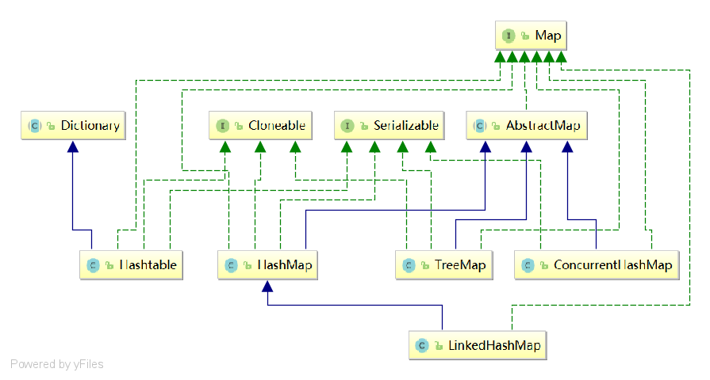
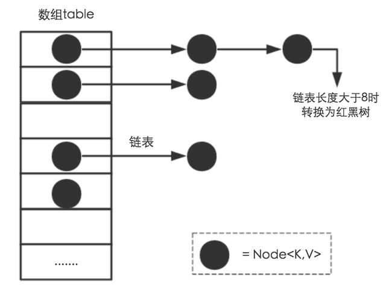

# Java集合相关面试题


## Arraylist、linkedlist差异，应用场景；
## HashMap在JDK1.8有哪些改动？

* 增加了红黑树结构
* HashMap中的元素由Entry改为Node
* 

## HashCurrentMap和HashMap的区别在哪里？
## Hashmap什么时候使用红黑树？

​		jdk1.8中的HashMap引入了红黑树结构，当hashmap的put操作时，把元素添加到hashmap中后，判断链表长度是否超过阀值(默认是8)，就把链表转化成红黑树，如果链表的长度低于阀值(默认6)，就把红黑树转回链表

​	

## ConcurrentHashMap的实现原理(JDK1.7和JDK1.8)


jdk1.8 HashMap的put方法逻辑

1. 如果HashMap未被初始化过，则初始化
2. 对Key求hash值，然后再计算下标
3. 如果没有碰撞，直接放入桶中
4. 如果碰撞了，以链表的方式连接到后面（链表长度超过8以红黑树结构，低于6就从红黑树转回链表）
5. 如果节点已经存在就替换旧值
6. 如果桶满了(容量16*加载因子0.75)，就需要resize(扩容2倍后重排)

```java
static final int TREEIFY_THRESHOLD = 8;    // 超过8就转为红黑树
static final int UNTREEIFY_THRESHOLD = 6;    // 少于6红黑树则转为链表
```

```java
final V putVal(int hash, K key, V value, boolean onlyIfAbsent,
                   boolean evict) {
        Node<K,V>[] tab; Node<K,V> p; int n, i;
        if ((tab = table) == null || (n = tab.length) == 0)
            n = (tab = resize()).length;
        if ((p = tab[i = (n - 1) & hash]) == null)
            tab[i] = newNode(hash, key, value, null);
        else {
            Node<K,V> e; K k;
            if (p.hash == hash &&
                ((k = p.key) == key || (key != null && key.equals(k))))
                e = p;
            else if (p instanceof TreeNode)
                e = ((TreeNode<K,V>)p).putTreeVal(this, tab, hash, key, value);
            else {
                for (int binCount = 0; ; ++binCount) {
                    if ((e = p.next) == null) {
                        p.next = newNode(hash, key, value, null);
                        if (binCount >= TREEIFY_THRESHOLD - 1) // -1 for 1st
                            treeifyBin(tab, hash);
                        break;
                    }
                    if (e.hash == hash &&
                        ((k = e.key) == key || (key != null && key.equals(k))))
                        break;
                    p = e;
                }
            }
            if (e != null) { // existing mapping for key
                V oldValue = e.value;
                if (!onlyIfAbsent || oldValue == null)
                    e.value = value;
                afterNodeAccess(e);
                return oldValue;
            }
        }
        ++modCount;
        if (++size > threshold)
            resize();
        afterNodeInsertion(evict);
        return null;
    }
```


## 深入探讨HashMap的底层结构、原理、扩容机制

### 概括

​	HashMap是Java程序员使用频率最高的用于映射(键值对)处理的数据类型。

​	随着JDK（Java Developmet Kit）版本的更新，JDK1.8对HashMap底层的实现进行了优化，例如引入红黑树的数据结构和扩容的优化等。本文结合JDK1.7和JDK1.8的区别，深入探讨HashMap的结构实现和功能原理。


## 简介

​	Java为数据结构中的映射定义了一个接口java.util.Map，此接口主要有四个常用的实现类，分别是HashMap、Hashtable、LinkedHashMap和TreeMap，类继承关系如下图所示：



**下面针对各个实现类的特点做一些说明：**

* HashMap：它根据键的hashCode值存储数据，大多数情况下可以直接定位到它的值，因而具有很快的访问速度，但遍历顺序却是不确定的。

HashMap最多只允许一条记录的键为null，允许多条记录的值为null。HashMap非线程安全，即任一时刻可以有多个线程同时写HashMap，可能会导致数据的不一致。如果需要满足线程安全，可以用 Collections的synchronizedMap方法使HashMap具有线程安全的能力，或者使用ConcurrentHashMap。

* Hashtable：Hashtable是遗留类，很多映射的常用功能与HashMap类似，不同的是它承自Dictionary类，并且是线程安全的，任一时间只有一个线程能写Hashtable，并发性不如ConcurrentHashMap，因为ConcurrentHashMap引入了分段锁。Hashtable不建议在新代码中使用，不需要线程安全的场合可以用HashMap替换，需要线程安全的场合可以用ConcurrentHashMap替换。

* LinkedHashMap：LinkedHashMap是HashMap的一个子类，保存了记录的插入顺序，在用Iterator遍历LinkedHashMap时，先得到的记录肯定是先插入的，也可以在构造时带参数，按照访问次序排序。

* TreeMap：TreeMap实现SortedMap接口，能够把它保存的记录根据键排序，默认是按键值的升序排序，也可以指定排序的比较器，当用Iterator遍历TreeMap时，得到的记录是排过序的。如果使用排序的映射，建议使用TreeMap。在使用TreeMap时，key必须实现Comparable接口或者在构造TreeMap传入自定义的Comparator，否则会在运行时抛出java.lang.ClassCastException类型的异常。


​		对于上述四种Map类型的类，要求映射中的key是不可变对象。不可变对象是该对象在创建后它的哈希值不会被改变。如果对象的哈希值发生变化，Map对象很可能就定位不到映射的位置了。

​		通过上面的比较，我们知道了HashMap是Java的Map家族中一个普通成员，鉴于它可以满足大多数场景的使用条件，所以是使用频度最高的一个。下文我们主要结合源码，从存储结构、常用方法分析、扩容以及安全性等方面深入讲解HashMap的工作原理。

### 内部实现

​		搞清楚HashMap，首先需要知道HashMap是什么，即它的存储结构-字段；其次弄明白它能干什么，即它的功能实现-方法。下面我们针对这两个方面详细展开讲解。

## 存储结构-字段

从结构实现来讲，HashMap是:**数组+链表+红黑树**（JDK1.8增加了红黑树部分）实现的，如下如所示。



**这里需要讲明白两个问题：数据底层具体存储的是什么？这样的存储方式有什么优点呢？**

(1) 从源码可知，HashMap类中有一个非常重要的字段，就是 Node[] table，即哈希桶数组，明显它是一个Node的数组。我们来看Node[JDK1.8]是何物。

```java
static class Node<K,V> implements Map.Entry<K,V> {
    final int hash;//用来定位数组索引位置
    final K key;   
    V value;
    Node<K,V> next; //链表的下一个元素

    Node(int hash, K key, V value, Node<K,V> next) {
        this.hash = hash;
        this.key = key;
        this.value = value;
        this.next = next;
    }

    public final K getKey()        { return key; }
    public final V getValue()      { return value; }
    public final String toString() { return key + "=" + value; }

    public final int hashCode() {
        return Objects.hashCode(key) ^ Objects.hashCode(value);
    }

    public final V setValue(V newValue) {
        V oldValue = value;
        value = newValue;
        return oldValue;
    }

    public final boolean equals(Object o) {
        if (o == this)
            return true;
        if (o instanceof Map.Entry) {
            Map.Entry<?,?> e = (Map.Entry<?,?>)o;
            if (Objects.equals(key, e.getKey()) &&
                Objects.equals(value, e.getValue()))
                return true;
        }
        return false;
    }
}
```

Node是HashMap的一个内部类，实现了Map.Entry接口，本质是就是一个映射(键值对)。上图中的每个黑色圆点就是一个Node对象。

(2) HashMap就是使用哈希表来存储的。哈希表为解决冲突，可以采用开放地址法和链地址法等来解决问题，Java中HashMap采用了链地址法。链地址法，简单来说，就是数组加链表的结合。在每个数组元素上都是一个链表结构，当数据被Hash后，得到数组下标，把数据放在对应下标元素的链表上。例如程序执行下面代码：

```java
hashMap.put("java","very good");
```

​		系统将调用”java”这个key的hashCode()方法得到其hashCode 值（该方法适用于每个Java对象），然后再通过Hash算法的后两步运算（**高位运算和取模运算**，下文有介绍）**来定位该键值对的存储位置，有时两个key会定位到相同的位置，表示发生了Hash碰撞**。当然Hash算法计算结果越分散均匀，Hash碰撞的概率就越小，map的存取效率就会越高。

​		如果哈希桶数组很大，即使较差的Hash算法也会比较分散，如果哈希桶数组数组很小，即使好的Hash算法也会出现较多碰撞，所以就需要在空间成本和时间成本之间权衡，其实就是在根据实际情况确定哈希桶数组的大小，并在此基础上设计好的hash算法减少Hash碰撞。那么通过什么方式来控制map使得Hash碰撞的概率又小，哈希桶数组（Node[] table）占用空间又少呢？答案就是好的Hash算法和扩容机制。

​		在理解Hash和扩容流程之前，我们得先了解下HashMap的几个字段。从HashMap的默认构造函数源码可知，构造函数就是对下面几个字段进行初始化，源码如下：

```java
int threshold; // 所能容纳的key-value对极限 
final float loadFactor; // 负载因子
int modCount; 
int size;
```

​		首先，Node[] table的**初始化长度length(默认值是16)**，**Load factor为负载因子(默认值是0.75)**，threshold是HashMap所能容纳的最大数据量的Node(键值对)个数。threshold = length * Load factor。也就是说，在数组定义好长度之后，负载因子越大，所能容纳的键值对个数越多。