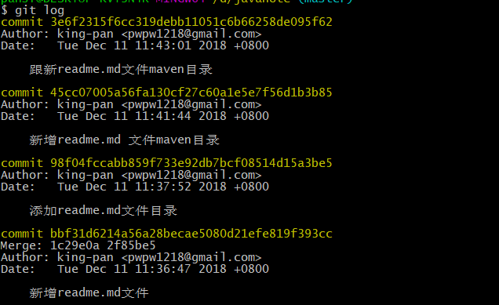
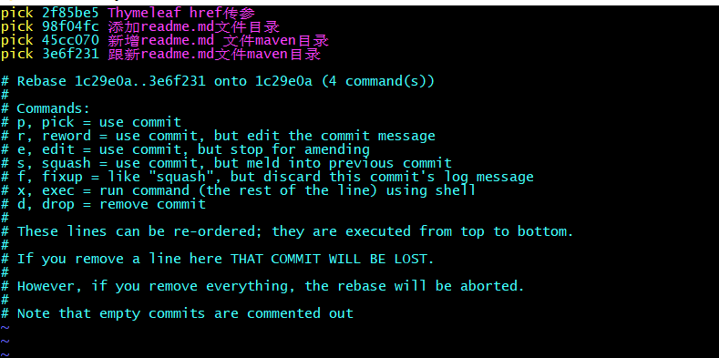
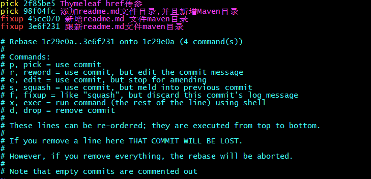

### 多个Git commit 合并

> 执行git log查看提交日志

```shell
git log
```




从上图看，最近的4次提交都是和readme文件相关的，看起来很乱，我们把它合并成一个请求

> 执行 git rebase -i HEAD~4 对最近的 4 个 commit 进行 rebase 操作；

```shell
git rebase -i HEAD~4
```




具体的操作下面的 Commands 说明得很清楚了，对于 commit 合并可以使用 squash、fixup 指令，区别是 squash 会将该 commit 的注释添加到上一个 commit 注释中，fixup 是放弃当前 commit 的注释；



编辑后保存退出，git 会自动压缩提交历史，如果有冲突，记得解决冲突后，使用 git rebase --continue 重新回到当前的 git 压缩过程；

#### 推送到远程仓库 git push -f

重新查看提交提交历史，会发现这些 commit 已经合并了，整个提交历史简洁了很多：

* 禁止向主分支执行push -f操作
* 禁止向主分支执行变更历史的操作


在上面的操作中，我这边遇到了 both added  安装git status提示的操作命令进一步操作即可

```shell
pansf@DESKTOP-KVT3N4R MINGW64 /d/javanote (master|REBASE-i 4/4)
$ git rebase --continue
Successfully rebased and updated refs/heads/master.

pansf@DESKTOP-KVT3N4R MINGW64 /d/javanote (master)
$ git push -f
Counting objects: 4, done.
Delta compression using up to 8 threads.
Compressing objects: 100% (4/4), done.
Writing objects: 100% (4/4), 669 bytes | 0 bytes/s, done.
Total 4 (delta 3), reused 0 (delta 0)
remote: Resolving deltas: 100% (3/3), completed with 3 local objects.
To git@github.com:King-Pan/javanote.git
   1c29e0a..714d545  master -> master
```


```shell
git rebase --skip  # 中间遇到某个补丁不需要应用，可以用下面命令忽略
git rebase --abort # 回到rebase执行之前的状态
```

