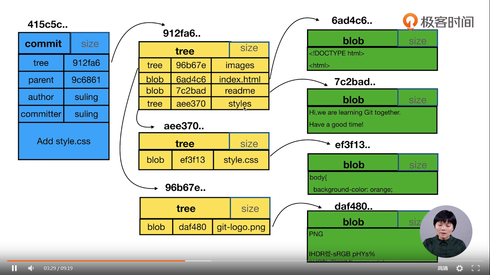

> 查看内容

```shell
git cat-file -p commit-id 查看内容
```

> 查看类型

```shell
git cat-file -t commit-id 查看类型
```


git根据文件内容产生一个blob和文件名没有关系


git 中目录也是一颗树(tree)


```shell
$ git cat-file -t eb936813f49aab102dcfcebbfe90bf8467f69745
commit

```


```sh
$ git cat-file -p eb936813f49aab102dcfcebbfe90bf8467f69745
tree 3c3444c26bbf3529ca1aa9f2c30f44bbdf4bd3aa
parent f232ef6d4493ed727ba7fa3e8870f2877da53135
author King-Pan <pwpw1218@gmail.com> 1551535009 +0800
committer King-Pan <pwpw1218@gmail.com> 1551535009 +0800

modify index.html

```


```shell
$ git cat-file -p 3c3444c26bbf3529ca1aa9f2c30f44bbdf4bd3aa
100644 blob a95ad9a2c9553b2d87a628c7147a1cc4d94aeb82    common.js
040000 tree 826e65dbcf1214b6474083a2ce1009387aa08666    images
100644 blob e8cca5b4622e344459a51afc003478549cc6f47a    index.html
100644 blob 29140d3e35157ffde5fbf234fbfd2ecf90f8a663    readme.md
100644 blob e69de29bb2d1d6434b8b29ae775ad8c2e48c5391    style.css

```


```shell
$ git cat-file -p e8cca5b4622e344459a51afc003478549cc6f47a
<h1>hello git</h1>

```

```shell
$ cat index.html
<h1>hello git</h1>

```


##  统计tree的个数

```shell
git init watch_git_objects
cd watch_git_objects
mkdir doc
git status

touch readme
vim readme
i love you

git add doc
git status
find .git/object -type -f
git cat-file -t
```


_


> 从指定分支上拉去新的分支

```shell
git checkout -b fix_readme fix_css
```

 从fix_css创建分支fix_readme


> 分离头指针

detached HEAD”state(分离头指针状态)——HEAD 头指针指向了一个具体的提交ID，而不是一个引用（分支）


```shell
# 强制将 master 分支指向当前头指针的位置
$ git branch -f master HEAD
# 检出 master 分支
$ git checkout master
```

```
git ckeckout -b fix_bug temp        //新分支
git diff commit信息 commit信息      //比较两个 commit 之间的差异
git diff HEAD HEAD^                 //等价于下面这条命令
git diff HEAD HEAD~1                //等价于上面这条命令
```


> 分支branch


* 查询所有的分支

```shell
git branch -av
```

* 创建新分支并且切换到新分支

```shell
git checkout -b branch_name  #基于当前分支新建分支，并且切换到新建分支

git branch
```

* 删除分支

```shell
git branch -d hotfix   #删除分支
```

