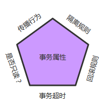

# Spring事务管理

## 1、初步理解

在企业级应用程序开发中，事务管理必不可少的技术，用来确保数据的完整性和一致性。 
事务有四个特性：ACID

* 在企业级应用程序开发中，事务管理必不可少的技术，用来确保数据的完整性和一致性。 
  事务有四个特性：ACID
* 一致性（Consistency）：一旦事务完成（不管成功还是失败），系统必须确保它所建模的业务处于一致的状态，而不会是部分完成部分失败。在现实中的数据不应该被破坏。
* 隔离性（Isolation）：可能有许多事务会同时处理相同的数据，因此每个事务都应该与其他事务隔离开来，防止数据损坏。
* 持久性（Durability）：一旦事务完成，无论发生什么系统错误，它的结果都不应该受到影响，这样就能从任何系统崩溃中恢复过来。通常情况下，事务的结果被写到持久化存储器中。

## 2、核心接口

​		Spring事务管理的实现有许多细节，如果对整个接口框架有个大体了解会非常有利于我们理解事务，下面通过讲解Spring的事务接口来了解Spring实现事务的具体策略。 

Spring事务管理涉及的接口的联系如下：


### 2.1、事务管理器

​		Spring并不直接管理事务，而是提供了多种事务管理器，他们将事务管理的职责委托给[hibernate](http://lib.csdn.net/base/javaee)或者JTA等持久化机制所提供的相关平台框架的事务来实现。 
​		Spring事务管理器的接口是org.springframework.transaction.PlatformTransactionManager，通过这个接口，Spring为各个平台如JDBC、Hibernate等都提供了对应的事务管理器，但是具体的实现就是各个平台自己的事情了。此接口的内容如下：

```java
public interface PlatformTransactionManager()...{  
    // 由TransactionDefinition得到TransactionStatus对象
    TransactionStatus getTransaction(TransactionDefinition definition) throws TransactionException; 
    // 提交
    Void commit(TransactionStatus status) throws TransactionException;  
    // 回滚
    Void rollback(TransactionStatus status) throws TransactionException;  
} 
```

​		从这里可知具体的具体的事务管理机制对Spring来说是透明的，它并不关心那些，那些是对应各个平台需要关心的，所以Spring事务管理的一个优点就是为不同的事务API提供一致的编程模型，如JTA、JDBC、Hibernate、JPA。下面分别介绍各个平台框架实现事务管理的机制。

#### 2.1.1 JDBC事务

​		如果应用程序中直接使用JDBC来进行持久化，DataSourceTransactionManager会为你处理事务边界。为了使用DataSourceTransactionManager，你需要使用如下的XML将其装配到应用程序的上下文定义中：

```xml
<bean id="transactionManager" class="org.springframework.jdbc.datasource.DataSourceTransactionManager">
    <property name="dataSource" ref="dataSource" />
</bean>
```

​		实际上，DataSourceTransactionManager是通过调用[Java](http://lib.csdn.net/base/java).sql.Connection来管理事务，而后者是通过DataSource获取到的。通过调用连接的commit()方法来提交事务，同样，事务失败则通过调用rollback()方法进行回滚。

#### 2.1.2、Hibernate事务

​		如果应用程序的持久化是通过Hibernate实习的，那么你需要使用HibernateTransactionManager。对于Hibernate3，需要在Spring上下文定义中添加如下的`<bean>`声明：

```xml
<bean id="transactionManager" class="org.springframework.orm.hibernate3.HibernateTransactionManager">
	<property name="sessionFactory" ref="sessionFactory" />
</bean>
```

​		sessionFactory属性需要装配一个Hibernate的session工厂，HibernateTransactionManager的实现细节是它将事务管理的职责委托给org.hibernate.Transaction对象，而后者是从Hibernate Session中获取到的。当事务成功完成时，HibernateTransactionManager将会调用Transaction对象的commit()方法，反之，将会调用rollback()方法。

#### 2.1.3、Java持久化API事务(JPA)

​		Hibernate多年来一直是事实上的Java持久化标准，但是现在Java持久化API作为真正的Java持久化标准进入大家的视野。如果你计划使用JPA的话，那你需要使用Spring的JpaTransactionManager来处理事务。你需要在Spring中这样配置JpaTransactionManager：

```xml
<bean id="transactionManager" class="org.springframework.orm.jpa.JpaTransactionManager">
	<property name="sessionFactory" ref="sessionFactory" />
</bean>
```

​		JpaTransactionManager只需要装配一个JPA实体管理工厂（javax.persistence.EntityManagerFactory接口的任意实现）。JpaTransactionManager将与由工厂所产生的JPA EntityManager合作来构建事务。

#### 2.1.4、Java原生API事务

​		如果你没有使用以上所述的事务管理，或者是跨越了多个事务管理源（比如两个或者是多个不同的数据源），你就需要使用JtaTransactionManager：

```xml
<bean id="transactionManager" class="org.springframework.transaction.jta.JtaTransactionManager">
    <property name="transactionManagerName" value="java:/TransactionManager" />
</bean>
```

​		JtaTransactionManager将事务管理的责任委托给javax.transaction.UserTransaction和javax.transaction.TransactionManager对象，其中事务成功完成通过UserTransaction.commit()方法提交，事务失败通过UserTransaction.rollback()方法回滚。

### 2.2、事务的属性

​		上面讲到的事务管理器接口PlatformTransactionManager通过getTransaction(TransactionDefinition definition)方法来得到事务，这个方法里面的参数是TransactionDefinition类，这个类就定义了一些基本的事务属性。 
​		那么什么是事务属性呢？事务属性可以理解成事务的一些基本配置，描述了事务策略如何应用到方法上。事务属性包含了5个方面，如图所示：



而TransactionDefinition接口内容如下：

```java
public interface TransactionDefinition {
    int getPropagationBehavior(); // 返回事务的传播行为
    int getIsolationLevel(); // 返回事务的隔离级别，事务管理器根据它来控制另外一个事务可以看到本事务内的哪些数据
    int getTimeout();  // 返回事务必须在多少秒内完成
    boolean isReadOnly(); // 事务是否只读，事务管理器能够根据这个返回值进行优化，确保事务是只读的
} 
```

​		我们可以发现TransactionDefinition正好用来定义事务属性，下面详细介绍一下各个事务属性。


#### 2.2.1、传播行为

​		事务的第一个方面是传播行为（propagation behavior）。当事务方法被另一个事务方法调用时，必须指定事务应该如何传播。例如：方法可能继续在现有事务中运行，也可能开启一个新事务，并在自己的事务中运行。Spring定义了七种传播行为：

| 传播行为                  | 含义                                                         |
| :------------------------ | :----------------------------------------------------------- |
| PROPAGATION_REQUIRED      | 表示当前方法必须运行在事务中。如果当前事务存在，方法将会在该事务中运行。否则，会启动一个新的事务 |
| PROPAGATION_SUPPORTS      | 表示当前方法不需要事务上下文，但是如果存在当前事务的话，那么该方法会在这个事务中运行 |
| PROPAGATION_MANDATORY     | 表示该方法必须在事务中运行，如果当前事务不存在，则会抛出一个异常 |
| PROPAGATION_REQUIRED_NEW  | 表示当前方法必须运行在它自己的事务中。一个新的事务将被启动。如果存在当前事务，在该方法执行期间，当前事务会被挂起。如果使用JTATransactionManager的话，则需要访问TransactionManager |
| PROPAGATION_NOT_SUPPORTED | 表示该方法不应该运行在事务中。如果存在当前事务，在该方法运行期间，当前事务将被挂起。如果使用JTATransactionManager的话，则需要访问TransactionManager |
| PROPAGATION_NEVER         | 表示当前方法不应该运行在事务上下文中。如果当前正有一个事务在运行，则会抛出异常 |
| PROPAGATION_NESTED        | 表示如果当前已经存在一个事务，那么该方法将会在嵌套事务中运行。嵌套的事务可以独立于当前事务进行单独地提交或回滚。如果当前事务不存在，那么其行为与PROPAGATION_REQUIRED一样。注意各厂商对这种传播行为的支持是有所差异的。可以参考资源管理器的文档来确认它们是否支持嵌套事务 |

注：以下具体讲解传播行为的内容参考自[Spring事务机制详解](http://www.open-open.com/lib/view/open1350865116821.html) 


（1）PROPAGATION_REQUIRED 如果存在一个事务，则支持当前事务。如果没有事务则开启一个新的事务。

```java

//事务属性 PROPAGATION_REQUIRED
methodA{
    ……
    methodB();
    ……
}

//事务属性 PROPAGATION_REQUIRED
methodB{
   ……
}
```

使用spring声明式事务，spring使用AOP来支持声明式事务，会根据事务属性，自动在方法调用之前决定是否开启一个事务，并在方法执行之后决定事务提交或回滚事务。

单独调用methodB方法：

```java
main{ 
    metodB(); 
}
```

相当于

```java
Main{ 
    Connection con=null; 
    try{ 
        con = getConnection(); 
        con.setAutoCommit(false); 
 
        //方法调用
        methodB(); 
 
        //提交事务
        con.commit(); 
    } Catch(RuntimeException ex) { 
        //回滚事务
        con.rollback();   
    } finally { 
        //释放资源
        closeCon(); 
    } 
} 
```

Spring保证在methodB方法中所有的调用都获得到一个相同的连接。在调用methodB时，没有一个存在的事务，所以获得一个新的连接，开启了一个新的事务。 
单独调用MethodA时，在MethodA内又会调用MethodB.

执行效果相当于：

```java
main{ 
    Connection con = null; 
    try{ 
        con = getConnection(); 
        methodA(); 
        con.commit(); 
    } catch(RuntimeException ex) { 
        con.rollback(); 
    } finally {    
        closeCon(); 
    }  
}
```

调用MethodA时，环境中没有事务，所以开启一个新的事务.当在MethodA中调用MethodB时，环境中已经有了一个事务，所以methodB就加入当前事务。

（2）PROPAGATION_SUPPORTS 如果存在一个事务，支持当前事务。如果没有事务，则非事务的执行。但是对于事务同步的事务管理器，PROPAGATION_SUPPORTS与不使用事务有少许不同。

```java
//事务属性 PROPAGATION_REQUIRED
methodA(){
  methodB();
}
 
//事务属性 PROPAGATION_SUPPORTS
methodB(){
  ……
}
```

单纯的调用methodB时，methodB方法是非事务的执行的。当调用methdA时,methodB则加入了methodA的事务中,事务地执行。

（3）PROPAGATION_MANDATORY 如果已经存在一个事务，支持当前事务。如果没有一个活动的事务，则抛出异常。

```java

//事务属性 PROPAGATION_REQUIRED
methodA(){
    methodB();
}
 
//事务属性 PROPAGATION_MANDATORY
methodB(){
    ……
}
```

当单独调用methodB时，因为当前没有一个活动的事务，则会抛出异常throw new IllegalTransactionStateException(“Transaction propagation ‘mandatory’ but no existing transaction found”);当调用methodA时，methodB则加入到methodA的事务中，事务地执行。

（4）PROPAGATION_REQUIRES_NEW 总是开启一个新的事务。如果一个事务已经存在，则将这个存在的事务挂起。

```java

//事务属性 PROPAGATION_REQUIRED
methodA(){
    doSomeThingA();
    methodB();
    doSomeThingB();
}
 
//事务属性 PROPAGATION_REQUIRES_NEW
methodB(){
    ……
}
```

调用A方法：

```java
main(){
    methodA();
}
```

相当于

```
main(){
    TransactionManager tm = null;
    try{
        //获得一个JTA事务管理器
        tm = getTransactionManager();
        tm.begin();//开启一个新的事务
        Transaction ts1 = tm.getTransaction();
        doSomeThing();
        tm.suspend();//挂起当前事务
        try{
            tm.begin();//重新开启第二个事务
            Transaction ts2 = tm.getTransaction();
            methodB();
            ts2.commit();//提交第二个事务
        } Catch(RunTimeException ex) {
            ts2.rollback();//回滚第二个事务
        } finally {
            //释放资源
        }
        //methodB执行完后，恢复第一个事务
        tm.resume(ts1);
        doSomeThingB();
        ts1.commit();//提交第一个事务
    } catch(RunTimeException ex) {
        ts1.rollback();//回滚第一个事务
    } finally {
        //释放资源
    }
}
```

在这里，我把ts1称为外层事务，ts2称为内层事务。从上面的代码可以看出，ts2与ts1是两个独立的事务，互不相干。Ts2是否成功并不依赖于 ts1。如果methodA方法在调用methodB方法后的doSomeThingB方法失败了，而methodB方法所做的结果依然被提交。而除了 methodB之外的其它代码导致的结果却被回滚了。使用PROPAGATION_REQUIRES_NEW,需要使用 JtaTransactionManager作为事务管理器。

（5）PROPAGATION_NOT_SUPPORTED 总是非事务地执行，并挂起任何存在的事务。使用PROPAGATION_NOT_SUPPORTED,也需要使用JtaTransactionManager作为事务管理器。（代码示例同上，可同理推出）

（6）PROPAGATION_NEVER 总是非事务地执行，如果存在一个活动事务，则抛出异常。

（7）PROPAGATION_NESTED如果一个活动的事务存在，则运行在一个嵌套的事务中. 如果没有活动事务, 则按TransactionDefinition.PROPAGATION_REQUIRED 属性执行。这是一个嵌套事务,使用JDBC 3.0驱动时,仅仅支持DataSourceTransactionManager作为事务管理器。需要JDBC 驱动的java.sql.Savepoint类。有一些JTA的事务管理器实现可能也提供了同样的功能。使用PROPAGATION_NESTED，还需要把PlatformTransactionManager的nestedTransactionAllowed属性设为true;而 nestedTransactionAllowed属性值默认为false。

```java

//事务属性 PROPAGATION_REQUIRED
methodA(){
    doSomeThingA();
    methodB();
    doSomeThingB();
}
 
//事务属性 PROPAGATION_NESTED
methodB(){
    ……
}
```

如果单独调用methodB方法，则按REQUIRED属性执行。如果调用methodA方法，相当于下面的效果：

```java
main(){
    Connection con = null;
    Savepoint savepoint = null;
    try{
        con = getConnection();
        con.setAutoCommit(false);
        doSomeThingA();
        savepoint = con2.setSavepoint();
        try{
            methodB();
        } catch(RuntimeException ex) {
            con.rollback(savepoint);
        } finally {
            //释放资源
        }
        doSomeThingB();
        con.commit();
    } catch(RuntimeException ex) {
        con.rollback();
    } finally {
        //释放资源
    }
}
```

​		当methodB方法调用之前，调用setSavepoint方法，保存当前的状态到savepoint。如果methodB方法调用失败，则恢复到之前保存的状态。但是需要注意的是，这时的事务并没有进行提交，如果后续的代码(doSomeThingB()方法)调用失败，则回滚包括methodB方法的所有操作。

​		嵌套事务一个非常重要的概念就是内层事务依赖于外层事务。外层事务失败时，会回滚内层事务所做的动作。而内层事务操作失败并不会引起外层事务的回滚。

​		***PROPAGATION_NESTED 与PROPAGATION_REQUIRES_NEW的区别:它们非常类似,都像一个嵌套事务，如果不存在一个活动的事务，都会开启一个新的事务。使用 PROPAGATION_REQUIRES_NEW时，内层事务与外层事务就像两个独立的事务一样，一旦内层事务进行了提交后，外层事务不能对其进行回滚。两个事务互不影响。两个事务不是一个真正的嵌套事务。同时它需要JTA事务管理器的支持。***

​		***使用PROPAGATION_NESTED时，外层事务的回滚可以引起内层事务的回滚。而内层事务的异常并不会导致外层事务的回滚，它是一个真正的嵌套事务。DataSourceTransactionManager使用savepoint支持PROPAGATION_NESTED时，需要JDBC 3.0以上驱动及1.4以上的JDK版本支持。其它的JTA TrasactionManager实现可能有不同的支持方式。***

​		***PROPAGATION_REQUIRES_NEW 启动一个新的, 不依赖于环境的 “内部” 事务. 这个事务将被完全 commited 或 rolled back 而不依赖于外部事务, 它拥有自己的隔离范围, 自己的锁, 等等. 当内部事务开始执行时, 外部事务将被挂起, 内务事务结束时, 外部事务将继续执行。***

​		***另一方面, PROPAGATION_NESTED 开始一个 “嵌套的” 事务, 它是已经存在事务的一个真正的子事务. 潜套事务开始执行时, 它将取得一个 savepoint. 如果这个嵌套事务失败, 我们将回滚到此 savepoint. 潜套事务是外部事务的一部分, 只有外部事务结束后它才会被提交。***

​		***由此可见, PROPAGATION_REQUIRES_NEW 和 PROPAGATION_NESTED 的最大区别在于, PROPAGATION_REQUIRES_NEW 完全是一个新的事务, 而 PROPAGATION_NESTED 则是外部事务的子事务, 如果外部事务 commit, 嵌套事务也会被 commit, 这个规则同样适用于 roll back.***

​		***PROPAGATION_REQUIRED应该是我们首先的事务传播行为。它能够满足我们大多数的事务需求。***


1.事务传播类型


​    **新建事务**

​      required

​      required_new   - 挂起当前

   **非事务方式运行**

​      supports

​      not_supported  - 挂起当前

​      never 

   **嵌套事务：**

​       nested

   **抛异常**

​      mandatory  

​      never

\2. PROPAGATION_REQUIRED

加入当前正要执行的事务不在另外一个事务里，那么就起一个新的事务。

3.PROPAGATION_SUPPORTS

如果当前在事务中，即以事务的形式运行，如果当前不再一个事务中，那么就以非事务的形式运行。

4.PROPAGATION_MANDATORY

必须在一个事务中运行。也就是说，他只能被一个父事务调用。否则，他就要抛出异常。

5.PROPAGATION_REQUIRES_NEW

这个就比较绕口了。 比如我们设计ServiceA.methodA的事务级别为PROPAGATION_REQUIRED，ServiceB.methodB的事务级别为PROPAGATION_REQUIRES_NEW，那么当执行到ServiceB.methodB的时候，ServiceA.methodA所在的事务就会挂起，ServiceB.methodB会起一个新的事务，等待ServiceB.methodB的事务完成以后，他才继续执行。**他与PROPAGATION_REQUIRED 的事务区别在于事务的回滚程度了**。**因为ServiceB.methodB是新起一个事务，那么就是存在两个不同的事务。如果ServiceB.methodB已经提交，那么ServiceA.methodA失败回滚，ServiceB.methodB是不会回滚的。如果ServiceB.methodB失败回滚，如果他抛出的异常被ServiceA.methodA捕获，ServiceA.methodA事务仍然可能提交。**

6.PROPAGATION_NOT_SUPPORTED

当前不支持事务。比如ServiceA.methodA的事务级别是PROPAGATION_REQUIRED ，而ServiceB.methodB的事务级别是PROPAGATION_NOT_SUPPORTED ，那么当执行到ServiceB.methodB时，ServiceA.methodA的事务挂起，而他以非事务的状态运行完，再继续ServiceA.methodA的事务。

7.PROPAGATION_NEVER

不能在事务中运行。假设ServiceA.methodA的事务级别是PROPAGATION_REQUIRED， 而ServiceB.methodB的事务级别是PROPAGATION_NEVER ，那么ServiceB.methodB就要抛出异常了。

8.PROPAGATION_NESTED

理解Nested的关键是savepoint。他与PROPAGATION_REQUIRES_NEW的区别是，**PROPAGATION_REQUIRES_NEW另起一个事务，将会与他的父事务相互独立， 而Nested的事务和他的父事务是相依的，他的提交是要等和他的父事务一块提交的。也就是说，如果父事务最后回滚，他也要回滚的**。

而Nested事务的好处是他有一个savepoint。也就是说ServiceB.methodB失败回滚，那么ServiceA.methodA也会回滚到savepoint点上，ServiceA.methodA可以选择另外一个分支，比如 ServiceC.methodC，继续执行，来尝试完成自己的事务。 但是这个事务并没有在EJB标准中定义。