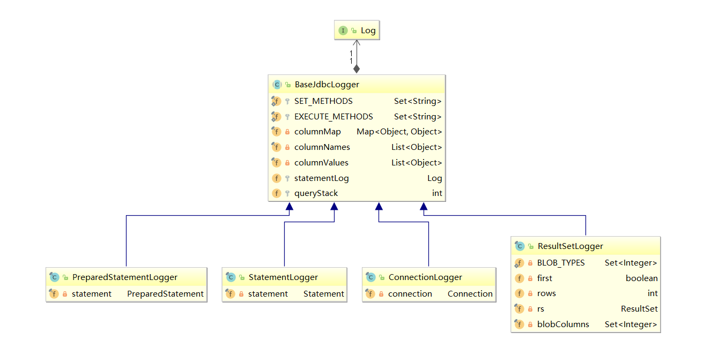
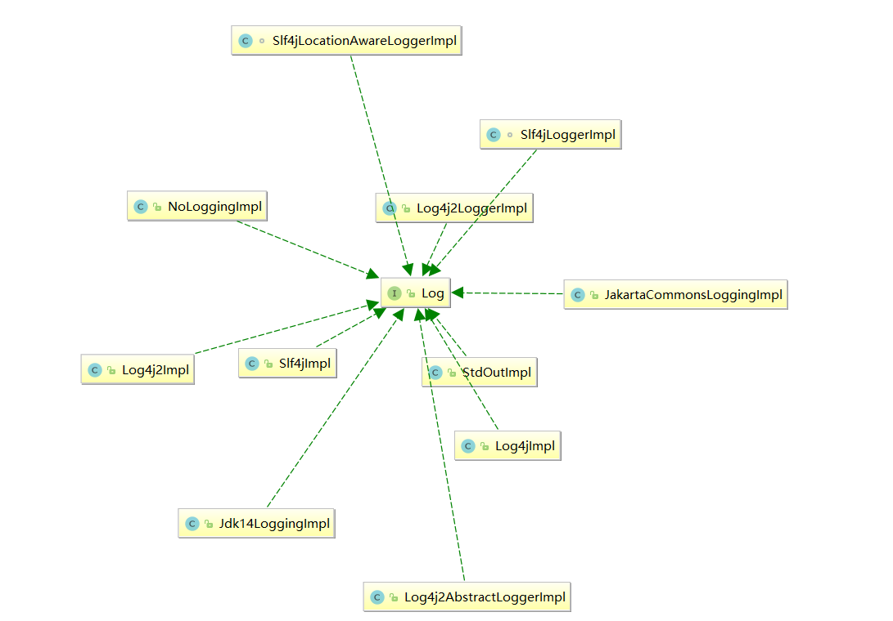

# Mybatis日志源码分析

mybatis版本: mybatis-3.4.6

## 日志源码解读

### 包路径

> org.apache.ibatis.logging.jdbc 

### 日志源码类图






### 日志源码

>BaseJdbcLogger

```java
public abstract class BaseJdbcLogger {
    protected static final Set<String> SET_METHODS = new HashSet();
    protected static final Set<String> EXECUTE_METHODS = new HashSet();
    private final Map<Object, Object> columnMap = new HashMap();
    private final List<Object> columnNames = new ArrayList();
    private final List<Object> columnValues = new ArrayList();
    protected Log statementLog;   //
    protected int queryStack;

    public BaseJdbcLogger(Log log, int queryStack) {
        this.statementLog = log;
        if (queryStack == 0) {
            this.queryStack = 1;
        } else {
            this.queryStack = queryStack;
        }

    }

    protected void setColumn(Object key, Object value) {
        this.columnMap.put(key, value);
        this.columnNames.add(key);
        this.columnValues.add(value);
    }

    protected Object getColumn(Object key) {
        return this.columnMap.get(key);
    }

    protected String getParameterValueString() {
        List<Object> typeList = new ArrayList(this.columnValues.size());
        Iterator var2 = this.columnValues.iterator();

        while(var2.hasNext()) {
            Object value = var2.next();
            if (value == null) {
                typeList.add("null");
            } else {
                typeList.add(this.objectValueString(value) + "(" + value.getClass().getSimpleName() + ")");
            }
        }

        String parameters = typeList.toString();
        return parameters.substring(1, parameters.length() - 1);
    }

    protected String objectValueString(Object value) {
        if (value instanceof Array) {
            try {
                return ArrayUtil.toString(((Array)value).getArray());
            } catch (SQLException var3) {
                return value.toString();
            }
        } else {
            return value.toString();
        }
    }

    protected String getColumnString() {
        return this.columnNames.toString();
    }

    protected void clearColumnInfo() {
        this.columnMap.clear();
        this.columnNames.clear();
        this.columnValues.clear();
    }

    protected String removeBreakingWhitespace(String original) {
        StringTokenizer whitespaceStripper = new StringTokenizer(original);
        StringBuilder builder = new StringBuilder();

        while(whitespaceStripper.hasMoreTokens()) {
            builder.append(whitespaceStripper.nextToken());
            builder.append(" ");
        }

        return builder.toString();
    }

    protected boolean isDebugEnabled() {
        return this.statementLog.isDebugEnabled();
    }

    protected boolean isTraceEnabled() {
        return this.statementLog.isTraceEnabled();
    }

    protected void debug(String text, boolean input) {
        if (this.statementLog.isDebugEnabled()) {
            this.statementLog.debug(this.prefix(input) + text);
        }

    }

    protected void trace(String text, boolean input) {
        if (this.statementLog.isTraceEnabled()) {
            this.statementLog.trace(this.prefix(input) + text);
        }

    }

    private String prefix(boolean isInput) {
        char[] buffer = new char[this.queryStack * 2 + 2];
        Arrays.fill(buffer, '=');
        buffer[this.queryStack * 2 + 1] = ' ';
        if (isInput) {
            buffer[this.queryStack * 2] = '>';
        } else {
            buffer[0] = '<';
        }

        return new String(buffer);
    }

    static {
        SET_METHODS.add("setString");
        SET_METHODS.add("setNString");
        SET_METHODS.add("setInt");
        SET_METHODS.add("setByte");
        SET_METHODS.add("setShort");
        SET_METHODS.add("setLong");
        SET_METHODS.add("setDouble");
        SET_METHODS.add("setFloat");
        SET_METHODS.add("setTimestamp");
        SET_METHODS.add("setDate");
        SET_METHODS.add("setTime");
        SET_METHODS.add("setArray");
        SET_METHODS.add("setBigDecimal");
        SET_METHODS.add("setAsciiStream");
        SET_METHODS.add("setBinaryStream");
        SET_METHODS.add("setBlob");
        SET_METHODS.add("setBoolean");
        SET_METHODS.add("setBytes");
        SET_METHODS.add("setCharacterStream");
        SET_METHODS.add("setNCharacterStream");
        SET_METHODS.add("setClob");
        SET_METHODS.add("setNClob");
        SET_METHODS.add("setObject");
        SET_METHODS.add("setNull");
        EXECUTE_METHODS.add("execute");
        EXECUTE_METHODS.add("executeUpdate");
        EXECUTE_METHODS.add("executeQuery");
        EXECUTE_METHODS.add("addBatch");
    }
}
```

