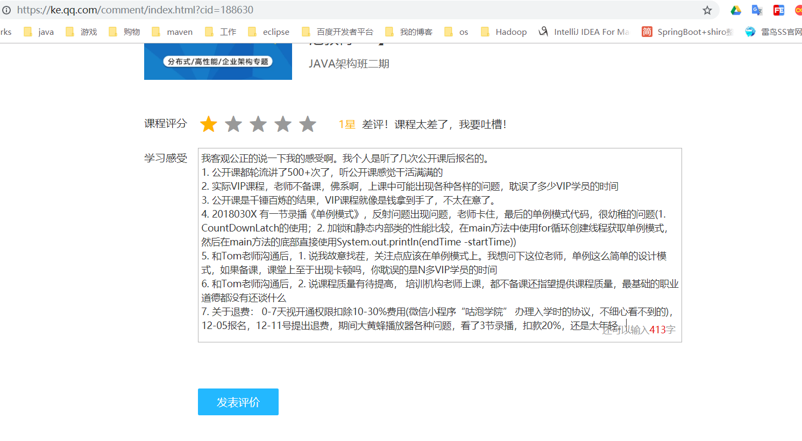
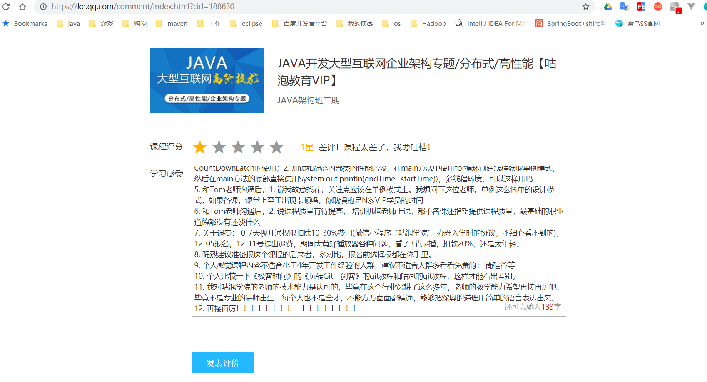
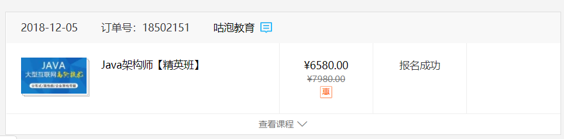

# 咕泡学院







```java
我客观公正的说一下我的感受啊。我个人是听了几次公开课后报名的。
1. 公开课都轮流讲了500+次了，听公开课感觉干活满满的
2. 实际VIP课程，老师不备课，佛系啊，上课中可能出现各种各样的问题，耽误了多少VIP学员的时间
3. 公开课是千锤百炼的结果，VIP课程就像是钱拿到手了，不太在意了。
4. 2018030X 有一节录播《单例模式》，反射问题出现问题，老师卡住，最后的单例模式代码，很幼稚的问题(1. CountDownLatch的使用；2. 加锁和静态内部类的性能比较，在main方法中使用for循环创建线程获取单例模式，然后在main方法的底部直接使用System.out.println(endTime -startTime))，多线程环境，可以这样用吗
5. 和Tom老师沟通后，1. 说我故意找茬，关注点应该在单例模式上。我想问下这位老师，单例这么简单的设计模式，如果备课，课堂上至于出现卡顿吗，你耽误的是N多VIP学员的时间
6. 和Tom老师沟通后，2. 说课程质量有待提高， 培训机构老师上课，都不备课还指望提供课程质量，最基础的职业道德都没有还谈什么
7. 关于退费： 0-7天视开通权限扣除10-30%费用(微信小程序“咕泡学院” 办理入学时的协议，不细心看不到的)，12-05报名，12-11号提出退费，期间大黄蜂播放器各种问题，看了3节录播，扣款20%，还是太年轻。
8. 强烈建议准备报这个课程的后来者，多对比，报名前选择权都在你手里。
9. 个人感觉课程内容不适合小于4年开发工作经验的人群，建议不适合人群多看看免费的： 尚硅谷等
10. 个人比较一下《极客时间》的《玩转Git三剑客》的git教程和咕泡的git教程，这样才能看出差别。
11. 我对咕泡学院的老师的技术能力是认可的，毕竟在这个行业深耕了这么多年，老师的教学能力希望再接再厉吧，毕竟不是专业的讲师出生，每个人也不是全才，不能方方面面都精通，能够把深奥的道理用简单的语言表达出来。
12. 再接再厉！！！！！！！！！！！！！！！！！
```





