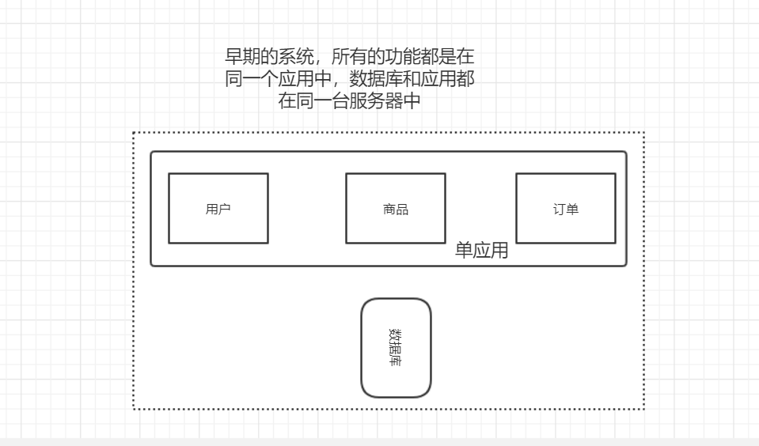
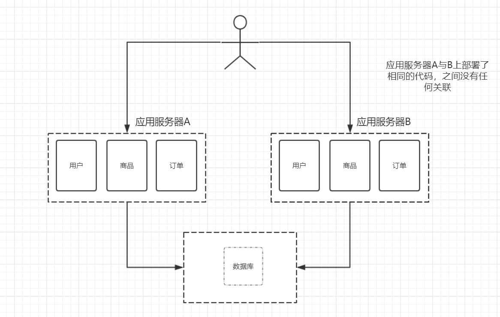
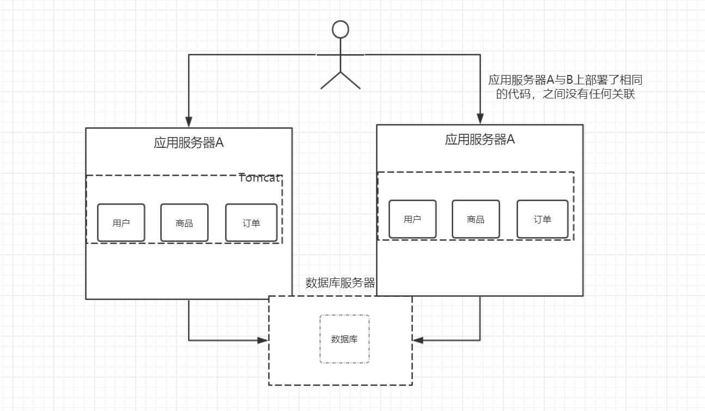

# 01-Java分布式架构演进过程

## 分布式架构概念

​	从集中式到分布式演进过程

> 单机应用(大型主机)

大型主机： 贵，单节点应用，服务挂了就挂了，没有主备

> 去IOE 阿里09

它是阿里巴巴造出的概念。其本意是，在阿里巴巴的IT架构中，去掉IBM的小型机、Oracle数据库、EMC存储设备，代之以自己在开源软件基础上开发的系统。

### 集群与分布式

> 集群

​	集群主要的使用场景是为了分担请求的压力，也就是在几个服务器上部署相同的应用程序，来分担客户端请求。

> 分布式

​	分布式是解决中心化管理的问题，把所有的任务叠加到一个节点处理，太慢了。

​	所以把一个大的问题拆分为多个小的问题，并分别解决，最终协同合作。分布式的主要工作是分解任务，将职能拆解。

> 集群和分布式的区别

**分布式：一个业务拆分为多个子业务，部署在多个服务器上 。** 

**集群：同一个业务，部署在多个服务器上 。**

> 消息中间件

分布式系统中各个模块之间的通讯组件，主要设计

## 