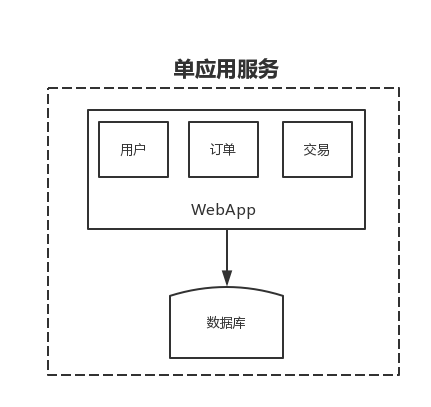
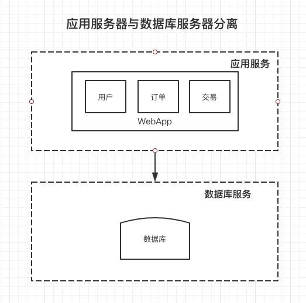

# 分布式架构演进过程


我们以 javaweb 为例，来搭建一个简单的电商系统，从这个系 统中来看系统的演变历史;要注意的是，接下来的演示模型， 关注的是数据量、访问量提升，网站结构发生的变化， 而不是 具体关注业务功能点。其次，这个过程是为了让大家更好的了 解网站演进过程中的一些问题和应对策略。 假如我们系统具备以下功能: 

```java
用户模块:用户注册和管理
商品模块:商品展示和管理
交易模块:创建交易及支付结算
```

## 单应用架构

	>  单应用架构产生的原因: 

* 早期应用程序功能单一
* IT技术局限性
* 单核CPU
* 使用人数很少

这样就会把应用服务和数据库服务都部署在一台服务器上。

### 单应用架构图



### 单应用架构的优缺点

> 优点

1. 开发、部署、维护简单
2. 受IO/和网络的限制少
3. 系统架构简单明了，功能扩展简单


> 缺点

1. 单节点服务没有保障，出现一个问题就会导致整个应用不能使用
2. 应用服务和数据库服务都部署在一台服务器上，主机性能差

## 应用服务器和数据库服务器分离


### 系统架构图



## 

