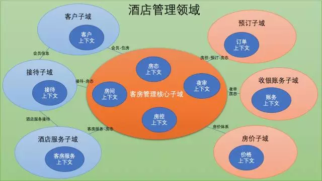
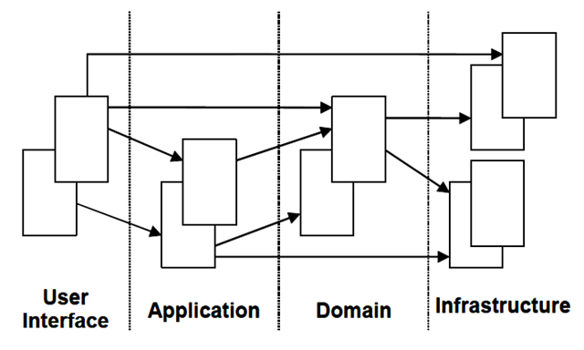
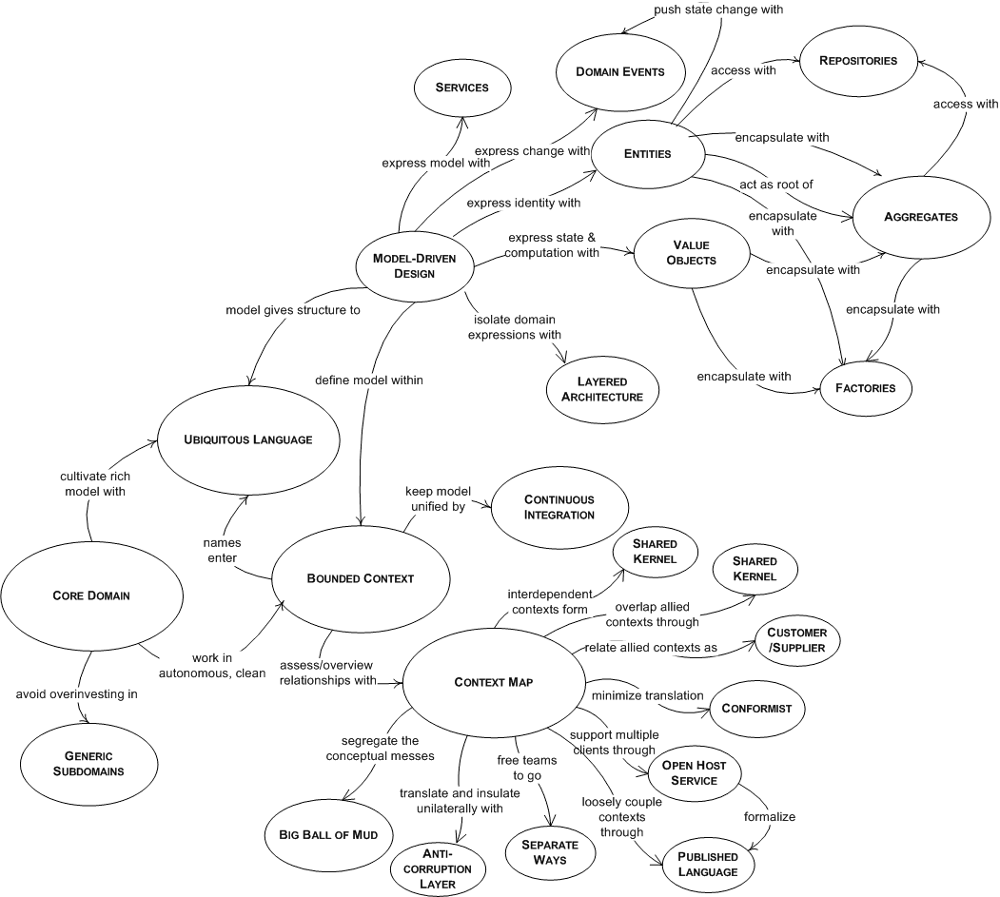
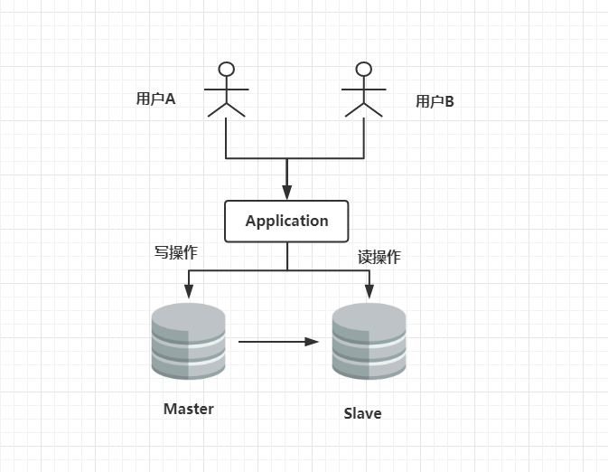

# 分布式架构设计


## 1、领域驱动

[领域驱动教程](https://www.cnblogs.com/butterfly100/p/7827870.html)

## 1.1、什么是领域驱动

​	我们所做的软件系统的目的都是来解决一系列问题，例如做一个电商系统来在线销售自己企业的产品；做一个灰度发布平台来提升服务的质量和稳定性。任何一个系统都会属于某个特定的领域，例如：

- 论坛是一个领域：要做一个论坛，那这个论坛的核心业务是确定的：比如用户发帖、回帖等核心基本功能；
- 电商系统是一个领域：只要是电商领域的系统，那核心业务就是：商品浏览、购物车、下单、减库存、付款交易等核心环节；


​	同一个领域的系统都具有相同的核心业务，因为他们要解决的问题的本质是类似的。因此可以推断：一个领域本质上可以理解为一个 问题域 。只要确定了系统所属的领域，那么这个系统的核心业务，即要解决的关键问题就基本确定了。通常我们说，要成为一个领域的专家，必须要在这个领域深入研究很多年才行，只有这样才会遇到非常多的该领域的问题，积累了丰富的经验。

## 1.2、界限上下文

​	通常来说，一个领域有且只有一个核心问题，我们称之为该领域的『核心子域』。在核心子域、通用子域、支撑子域梳理的同时，会定义出子域中的『限界上下文』及其关系，用它来 阐述子域之间的关系 。界限上下文可以简单理解成一个子系统或组件模块。

例如：下图是对酒店管理的子域和界限上下文的梳理：




## 1.3、领域模型(Domain Model)

> 领域驱动设计（Domain-Driven Design）分为两个阶段：

1. 以一种领域专家、设计人员、开发人员都能理解的通用语言作为相互交流的工具，在交流的过程中发现领域概念，然后将这些概念设计成一个领域模型；
2. 由领域模型驱动软件设计，用代码来实现该领域模型；

> 由此可见，领域驱动设计的核心是建立正确的领域模型。领域模型具有以下特点：

1. 对具有某个边界的领域的一个抽象，反映了领域内用户 业务需求的本质 。它属于『解决问题空间』。领域模型是有边界的，只反应了我们在领域内所关注的部分，包括 实体概念（如：货物，书本，应聘记录，地址等），以及 过程概念（如：资金转账等）；
2. 提高软件的 可维护性，业务可理解性以及可重用性。领域模型确保了我们的软件的业务逻辑都在一个模型中，帮助开发人员相对平滑地将领域知识转化为软件构造；
3. 贯穿软件 分析、设计、开发 的整个过程。领域专家、设计人员、开发人员面向同一个模型进行交流，彼此共享知识与信息，所以可以防止需求走样，让软件开发人员做出来的软件真正满足需求；要建立正确的领域模型并不简单，需要领域专家、设计、开发人员积极沟通共同努力，然后才能使大家对领域的认识不断深入，从而不断细化和完善领域模型；
4. 为了让领域模型看的见，使用的常用表达领域模型的方式：图、代码或文字；
5. 重要性：领域模型是整个软件的核心，是软件中最有价值和最具竞争力的部分；设计足够精良且符合业务需求的领域模型能够更快速的响应需求变化；


## 1.4、领域通用语言

​	由软件专家和领域专家合作开发一个领域的模型是有必要的。开发过程中， 开发人员以类、算法、设计模式、架构等进行思考与交流。但领域专家对此一无所知，他们对技术上的术语没有太多概念，只了解特有的领域专业技能，例如：在空中交通监控样例中，领域专家知道飞机、路线、海拔、经度、纬度，他们有自己的术语来讨论这些事情。软件专家和领域专家交流过程中，需要做翻译才能让对方理解这些概念。

​	领域驱动设计的一个核心原则是使用一种基于模型的语言。使用模型作为语言的核心骨架，要求团队在进行所有的交流是都使用一致的语言，在代码中也是这样，这种语言被称为『通用语言』。

## 1.5、建模思考的问题：用户需求

​	『用户需求』不能等同于『用户』，捕捉『用户心中的模型』也不能等同于『以用户为核心设计领域模型』。设计领域模型时不能以用户为出发点去思考问题，不能老想着用户会对系统做什么；而应该从一个客观的角度，根据用户需求挖掘出领域内的相关事物，思考这些事物的本质关联及其变化规律作为出发点去思考问题。

​	领域模型是 排除了人之外的客观世界模型 ，包含了人所扮演的参与者角色。但是一般情况下不要让参与者角色在领域模型中占据主要位置，否则各个系统的领域模型将变得没有差别，因为软件系统就是一个人机交互的系统，都是以人为主的活动记录或跟踪。例如：

- 论坛中如果以人为主导，那么领域模型就是：人发帖，人回帖，人结贴，等等；
- 货物托运系统中如果以人为主导，就变成了：托运人托运货物，收货人收货物，付款人付款，等等；

以一个货物运输系统为例子简单说明一下。在用户需求相对明朗之后，这样描述领域模型：

- 一个Cargo（货物）涉及多个Customer（客户，如托运人、收货人、付款人），每个Customer承担不同的角色；
- Cargo的运送目标已指定，即Cargo有一个运送目标；
- 由一系列满足Specification（规格）的Carrier Movement（运输动作）来完成运输目标；

以上描述没有从用户的角度去描述领域模型，而是以领域内的相关事物为出发点，考虑这些事物的本质关联及其变化规律的：

- 以货物为中心，把客户看成是货物在某个场景中可能会涉及到的关联角色，如货物会涉及到托运人、收货人、付款人；
- 货物有一个确定的目标，货物会经过一系列的运输动作到达目的地。

以用户为中心来思考领域模型的思维只是停留在需求的表面，而没有挖掘出真正的需求的本质。领域建模时需要努力挖掘用户需求的本质，这样才能真正实现用户需求。

## 1.6、经典分层架构




> 用户界面/展示层：

* 请求应用层获取用户所需的展示数据；
*  发送命令给应用层执行用户的命令

> 应用层：

​	薄薄的一层，定义软件要完成的任务。对外为展示层提供各种应用功能，对内调用领域层（领域对象或领域服务）完成各种业务逻辑。应用层不包含业务逻辑

> 领域层：

​	表达业务概念、业务状态信息及业务规则，是业务软件的核心

> 基础设施层：

​	为其他层提供通用的技术能力，提供了层间通信；为领域层提供持久化机制。


## 1.7、使用的模式

### 1.7.1总览图



### 1.7.2、关联的设计

> 关联在领域建模的过程中非常重要，关联的设计可以遵循如下的一些原则：

- 关联 尽量少。对象之间复杂的关联容易形成对象的关系网，对于理解和维护单个对象很不利，同时也很难划分对象与对象之间的边界；另外，减少关联有助于简化对象之间的遍历；
- 关联尽量保持 单向 的关联；
- 在建立关联时，需要挖掘是否存在关联的 限制条件 。如果存在，那么最好把限制条件加到关联上，往往这样的限制条件能将关联化繁为简，即将多对多简化为1对多，或将1对多简化为1对1；

### 1.7.3、实体（Entity）

​	实体就是领域中需要 唯一标识 的领域概念。因为我们有时需要区分是哪个实体：有两个实体，如果唯一标识不一样，那么即便实体的其他所有属性都一样，也认为他们是两个不同的实体。

​	不应该给实体定义太多的属性或行为，而应该寻找关联，将属性或行为转移到其他关联的实体或值对象上。比如：Customer 实体，有一些地址信息，由于地址信息是一个完整的有业务含义的概念，所以我们可以定义一个 Address 对象，然后把 Customer 的地址相关的信息转移到 Address 对象上。如果没有 Address 对象，而把这些地址信息直接放在 Customer 对象上，然后对于一些其他的类似Address的信息也都直接放在Customer 上，会导致 Customer 对象很混乱，结构不清晰，最终导致它难以维护和理解。

### 1.7.4、值对象（Value Object）

​	并不是每一个事物都必须有一个唯一标识。就以上面的地址对象 Address 为例，如果两个 Customer 的地址信息是一样的，我们就会认为这两个 Customer 的地址是同一个。用程序的方式来表达就是：如果两个对象所有属性的值都相同，我们会认为它们是同一个对象，那么就可以把这种对象设计为值对象。

> 值对象的特征：

- 值对象 没有唯一标识 ，这是它和实体的最大不同。值对象在判断是否是同一个对象时是通过它们的所有属性是否相同，如果相同则认为是同一个值对象。在区分是否是同一个实体时，只看实体的唯一标识是否相同，而不管实体的属性是否相同。
- 值对象是 不可变 的，即所有属性都是只读的，所以可以被安全的共享。

应该给值对象设计的尽量简单，不要让它引用很多其他的对象。值对象只是一个值，类似（int a = 3）中的『3』，只不过是用对象来表示。值对象虽然是只读的，是一个完整的不可分割的整体，但是可以被整个替换掉：类似（a = 4）把a的值由『3』替换为为『4』，当修改 Customer 的 Address 对象引用时，不是通过 Customer.Address.Street 这样的方式来修改属性，可以这样做：Customer.Address = new Address(…)

### 1.7.5、领域服务（Domain Service）

​	领域中的一些概念不太适合建模为对象（实体对象或值对象），因为它们本质上就是一些操作、动作，而不是事物。这些操作往往需要 协调多个领域对象。如果强行将这些操作职责分配给任何一个对象，则被分配的对象就是承担一些不该承担的职责，从而会导致对象的职责不明确很混乱。DDD认为领域服务模式是一个很自然的范式用来对应这种跨多个对象的操作。一般的领域对象都是有状态和行为的，而领域服务没有状态只有行为。

​	领域服务还有一个很重要的功能就是可以避免领域逻辑泄露到应用层。因为如果没有领域服务，那么应用层会直接调用领域对象完成本该是属于领域服务该做的操作，需要了解每个领域对象的业务功能，以及它可能会与哪些其他领域对象交互等一系列领域知识。这样一来，领域层可能会把一部分领域知识泄露到应用层。对于应用层来说，通过调用领域服务提供的简单易懂且意义明确的接口肯定也要比直接操纵领域对象容易的多。

​	说到领域服务，还需要提一下软件中一般有三种服务：应用层服务、领域服务、基础服务。从以下的例子中可以清晰的看出每种服务的职责：

> 应用层服务

1. 获取输入（如一个XML请求）
2. 发送消息给领域层服务，要求其实现转帐的业务逻辑
3. 领域层服务处理成功，则调用基础层服务发送Email通知

> 领域层服务

1. 获取源帐号和目标帐号，分别通知源帐号和目标帐号进行扣除金额和增加金额的操作
2. 提供返回结果给应用层

> 基础层服务

1. 按照应用层的请求，发送Email通知

### 1.7.6、聚合及聚合根（Aggregate，Aggregate Root）

​	聚合定义了一组具有 内聚关系 的相关对象的集合，以及对象之间清晰的所属关系和边界，避免了错综复杂的难以维护的对象关系网的形成。我们把聚合看作是一个修改数据的单元。

> 聚合有以下特点：

1. 每个聚合有一个根和一个边界：根是聚合内的某个实体；边界定义了一个聚合内部有哪些实体或值对象；
2. 聚合根是外部可以保持对聚合引用的唯一元素，负责与外部其他对象打交道并维护自己内部的业务规则。聚合内部的对象之间可以相互引用，但是聚合外部如果要访问聚合内部的对象时，必须通过聚合根开始导航，绝对不能绕过聚合根直接访问聚合内的对象；
3. 聚合内除根以外的其他实体的唯一标识都是本地标识，也就是只要在聚合内部保持唯一即可，因为它们总是从属于这个聚合的；
4. 聚合内部的对象可以保持对其他聚合根的引用；
5. 删除一个聚合根时必须同时删除该聚合内的所有相关对象，因为他们都同属于一个聚合，是一个完整的概念；
6. 基于聚合的以上概念，我们可以推论出从数据库查询时的单元也是以聚合为一个单元，不能直接查询聚合内部的某个非根的对象；

> 如何识别聚合：

​	可以从业务的角度分析哪些对象它们的关系是内聚的，可看成一个整体来考虑的，然后这些对象可以放在一个聚合内。关系内聚是指这些对象之间必须保持一个固定规则，固定规则是指在数据变化时必须保持不变的一致性规则。当修改一个聚合时，必须在 `事务级别` 确保整个聚合内的所有对象满足这个固定规则。聚合尽量不要太大，否则可能带来一定的性能问题。通常在大部分领域模型中，有70%的聚合通常只有一个实体，即聚合根，该实体内部没有包含其他实体，只包含一些值对象；另外30%的聚合中，基本上也只包含两到三个实体。

> 如何识别聚合根：

​	如果一个聚合只有一个实体，那么这个实体就是聚合根；如果有多个实体，那么我们可以思考聚合内哪个对象有独立存在的意义并且可以和外部直接进行交互。

### 1.7.7、工厂（Factory）

​	DDD中的工厂也是一种体现 封装思想 的模式。DDD中引入工厂模式的原因是：有时创建一个领域对象是一件比较复杂的事情，不仅仅是简单的new操作。工厂是用来封装创建一个复杂对象尤其是聚合时所需的知识，将创建对象的细节（如何实例化对象，然后做哪些初始化操作）隐藏起来。

​	客户传递给工厂一些简单的参数，如果参数符合业务规则，则工厂可以在内部创建出一个相应的领域对象返回给客户；但是如果参数无效，应该抛出异常，以确保不会创建出一个错误的对象。当然也并不总是需要通过工厂来创建对象，事实上大部分情况下领域对象的创建都不会太复杂，只需要简单的使用构造函数就可以了。隐藏创建对象的好处：可以不让领域层的业务逻辑泄露到应用层，同时也减轻了应用层的负担，它只需要简单的调用领域工厂创建出期望的对象即可。

### 1.7.8、仓储（Repository）

​	仓储被设计出来的原因：领域模型中的对象自从创建后不会一直留在内存活动，当它不活动时会被持久化到DB中，当需要的时候会重建该对象。所以，重建对象是一个和DB打交道的过程，需要提供一种机制，提供类似集合的接口来帮助我们 管理对象。

​	仓储里存放的对象一定是聚合，因为之前提到的领域模型是以聚合的概念来划分边界的。我们 只对聚合设计仓储 ，把整个聚合看成一个整体，要么一起取出来，要么一起被删除，不会单独对某个聚合内的子对象进行单独查询和更新。仓储还有一个重要的特征就是分为仓储定义部分和仓储实现部分，在领域模型中定义仓储的接口，而在基础设施层实现具体的仓储。

## 1.8、设计领域模型时一般步骤

1. 根据需求建立初步的领域模型，识别明显的领域概念和之间的关联（1:1, 1:n的关系），用文字精确没有歧义的描述出每个领域概念的含义；
2. 分析主要的软件功能，识别主要的应用层的类，这样有助于及早发现哪些是应用层的职责，哪些是领域层的职责；
3. 进一步分析领域模型，识别出实体、值对象、领域服务；
4. 分析关联，通过对业务的深入分析和软件设计原则及性能方面的权衡，明确关联的方向，去掉一些不需要的关联；
5. 找出聚合边界及聚合根，在分析过程中会出现难以清洗判断的选择问题，这就依赖平时分析经验的积累了；
6. 为聚合根配置仓储，一般情况下为一个聚合分配一个仓储，此时设计好仓储的接口即可；
7. 遍历所有场景，确定设计的领域模型能有效解决业务需求；
8. 考虑如何创建实体和值对象，是通过工厂还是构造函数；
9. 重构模型，寻找模型中有疑问或蹩脚的地方，比如思考：聚合的设计是否正确，模型的性能等等；

领域建模是一个不断重构，持续完善的过程，大家会在讨论中将变化的部分反映到模型中，从而模型不断细化并朝正确的方向走。


领域驱动开发: 

DDD: Domain-Driven Design

DDD业内笑话(Debug - Driven - Development)


```java
|-business
|-|-lottery   					#领域界限上下文(抽奖上下文),根据不同的领域界限上下文来规划包
|-|-|-domain					#领域模型
|-|-|-|-valobj					#领域对象-值对象	
|-|-|-|-entity					#领域对象-实体	
|-|-|-|-aggregate				#领域对象-聚合根	
|-|-|-service					#领域服务
|-|-|-repo						#领域资源库
|-|-prize                       #领域界限上下文(奖品上下文)
```

## CAP理论

​	一个经典的分布式系统理论。

CAP理论告诉我们：

**一个分布式系统不可能同时满足一致性（C：Consistency）、可用性（A：Availability）和分区容错性（P：Partition tolerance）**==这三个基本需求，最多只能同时满足其中两项==


CAP: 分布式一致性,可用性，分区容错性


只能满足两个条件,

BASE基本可用(查询由1s变成2s，降级页面(当前访问量过多))，

软状态(状态机: 待支付、支付中、支付成功、支付失败)，

数据最终一致性: 基于消息中间件


### 分布式一致性

​	在分布式环境下，一致性是指数据在多个副本之间能否保持一致的特性。在一致性的需求下，当一个系统在数据一致的状态下执行更新操作后，应该保证系统的数据仍然处于一直的状态。

​	对于一个将数据副本分布在不同分布式节点上的系统来说，如果对第一个节点的数据进 行了更新操作并且更新成功后，却没有使得第二个节点上的数据得到相应的更新，于是在对第二个节点的数据进行读取操作时，获取的依然是老数据（或称为脏数 据），这就是典型的分布式数据不一致的情况。在分布式系统中，如果能够做到针对一个数据项的更新操作执行成功后，所有的用户都可以读取到其最新的值，那么 这样的系统就被认为具有强一致性



### 分布式可用性

​	可用性是指系统提供的服务必须一直处于可用的状态，对于用户的每一个操作请求总是能够在有限的时间内返回结果。这里的重点是"有限时间内"和"返回结果"。

​	"有限时间内"是指，对于用户的一个操作请求，系统必须能够在指定的时间内返回对 应的处理结果，如果超过了这个时间范围，那么系统就被认为是不可用的。另外，"有限的时间内"是指系统设计之初就设计好的运行指标，通常不同系统之间有很 大的不同，无论如何，对于用户请求，系统必须存在一个合理的响应时间，否则用户便会对系统感到失望。

​	"返回结果"是可用性的另一个非常重要的指标，它要求系统在完成对用户请求的处理后，返回一个正常的响应结果。正常的响应结果通常能够明确地反映出队请求的处理结果，即成功或失败，而不是一个让用户感到困惑的返回结果。

### 分布式分区容错性

​	分区容错性约束了一个分布式系统具有如下特性：**分布式系统在遇到任何网络分区故障的时候，仍然需要能够保证对外提供满足一致性和可用性的服务，除非是整个网络环境都发生了故障**。

​	网络分区是指在分布式系统中，不同的节点分布在不同的子网络（机房或异地网络） 中，由于一些特殊的原因导致这些子网络出现网络不连通的状况，但各个子网络的内部网络是正常的，从而导致整个系统的网络环境被切分成了若干个孤立的区域。 需要注意的是，组成一个分布式系统的每个节点的加入与退出都可以看作是一个特殊的网络分区。

​	既然一个分布式系统无法同时满足一致性、可用性、分区容错性三个特点，所以我们就需要抛弃一样：


用一张表格说明一下：

| **选    择**   | **说    明**                                                 |
| -------------- | ------------------------------------------------------------ |
| CA             | 放弃分区容错性，加强一致性和可用性，其实就是传统的单机数据库的选择 |
| AP             | 放弃一致性（这里说的一致性是强一致性），追求分区容错性和可用性，这是很多分布式系统设计时的选择，例如很多NoSQL系统就是如此 |
| ==CP必然选择== | ==放弃可用性，追求一致性和分区容错性，基本不会选择，网络问题会直接让整个系统不可用== |

​	需要明确的一点是，对于一个分布式系统而言，分区容错性是一个最基本的要求。因为 既然是一个分布式系统，那么分布式系统中的组件必然需要被部署到不同的节点，否则也就无所谓分布式系统了，因此必然出现子网络。而对于分布式系统而言，网 络问题又是一个必定会出现的异常情况，因此分区容错性也就成为了一个分布式系统必然需要面对和解决的问题。因此系统架构师往往需要把精力花在如何根据业务 特点在C（一致性）和A（可用性）之间寻求平衡。


## **BASE理论**

​	BASE是Basically Available（基本可用）、Soft state（软状态）和Eventually consistent（最终一致性）三个短语的缩写。

​	BASE理论是对CAP中一致性和可用性权衡的结果，其来源于对大规模互联网系统分布式实践的总结， 是基于CAP定理逐步演化而来的。BASE理论的核心思想是：**即使无法做到强一致性，但每个应用都可以根据自身业务特点，采用适当的方式来使系统达到最终一致性**。接下来看一下BASE中的三要素：

**1、基本可用**

基本可用是指分布式系统在出现不可预知故障的时候，允许损失部分可用性----注意，这绝不等价于系统不可用。比如：

（1）响应时间上的损失。正常情况下，一个在线搜索引擎需要在0.5秒之内返回给用户相应的查询结果，但由于出现故障，查询结果的响应时间增加了1~2秒

（2）系统功能上的损失：正常情况下，在一个电子商务网站上进行购物的时候，消费者几乎能够顺利完成每一笔订单，但是在一些节日大促购物高峰的时候，由于消费者的购物行为激增，为了保护购物系统的稳定性，部分消费者可能会被引导到一个降级页面

**2、软状态**

软状态指允许系统中的数据存在中间状态，并认为该中间状态的存在不会影响系统的整体可用性，即允许系统在不同节点的数据副本之间进行数据同步的过程存在延时

**3、最终一致性**

最终一致性强调的是所有的数据副本，在经过一段时间的同步之后，最终都能够达到一个一致的状态。因此，最终一致性的本质是需要系统保证最终数据能够达到一致，而不需要实时保证系统数据的强一致性。

总的来说，BASE理论面向的是大型高可用可扩展的分布式系统，和传统的事物ACID特性是相反的，**它完全不同于ACID的强一致性模型，而是通过牺牲强一致性来获得可用性，并允许数据在一段时间内是不一致的，但最终达到一致状态**。但同时，在实际的分布式场景中，不同业务单元和组件对数据一致性的要求是不同的，因此在具体的分布式系统架构设计过程中，ACID特性和BASE理论往往又会结合在一起。

 

