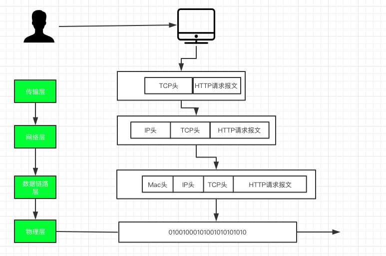

# Http协议

## http协议整体流程

> 客户端请求流程

从DNS解析网址找到对应IP,生成http请求报文

传输层: 添加了TCP头，使用TCP协议传输

网络层: 添加客户端IP头，

数据链路层:  添加客户端MAC头

物理层: 把上面的信息生成byte流

> 服务端响应流程

物理层：数据通过网卡的时候，判断是否接受数据

数据链路层: 从byte流中获取mac地址，判断当前mac地址和当前网卡的mac是否匹配，如果匹配说明当前mac地址没错

网络层: 从byte流中拿到ip头，判断ip是否与本机ip相同，如果相同接受数据，如果不同转发

传输层: TCP头中会携带端口，将报文交给指定端口的进程进行处理

