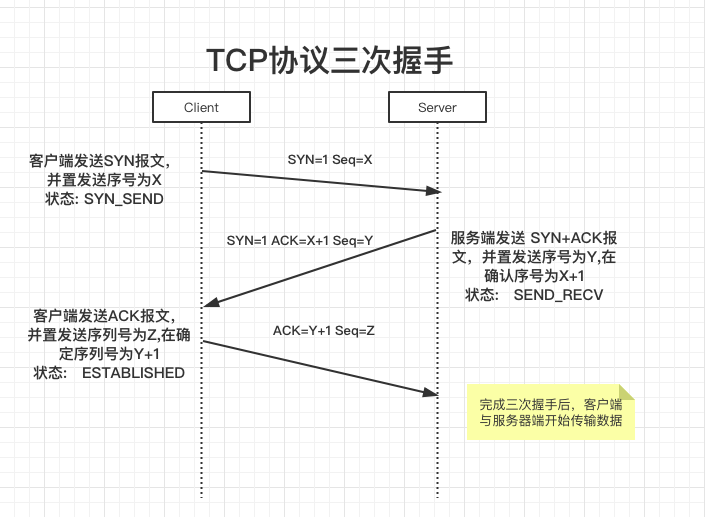
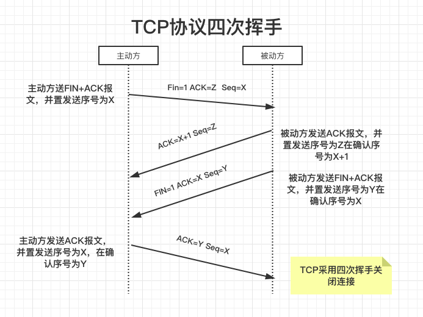
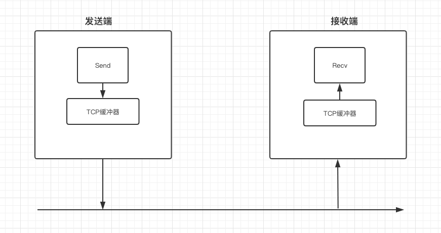
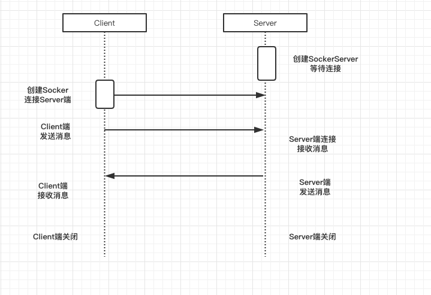
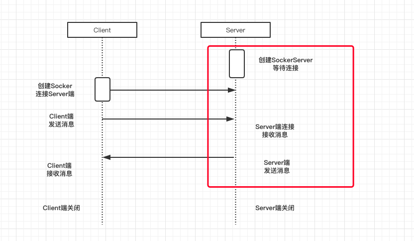
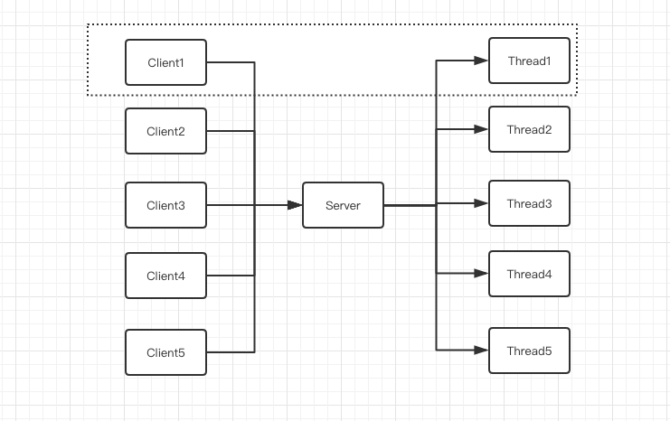

# 分布式架构基石-TCP协议

### 1、TCP协议三次握手

> TCP协议三次握手

1. 第一次握手: 客户端发送一个TCP的SYN标志位置1的包指明客户打算连接的服务器的端口，以及初始序号X,保存在包头的序列号(Sequence Number)字段里。
2. 第二次握手: 服务器发回确认包(ACK)应答。即SYN标志位和ACK标志位均为1同时，将确认序号(Acknowledgement Number)设置为客户的I S N加1以.即X+1。
3. 第三次握手: 客户端再次发送确认包(ACK) SYN标志位为0,ACK标志位为1.并且把服务器发来ACK的序号字段+1,放在确定字段中发送给对方.并且在数据段放写ISN的+1




### 2、TCP协议四次挥手


​	由于TCP连接是全双工的，因此每个方向都必须单独进行关闭。这个原则是当一方完成它的数据发送任务后就能发送一个FIN来终止这个方向的连接。收到一个 FIN只意味着这一方向上没有数据流动，一个TCP连接在收到一个FIN后仍能发送数据。首先进行关闭的一方将执行主动关闭，而另一方执行被动关闭。

1. 第一次挥手: 客户端A发送一个FIN，用来关闭客户A到服务器B的数据传送(报文段4)。
2. 第二次挥手: 服务器B收到这个FIN，它发回一个ACK，确认序号为收到的序号加1(报文段5)。和SYN一样，一个FIN将占用一个序号。
3. 第三次挥手: 服务器B关闭与客户端A的连接，发送一个FIN给客户端A(报文段6)。
4. 第四次挥手: 客户端A发回ACK报文确认，并将确认序号设置为收到序号加1(报文段7)。

TCP采用四次挥手关闭连接





## 3. TCP流量控制—滑动窗口




## 4、TCP协议的java实现

### 4.1、Server端代码

```java
public static void main(String[] args) {
        ServerSocket sc = null;
        BufferedReader bufferedReader = null;
        try {
            sc = new ServerSocket(2500);
            //等待客户端连接
            Socket socket = sc.accept();

            bufferedReader = new BufferedReader(new InputStreamReader(socket.getInputStream()));

            System.out.println(bufferedReader.readLine());

        } catch (IOException e) {
            e.printStackTrace();
        } finally {
            try {
                if (bufferedReader != null) {
                    bufferedReader.close();
                }
                if (sc != null) {
                    sc.close();
                }
            } catch (IOException e) {
                e.printStackTrace();
            }
        }


    }
```


### 4.2、Client端代码

```java
public static void main(String[] args) {
        Socket socket = null;
        PrintWriter printWriter = null;
        try {
            socket = new Socket("127.0.0.1", 2500);
            printWriter = new PrintWriter(socket.getOutputStream(), true);
            printWriter.println("Hello");
        } catch (IOException e) {
            e.printStackTrace();
        } finally {
            try {
                if (socket != null) {
                    socket.close();
                }
                if (printWriter != null) {
                    printWriter.close();
                }
            } catch (Exception e) {
                e.printStackTrace();
            }
        }

    }
```


### 4.3、TCP协议连接时序图



上图反应了Server端和Client端的单次连接，从上图中我们可以知道

1. 服务端创建一次，客户端创建一次
2. 服务端只能为一个客户端 服务，并且服务完成后自动关闭
3. 这种模式性能低
4. 服务端等待连接是IO阻塞的，Client连接上服务端后，也是阻塞的


> 改进后的Server端和Client端



把红色框内的部分实现放入while(true)中，这样可以服务多个客户端，相关java代码

```java
public static void main(String[] args) {
        ServerSocket sc = null;
        BufferedReader bufferedReader = null;
        try {
            sc = new ServerSocket(2500);
            while (true) {
                //等待客户端连接
                Socket socket = sc.accept();
                bufferedReader = new BufferedReader(new InputStreamReader(socket.getInputStream()));
                System.out.println(bufferedReader.readLine());
            }
        } catch (IOException e) {
            e.printStackTrace();
        } finally {
            try {
                if (bufferedReader != null) {
                    bufferedReader.close();
                }
                if (sc != null) {
                    sc.close();
                }
            } catch (IOException e) {
                e.printStackTrace();
            }
        }
    }
```


​	因为服务端是IO阻塞的，也就是说服务端在同一时间内只能为一个客户端服务，我们继续改进,在while(true)中，每获取一个客户端连接，我们创建一个线程来处理这个Socket请求。这儿我们解决了服务端IO阻塞只能解决一个客户端问题，但是客户端多了以后，我们可能同时创建上万，十万，百万个线程来处理客户端请求，这样就会带来新的问题，服务器可能撑不住。这里我们可以不使用BIO,使用NIO来解决这个问题。



### 4.4 非阻塞IO    NIO

​	非阻塞要解决的就是IO线程与Socket解耦的问题，因此，它引入了事件机制来达到解耦的目的。我们认为NIO底层中存在一个IO调度线程，它不断的扫描每个Socket的缓冲区，当发现写入缓冲区为空的时候，它会产生一个Socket可写事件，此时程序就可以把数据写入到Socket中。如果一次写不完，就等待下一次的可写事件通知；反之，当缓存区里有数据的时候，它会产生一个Socket可读事件，程序收到这个通知事件就可以从Socket读取数据了。

