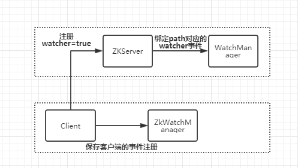

# Zookeeper实践

## 数据存储

### 事务日志: 

​	zoo.cfg配置的dataLogDir目录中

​	事务日志是增量的方式持久化到磁盘上

​	文件命名:  日志文件的命名规则为log.xx，文件大小为64MB，xx表示写入该日志的第一个事务的ID，十六进制表示。

### 快照日志: 

​	zookeeper的数据在内存中是以树形结构进行存储的，而快照就是每隔一段时间就会把整个DataTree的数据序列化后存储在磁盘中，这就是zookeeper的快照文件。如果没有配置事务日志(即dataLogDir配置项)的路径，那么ZooKeeper的事务日志也存放在数据目录中。

​	如果是事务ZXID5触发的拍快照，那么快照名就是snapshot.ZXID5，拍完后，下一个事务的ID就是ZXID6，于是新的事务日志名为log.ZXID6。 

​	zoo.cfg配置的dataDir目录中

​	快照日志是内存的全量快照

### 运行时日志：

 zookeeper按照目录的bin/zookeeper.out

### 日志查看

事务日志和快照日志都是二进制存储，需要通过zookeeper提供的日志查看工具LogFormatter来查看日志

```shell
java -classpath .:lib/slf4j-api-1.6.1.jar:zookeeper-3.4.10.jar org.apache.zookeeper.server.LogFormatter /tmp/zookeeper/version-2/log.1
```

### 相关配置

- `dataDir`：
  ZooKeeper的数据目录，主要目的是存储内存数据库序列化后的快照路径。如果没有配置事务日志(即dataLogDir配置项)的路径，那么ZooKeeper的事务日志也存放在数据目录中。
- `dataLogDir`：
  指定事务日志的存放目录。**事务日志对ZooKeeper的影响非常大，强烈建议事务日志目录和数据目录分开**，不要将事务日志记录在数据目录(主要用来存放内存数据库快照)下。
- `preAllocSize`：
  为事务日志预先开辟磁盘空间。默认是64M，意味着每个事务日志大小就是64M(可以去事务日志目录中看一下，每个事务日志只要被创建出来，就是64M)。如果ZooKeeper产生快照频率较大，可以考虑减小这个参数，因为每次快照后都会切换到新的事务日志，但前面的64M根本就没写完。(见snapCount配置项)
- `snapCount`：
  ZooKeeper使用事务日志和快照来持久化每个事务(注意是日志先写)。该配置项指定ZooKeeper在将内存数据库序列化为快照之前，需要先写多少次事务日志。也就是说，每写几次事务日志，就快照一次。默认值为100000。为了防止所有的ZooKeeper服务器节点同时生成快照(一般情况下，所有实例的配置文件是完全相同的)，当某节点的先写事务数量在(snapCount/2+1,snapCount)范围内时(挑选一个随机值)，这个值就是该节点拍快照的时机。
- `autopurge.snapRetainCount`：
  该配置项指定开启了ZooKeeper的自动清理功能后(见下一个配置项)，每次自动清理时要保留的版本数量。默认值为3，最小值也为3。它表示在自动清理时，会保留最近3个快照以及这3个快照对应的事务日志。其它的所有快照和日志都清理。
- `autopurge.purgeInterval`：
  指定触发自动清理功能的时间间隔，单位为小时，值为大于或等于1的整数，默认值为0，表示不开启自动清理功能。

### 日志的存储格式以及日志文件命名是怎么做的？

```
事务日志和快照日志是二进制存储，事务日志存放在dataLogDir配置的目录中，如果没有配置，那么就默认存放在dataDir配置的目录

快照日志存放在dataDir配置的目录中，默认放在/tmp/zookeeper目录下

事务日志的命名: log.xx xx表示第一个事务的id（zxid），十六进制

快照日志的命名: snapshot.yy  yy表示触发快照的事务id，下一个事务为zz,那么就会生成一个事务日志文件为log.zz

每次快照后，下一个事务都会生成一个新的事务日志文件，并且事务日志文件初始化默认64MB
```


## 基于JavaApi初探zookeeper的使用

### Zookeeper连接

​	zookeeper的状态有: NOT_CONNECT、CONNECTING、CONNECTED、CLOSE

> no watch连接

```java
   @Test
    public void test() {
        try {
            ZooKeeper zooKeeper = new ZooKeeper("47.92.72.146:2181", 4000000, null);
            System.out.println(zooKeeper.getState());//connecting
            Thread.sleep(1000);
            System.out.println(zooKeeper.getState());//connected
            zooKeeper.close();
        } catch (Exception e) {
            e.printStackTrace();
        }
    }
```

由于没有watch监听zookeeper的连接状态的变化，所以只能使用线程睡眠的方式，但是状态不一定是connected,如果服务端网络有延迟，从CONNECTING到CONNECTED状态转换超过设置的睡眠时间，那么第二次的状态输出的就不是COONECTED、所以引入了Watch时间，来监听zookeeper的连接状态

> watch连接

```java
@Test
    public void test() {
        final CountDownLatch countDownLatch = new CountDownLatch(1);
        try {
            ZooKeeper zooKeeper = new ZooKeeper("47.92.72.146:2181", 4000, new 		                 Watcher() {
                @Override
                public void process(WatchedEvent event) {
                    System.out.println("默认事件:" + event.getType());
                    if (Event.KeeperState.SyncConnected == event.getState()) {
                        //如果收到服务端的响应事件，连接成功
                        countDownLatch.countDown();
                    }
                }
            });
            countDownLatch.await();
        } catch (Exception e) {
            e.printStackTrace();
        }
    }
```

> 创建节点、修改节点、删除节点

```java
 @Test
    public void createTest() {
        try {
            //创建节点: 第一个参数节点名称，第二个参数节点值的byte数组，第三个参数，权限，第四个参数节点类型
            zooKeeper.create("/zk-king", "king-pan".getBytes(), ZooDefs.Ids.OPEN_ACL_UNSAFE, CreateMode.PERSISTENT);

            Thread.sleep(1000);
            Stat stat = new Stat();
            // 获取节点值
            byte[] bytes = zooKeeper.getData("/zk-king", null, stat);
            System.out.println(new String(bytes));
            //修改节点的值
            zooKeeper.setData("/zk-king", "pan-king".getBytes(), stat.getVersion());
            bytes = zooKeeper.getData("/zk-king", null, stat);
            System.out.println(new String(bytes));

            //删除节点
            zooKeeper.delete("/zk-king",stat.getVersion());
        } catch (KeeperException e) {
            e.printStackTrace();
        } catch (InterruptedException e) {
            e.printStackTrace();
        }finally {
            if (zooKeeper != null) {
                try {
                    zooKeeper.close();
                } catch (InterruptedException e) {
                    e.printStackTrace();
                }
            }
        }

    }
```


## 深入分析Watcher机制的实现原理

​	watch特性: 当数据发生变化的时候，zookeeper会产生一个watcher事件，并且会发送到客户端。但是客户端只会收到一次通知。如果后续这个节点再次发生变化，那么之前设置watcher的客户端不会再次收到消息。（watcher是一次性操作。）可以通过循环监听去达到永久监听的效果。

	### 如何注册事件机制

通过这三个操作来绑定事件: getData、Exists、getChildren

> 如何触发事件

凡是事务类型的操作:，都会触发监听事件。create、delete、setData


> watcher事件类型

* None(-1) : 客户端链接状态发生变化的时候，会受到None的事件
* NodeCreated(1) : 创建节点的事件。
* NodeDeleted(2) :  删除节点的事件
* NodeDataChanged(3) : 节点数据发生变更
* NodeChildrenChanged(4) : 子节点被创建、被删除、会发送事件触发

|                                 | /watcher-demo(监听事件)          | /watcher-demo/子节点(监听事件)   |
| ------------------------------- | -------------------------------- | -------------------------------- |
| create(/watcher-demo)           | NodeCreated(exists、getData)     | 无                               |
| delete(/watcher-demo)           | NodeDeleted(exists、getData)     | 无                               |
| setData(/watcher-demo)          | NodeDataChanged(exists、getData) | 无                               |
| create(/watcher-demo/children)  | NodeChildrenChanged(getChildren) | NodeCreated(exists、getData)     |
| delete(/watcher-demo/children)  | NodeChildrenChanged(getChildren) | NodeDeleted(exists、getData)     |
| setData(/watcher-demo/children) | NodeChildrenChanged(getChildren) | NodeDataChanged(exists、getData) |

> watcher事件注册流程



## Curator客户端的使用，简单高效

