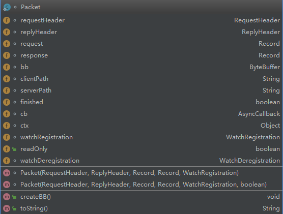

# Zookeeper实践之watcher源码分析

https://www.cnblogs.com/shangxiaofei/p/7171882.html

## Zookeeper初始化

```java
ZooKeeper zooKeeper = new ZooKeeper("47.92.72.146:2181", 4000, new Watcher() {
                @Override
                public void process(WatchedEvent event) {
                    System.out.println("默认事件:" + event.getType());
                    if (Event.KeeperState.SyncConnected == event.getState()) {
                        //如果收到服务端的响应事件，连接成功
                        countDownLatch.countDown();
                    }
                }
            });
```

​	初始化Zookeeper时，需要传入一个Watcher，作为一个默认的watcher，会一直保持在客户端ZKWatchManager中。

### Zookeeper构造方法

```java

  public ZooKeeper(String connectString, int sessionTimeout, Watcher watcher) throws IOException {
        this(connectString, sessionTimeout, watcher, false);
    }

```

```java
public ZooKeeper(String connectString, int sessionTimeout, Watcher watcher, boolean canBeReadOnly) throws IOException {
    //初始化ZKWatchManager
    this.watchManager = new ZooKeeper.ZKWatchManager();
    LOG.info("Initiating client connection, connectString=" + connectString + " sessionTimeout=" + sessionTimeout + " watcher=" + watcher); 
    //把new Zookeeper传入的watcher设置成全局默认的watcher
    this.watchManager.defaultWatcher = watcher;
    ConnectStringParser connectStringParser = new ConnectStringParser(connectString);
    HostProvider hostProvider = new StaticHostProvider(connectStringParser.getServerAddresses());
    //初始化ClientCnxn
    this.cnxn = new ClientCnxn(connectStringParser.getChrootPath(), hostProvider, sessionTimeout, this, this.watchManager, getClientCnxnSocket(), canBeReadOnly);
    //调用ClientCnxn的start方法
    this.cnxn.start();
}
```

### ClientCnxn构造方法

```java
 public ClientCnxn(String chrootPath, HostProvider hostProvider, int sessionTimeout, ZooKeeper zooKeeper, ClientWatchManager watcher, ClientCnxnSocket clientCnxnSocket, boolean canBeReadOnly) throws IOException {
        this(chrootPath, hostProvider, sessionTimeout, zooKeeper, watcher, clientCnxnSocket, 0L, new byte[16], canBeReadOnly);
    }

 public ClientCnxn(String chrootPath, HostProvider hostProvider, int sessionTimeout, ZooKeeper zooKeeper, ClientWatchManager watcher, ClientCnxnSocket clientCnxnSocket, long sessionId, byte[] sessionPasswd, boolean canBeReadOnly) {
        this.authInfo = new CopyOnWriteArraySet();
        this.pendingQueue = new LinkedList();
        this.outgoingQueue = new LinkedList();
        this.sessionPasswd = new byte[16];
        this.closing = false;
        this.seenRwServerBefore = false;
        this.eventOfDeath = new Object();
        this.xid = 1;
        this.state = States.NOT_CONNECTED;
        this.zooKeeper = zooKeeper;
        this.watcher = watcher;
        this.sessionId = sessionId;
        this.sessionPasswd = sessionPasswd;
        this.sessionTimeout = sessionTimeout;
        this.hostProvider = hostProvider;
        this.chrootPath = chrootPath;
        this.connectTimeout = sessionTimeout / hostProvider.size();
        this.readTimeout = sessionTimeout * 2 / 3;
        this.readOnly = canBeReadOnly;
        //初始化sendThread传入clientCnxnSocket,这个clientCnxnSocket是调用Zookeeper的getClientCnxnSocket()方法获取的。默认使用ClientCnxnSocketNIO
        //初始化eventThread
        //
        this.sendThread = new ClientCnxn.SendThread(clientCnxnSocket);
        this.eventThread = new ClientCnxn.EventThread();
    }
```

### SendThread

**SendThread: 负责客户端和服务器端的数据通信, 也包括事件信息的传输的线程**

```java
SendThread(ClientCnxnSocket clientCnxnSocket) {
    super(ClientCnxn.makeThreadName("-SendThread()"));
    ClientCnxn.this.state = States.CONNECTING;
    this.clientCnxnSocket = clientCnxnSocket;
    this.setDaemon(true);
}

//SendThread构造参数
//org.apache.zookeeper.ZooKeeper#getClientCnxnSocket
private static ClientCnxnSocket getClientCnxnSocket() throws IOException {
        String clientCnxnSocketName = System.getProperty("zookeeper.clientCnxnSocket");
        if (clientCnxnSocketName == null) {
            clientCnxnSocketName = ClientCnxnSocketNIO.class.getName();
        }

        try {
            return (ClientCnxnSocket)Class.forName(clientCnxnSocketName).newInstance();
        } catch (Exception var3) {
            IOException ioe = new IOException("Couldn't instantiate " + clientCnxnSocketName);
            ioe.initCause(var3);
            throw ioe;
        }
    }
```

run方法

```java
public void run() {
            this.clientCnxnSocket.introduce(this, ClientCnxn.this.sessionId);
            this.clientCnxnSocket.updateNow();
            this.clientCnxnSocket.updateLastSendAndHeard();
            long lastPingRwServer = System.currentTimeMillis();
            boolean var4 = true;

            while(ClientCnxn.this.state.isAlive()) {
                try {
                    //判断未连接
                    if (!this.clientCnxnSocket.isConnected()) {
                        if (!this.isFirstConnect) {
                            try {
                                Thread.sleep((long)this.r.nextInt(1000));
                            } catch (InterruptedException var9) {
                                ClientCnxn.LOG.warn("Unexpected exception", var9);
                            }
                        }

                        if (ClientCnxn.this.closing || !ClientCnxn.this.state.isAlive()) {
                            break;
                        }

                        this.startConnect();
                        this.clientCnxnSocket.updateLastSendAndHeard();
                    }

                    int to;
                    //判断已连接
                    if (ClientCnxn.this.state.isConnected()) {
                        if (ClientCnxn.this.zooKeeperSaslClient != null) {
                            boolean sendAuthEvent = false;
                            if (ClientCnxn.this.zooKeeperSaslClient.getSaslState() == SaslState.INITIAL) {
                                try {
                                    ClientCnxn.this.zooKeeperSaslClient.initialize(ClientCnxn.this);
                                } catch (SaslException var8) {
                                    ClientCnxn.LOG.error("SASL authentication with Zookeeper Quorum member failed: " + var8);
                                    ClientCnxn.this.state = States.AUTH_FAILED;
                                    sendAuthEvent = true;
                                }
                            }

                            KeeperState authState = ClientCnxn.this.zooKeeperSaslClient.getKeeperState();
                            if (authState != null) {
                                if (authState == KeeperState.AuthFailed) {
                                    ClientCnxn.this.state = States.AUTH_FAILED;
                                    sendAuthEvent = true;
                                } else if (authState == KeeperState.SaslAuthenticated) {
                                    sendAuthEvent = true;
                                }
                            }

                            if (sendAuthEvent) {
                                ClientCnxn.this.eventThread.queueEvent(new WatchedEvent(EventType.None, authState, (String)null));
                            }
                        }

                        to = ClientCnxn.this.readTimeout - this.clientCnxnSocket.getIdleRecv();
                    } else {
                        to = ClientCnxn.this.connectTimeout - this.clientCnxnSocket.getIdleRecv();
                    }
					//to <= 0客户端连接超时
                    if (to <= 0) {
                        String warnInfo = "Client session timed out, have not heard from server in " + this.clientCnxnSocket.getIdleRecv() + "ms" + " for sessionid 0x" + Long.toHexString(ClientCnxn.this.sessionId);
                        ClientCnxn.LOG.warn(warnInfo);
                        throw new ClientCnxn.SessionTimeoutException(warnInfo);
                    }
					//客户端连接状态发送心跳ping
                    if (ClientCnxn.this.state.isConnected()) {
                        int timeToNextPing = ClientCnxn.this.readTimeout / 2 - this.clientCnxnSocket.getIdleSend() - (this.clientCnxnSocket.getIdleSend() > 1000 ? 1000 : 0);
                        if (timeToNextPing > 0 && this.clientCnxnSocket.getIdleSend() <= 10000) {
                            if (timeToNextPing < to) {
                                to = timeToNextPing;
                            }
                        } else {
                            this.sendPing();
                            this.clientCnxnSocket.updateLastSend();
                        }
                    }
					//连接状态是只读
                    if (ClientCnxn.this.state == States.CONNECTEDREADONLY) {
                        long now = System.currentTimeMillis();
                        int idlePingRwServer = (int)(now - lastPingRwServer);
                        if (idlePingRwServer >= this.pingRwTimeout) {
                            lastPingRwServer = now;
                            idlePingRwServer = 0;
                            this.pingRwTimeout = Math.min(2 * this.pingRwTimeout, 60000);
                            this.pingRwServer();
                        }

                        to = Math.min(to, this.pingRwTimeout - idlePingRwServer);
                    }
					//调用clientCnxnSocket发起传输,
                    //其中pendingQueue是一个用来存放已经发送、等待回应的Packet队列，								//clientCnxnSocket默认使用ClientCnxnSocketNIO
                    this.clientCnxnSocket.doTransport(to, ClientCnxn.this.pendingQueue, ClientCnxn.this.outgoingQueue, ClientCnxn.this);
                } catch (Throwable var10) {
                    if (ClientCnxn.this.closing) {
                        if (ClientCnxn.LOG.isDebugEnabled()) {
                            ClientCnxn.LOG.debug("An exception was thrown while closing send thread for session 0x" + Long.toHexString(ClientCnxn.this.getSessionId()) + " : " + var10.getMessage());
                        }
                        break;
                    }

                    if (var10 instanceof ClientCnxn.SessionExpiredException) {
                        ClientCnxn.LOG.info(var10.getMessage() + ", closing socket connection");
                    } else if (var10 instanceof ClientCnxn.SessionTimeoutException) {
                        ClientCnxn.LOG.info(var10.getMessage() + ", closing socket connection and attempting reconnect");
                    } else if (var10 instanceof ClientCnxn.EndOfStreamException) {
                        ClientCnxn.LOG.info(var10.getMessage() + ", closing socket connection and attempting reconnect");
                    } else if (var10 instanceof ClientCnxn.RWServerFoundException) {
                        ClientCnxn.LOG.info(var10.getMessage());
                    } else {
                        ClientCnxn.LOG.warn("Session 0x" + Long.toHexString(ClientCnxn.this.getSessionId()) + " for server " + this.clientCnxnSocket.getRemoteSocketAddress() + ", unexpected error" + ", closing socket connection and attempting reconnect", var10);
                    }

                    this.cleanup();
                    if (ClientCnxn.this.state.isAlive()) {
                        ClientCnxn.this.eventThread.queueEvent(new WatchedEvent(EventType.None, KeeperState.Disconnected, (String)null));
                    }

                    this.clientCnxnSocket.updateNow();
                    this.clientCnxnSocket.updateLastSendAndHeard();
                }
            }

            this.cleanup();
            this.clientCnxnSocket.close();
            if (ClientCnxn.this.state.isAlive()) {
                ClientCnxn.this.eventThread.queueEvent(new WatchedEvent(EventType.None, KeeperState.Disconnected, (String)null));
            }

            ZooTrace.logTraceMessage(ClientCnxn.LOG, ZooTrace.getTextTraceLevel(), "SendThread exited loop for session: 0x" + Long.toHexString(ClientCnxn.this.getSessionId()));
        }
```

> ClientCnxnSocketNIO.doTransport负责发起传输


### EventThread

 **EventThread : 主要在客户端回调注册的 Watchers 进行通知处理**

```java
EventThread() {
    super(ClientCnxn.makeThreadName("-EventThread"));
    this.sessionState = KeeperState.Disconnected;
    this.wasKilled = false;
    this.isRunning = false;
    this.setDaemon(true);
}


```

> 线程run方法

```java
public void run() {
    try {
        this.isRunning = true;
		//死循环等待事件
        while(true) {
            Object event = this.waitingEvents.take();
            if (event == ClientCnxn.this.eventOfDeath) {
                this.wasKilled = true;
            } else {
                this.processEvent(event);
            }

            if (this.wasKilled) {
                synchronized(this.waitingEvents) {
                    if (this.waitingEvents.isEmpty()) {
                        this.isRunning = false;
                        break;
                    }
                }
            }
        }
    } catch (InterruptedException var5) {
        ClientCnxn.LOG.error("Event thread exiting due to interruption", var5);
    }

    ClientCnxn.LOG.info("EventThread shut down for session: 0x{}", Long.toHexString(ClientCnxn.this.getSessionId()));
}
```


### org.apache.zookeeper.ClientCnxn#start

```java
public void start() {
    //启动发送线程
    this.sendThread.start();
    //启动watcher事件线程
    this.eventThread.start();
}
```


## Watcher源码入口

watcher只能绑定在getData、exists、getChildren事件中


### zookeeper.exists方法

> zookeeper调用exists方法

```java
 @Test
    public void watcherTest() {

        try {
            //1. 创建节点
            zooKeeper.create("/watcher-demo", "watcher-demo".getBytes(), ZooDefs.Ids.OPEN_ACL_UNSAFE, CreateMode.PERSISTENT);
            //2. 绑定监听事件 getData、exists、getChildren

            //zooKeeper.exists(path,boolean) 通过默认的监听事件监听
            Stat stat = zooKeeper.exists("/watcher-demo", new Watcher() {
                @Override
                public void process(WatchedEvent event) {
                    System.out.println(event.getType() + "->" + event.getPath());
                }
            });
            //修改节点，path，value，版本号，乐观锁，如果版本号小于当前版本号，修改失败
            stat = zooKeeper.setData("/watcher-demo","watcher-demo-modify".getBytes(),stat.getVersion());
            Thread.sleep(1000);
            // 删除节点: path和版本号
            zooKeeper.delete("/watcher-demo",stat.getVersion());
        } catch (KeeperException e) {
            e.printStackTrace();
        } catch (InterruptedException e) {
            e.printStackTrace();
        }
    }
```

>  zooKeeper.exists()源码

```java
 public Stat exists(final String path, Watcher watcher)
        throws KeeperException, InterruptedException
    {
        final String clientPath = path;
        PathUtils.validatePath(clientPath);

        // the watch contains the un-chroot path
        WatchRegistration wcb = null;
        if (watcher != null) {
            wcb = new ExistsWatchRegistration(watcher, clientPath);
        }

        final String serverPath = prependChroot(clientPath);
		
		//构建请求头
        RequestHeader h = new RequestHeader();
        h.setType(ZooDefs.OpCode.exists);
        //构建exists请求体
        ExistsRequest request = new ExistsRequest();
        request.setPath(serverPath);
        request.setWatch(watcher != null);
        SetDataResponse response = new SetDataResponse();
        ReplyHeader r = cnxn.submitRequest(h, request, response, wcb);
        if (r.getErr() != 0) {
            if (r.getErr() == KeeperException.Code.NONODE.intValue()) {
                return null;
            }
            throw KeeperException.create(KeeperException.Code.get(r.getErr()),
                    clientPath);
        }

        return response.getStat().getCzxid() == -1 ? null : response.getStat();
    }
```

**构建请求头RequestHeader和exists请求体ExistsRequest**

>  org.apache.zookeeper.ClientCnxn#submitRequest

```java
public ReplyHeader submitRequest(RequestHeader h, Record request,
                                 Record response, WatchRegistration watchRegistration)
    throws InterruptedException {
    ReplyHeader r = new ReplyHeader(); 
    //把请求和exists请求体构建成一个Packet,并且把Packet放入到outgoingQueue队列中
    Packet packet = queuePacket(h, r, request, response, null, null, null,
                                null, watchRegistration);
    //对当前数据包加锁，阻塞，直到packet处理完成
    synchronized (packet) {
        while (!packet.finished) {
            packet.wait();
        }
    }
    return r;
}

//queuePacket方法,组装Packet，加入到outgoingQueue队列中
ClientCnxn.Packet queuePacket(RequestHeader h, ReplyHeader r, Record request, Record response, AsyncCallback cb, String clientPath, String serverPath, Object ctx, WatchRegistration watchRegistration) {
    ClientCnxn.Packet packet = null;
    synchronized(this.outgoingQueue) {
        //把请求信息构建成ClientCnxn.Packet
        packet = new ClientCnxn.Packet(h, r, request, response, watchRegistration);
        packet.cb = cb;
        packet.ctx = ctx;
        packet.clientPath = clientPath;
        packet.serverPath = serverPath;
        if (this.state.isAlive() && !this.closing) {
            if (h.getType() == -11) {
                this.closing = true;
            }
			//添加到outgoingQueue队列中
            this.outgoingQueue.add(packet);
        } else {
            this.conLossPacket(packet);
        }
    }
    //TODO NIO 还有点不明白
	//此处是多路复用机制，唤醒 Selector，告诉他有数据包添加过来了
    this.sendThread.getClientCnxnSocket().wakeupCnxn();
    return packet;
}
```

​	在 ZooKeeper 中，Packet 是一个**最小的通信协议单元，即数据包**。Pakcet 用于进行客户端与服务端之间的网络传输，任何需要传输的对象都需要包装成一个 Packet 对象。在 ClientCnxn 中 WatchRegistration 也 会 被 封 装 到Pakcet 中，然后由 SendThread 线程调用 queuePacket方法把 Packet 放入发送队列中等待客户端发送，这又是一个异步过程，分布式系统采用异步通信是一个非常常见的手段

### client与server端交互

​	通过对SendThread源码分析，我们直到，在SendThread线程的run方法中调用了 this.clientCnxnSocket.doTransport(to, ClientCnxn.this.pendingQueue, ClientCnxn.this.outgoingQueue, ClientCnxn.this);方法来实现client与Server端交互，那么所有的交互逻辑都被封装到doTransport方法中。 Zookeeper中ClientCnxnSocket有两个实现ClientCnxnSocketNetty和ClientCnxnSocketNIO(默认)

> clientCnxnSocket.doTransport方法

```java
//ClientCnxnSocketNIO.doTransport方法
@Override
void doTransport(int waitTimeOut, List<Packet> pendingQueue, ClientCnxn cnxn)
    throws IOException, InterruptedException {
    selector.select(waitTimeOut);
    Set<SelectionKey> selected;
    synchronized (this) {
        selected = selector.selectedKeys();
    }
    // Everything below and until we get back to the select is
    // non blocking, so time is effectively a constant. That is
    // Why we just have to do this once, here
    updateNow();
    for (SelectionKey k : selected) {
        SocketChannel sc = ((SocketChannel) k.channel());
        if ((k.readyOps() & SelectionKey.OP_CONNECT) != 0) {
            if (sc.finishConnect()) {
                updateLastSendAndHeard();
                updateSocketAddresses();
                sendThread.primeConnection();
            }
        } else if ((k.readyOps() & (SelectionKey.OP_READ | SelectionKey.OP_WRITE)) != 0) {
            doIO(pendingQueue, cnxn);
        }
    }
    if (sendThread.getZkState().isConnected()) {
        if (findSendablePacket(outgoingQueue,
                               sendThread.tunnelAuthInProgress()) != null) {
            enableWrite();
        }
    }
    selected.clear();
}
```

> 核心方法doIO(pendingQueue,cnxn)

```java
 /**
     * @return true if a packet was received
     * @throws InterruptedException
     * @throws IOException
     */
    void doIO(List<Packet> pendingQueue, ClientCnxn cnxn)
      throws InterruptedException, IOException {
        SocketChannel sock = (SocketChannel) sockKey.channel();
        if (sock == null) {
            throw new IOException("Socket is null!");
        }
        if (sockKey.isReadable()) {
            int rc = sock.read(incomingBuffer);
            if (rc < 0) {
                throw new EndOfStreamException(
                        "Unable to read additional data from server sessionid 0x"
                                + Long.toHexString(sessionId)
                                + ", likely server has closed socket");
            }
            if (!incomingBuffer.hasRemaining()) {
                incomingBuffer.flip();
                if (incomingBuffer == lenBuffer) {
                    recvCount.getAndIncrement();
                    readLength();
                } else if (!initialized) {
                    readConnectResult();
                    enableRead();
                    if (findSendablePacket(outgoingQueue,
                            sendThread.tunnelAuthInProgress()) != null) {
                        // Since SASL authentication has completed (if client is configured to do so),
                        // outgoing packets waiting in the outgoingQueue can now be sent.
                        enableWrite();
                    }
                    lenBuffer.clear();
                    incomingBuffer = lenBuffer;
                    updateLastHeard();
                    initialized = true;
                } else {
                    sendThread.readResponse(incomingBuffer);
                    lenBuffer.clear();
                    incomingBuffer = lenBuffer;
                    updateLastHeard();
                }
            }
        }
        if (sockKey.isWritable()) {
            Packet p = findSendablePacket(outgoingQueue,
                    sendThread.tunnelAuthInProgress());

            if (p != null) {
                updateLastSend();
                // If we already started writing p, p.bb will already exist
                if (p.bb == null) {
                    if ((p.requestHeader != null) &&
                            (p.requestHeader.getType() != OpCode.ping) &&
                            (p.requestHeader.getType() != OpCode.auth)) {
                        p.requestHeader.setXid(cnxn.getXid());
                    }
                    p.createBB();
                }
                sock.write(p.bb);
                if (!p.bb.hasRemaining()) {
                    sentCount.getAndIncrement();
                    outgoingQueue.removeFirstOccurrence(p);
                    if (p.requestHeader != null
                            && p.requestHeader.getType() != OpCode.ping
                            && p.requestHeader.getType() != OpCode.auth) {
                        synchronized (pendingQueue) {
                            pendingQueue.add(p);
                        }
                    }
                }
            }
            if (outgoingQueue.isEmpty()) {
                // No more packets to send: turn off write interest flag.
                // Will be turned on later by a later call to enableWrite(),
                // from within ZooKeeperSaslClient (if client is configured
                // to attempt SASL authentication), or in either doIO() or
                // in doTransport() if not.
                disableWrite();
            } else if (!initialized && p != null && !p.bb.hasRemaining()) {
                // On initial connection, write the complete connect request
                // packet, but then disable further writes until after
                // receiving a successful connection response.  If the
                // session is expired, then the server sends the expiration
                // response and immediately closes its end of the socket.  If
                // the client is simultaneously writing on its end, then the
                // TCP stack may choose to abort with RST, in which case the
                // client would never receive the session expired event.  See
                // http://docs.oracle.com/javase/6/docs/technotes/guides/net/articles/connection_release.html
                disableWrite();
            } else {
                // Just in case
                enableWrite();
            }
        }
    }
```


## 重要类分析


### Packet

#### 类图



#### 重要属性和方法

​	Packet中包含了最基本的请求头（requestHeader）、响应头（replyHeader）、请求体（request）、响应体（response）、节点路径（clientPath/serverPath）和注册的Watcher（watchRegistration）等信息。

​	Packet的createBB()方法负责对Packet对象进行序列化，最终生成可用于底层网络传输的ByteBuffer对象。在这个过程中，只会将requestHeader、request和readOnly三个属性进行序列化，其余属性都保存在客户端的上下文，不会进行与服务端之间的网络传输。

#### 源码分析

> org.apache.zookeeper.ClientCnxn.Packet#createBB

```java
 public void createBB() {
            try {
                ByteArrayOutputStream baos = new ByteArrayOutputStream();
                BinaryOutputArchive boa = BinaryOutputArchive.getArchive(baos);
                boa.writeInt(-1, "len"); // We'll fill this in later
                //序列号requestHeader
                if (requestHeader != null) {
                    requestHeader.serialize(boa, "header");
                }
                //如果request类型是ConnectRequest
                if (request instanceof ConnectRequest) {
                    request.serialize(boa, "connect");
                    // append "am-I-allowed-to-be-readonly" flag
                    boa.writeBool(readOnly, "readOnly");
                } else if (request != null) {
                    request.serialize(boa, "request");
                }
                baos.close();
                this.bb = ByteBuffer.wrap(baos.toByteArray());
                this.bb.putInt(this.bb.capacity() - 4);
                this.bb.rewind();
            } catch (IOException e) {
                LOG.warn("Ignoring unexpected exception", e);
            }
        }
```

