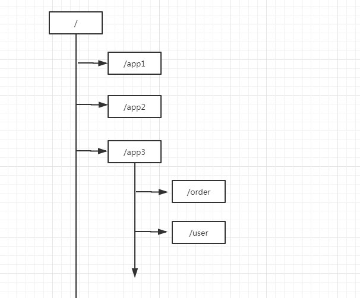
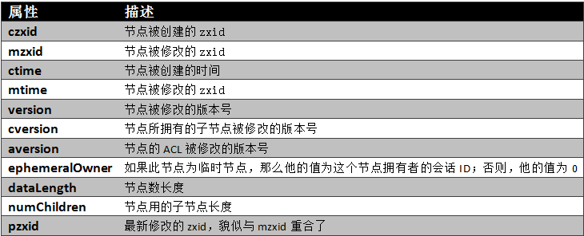
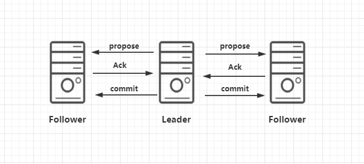

# 分布式服务协调-Zookeeper

[Zookeeper官网](https://archive.apache.org/)

## 什么是Zookeeper

​	zookeeper 是一个开源的分布式协调服务，由雅虎公司创建，是 google chubby 的开源实现。zookeeper 的设计目标是将哪些复杂且容易出错的分布式一致性服务封装起来，构成一个高效可靠的原语集（由若干条指令组成的，完成一定功能的一个过程），并且以一些列简单易用的接口提供给用户使用。

### Zookeeper数据结构

> Zookeeper数据结构图



> 数据结构特点

* zookeeper中的节点称为：znode
* 相同路径下节点唯一
* 节点Znode可以包含数据和子节点（但是EPHEMERAL类型的节点不能有子节点）
* Znode有两种类型：临时节点、持久节点
* 临时节点通过create -e 创建,临时节点在客户端断开一定时间后，会自动删除
* 持久节点通过create -s 创建 默认创建持久节点

## Zookeeper的安装部署

zookeeper服务命令

* sh zkServer.sh start 启动
* sh zkServer.sh status 查看状态
* sh zkServer.sh stop  停止
* sh zkServer.sh restart 重启
* sh zkCli.sh -timeout 0 -r -server ip:port  启动zk客户端

> Zookeeper下载

[Zookeeper下载地址](https://archive.apache.org/dist/zookeeper/zookeeper-3.4.10/zookeeper-3.4.10.tar.gz)

> 解压启动

```shell
tar -xvf zookeeper-3.4.10.tar.gz
mv zookeeper-3.4.10 /usr/local
cd /usr/local/zookeeper-3.4.10/conf
cp zoo_simple.cxf zoo.cxf
cd ../bin
sh zkServer.sh start #启动zookeepr
sh zkCli.sh #启动zookeeper客户端
```

> 连接Zookeeper客户端

```shell
[zk: localhost:2181(CONNECTED) 0] help
ZooKeeper -server host:port cmd args
        stat path [watch]
        set path data [version]
        ls path [watch]
        delquota [-n|-b] path
        ls2 path [watch]
        setAcl path acl
        setquota -n|-b val path
        history 
        redo cmdno
        printwatches on|off
        delete path [version]
        sync path
        listquota path
        rmr path
        get path [watch]
        create [-s] [-e] path data acl
        addauth scheme auth
        quit 
        getAcl path
        close 
        connect host:port
[zk: localhost:2181(CONNECTED) 1] 
```

### zookeeper集群配置

​	略，电脑不行不能搭建集群环境。

每个zookeeper的zoo.cxf配置文件中需要添加配置文件,集群建议最少3个节点，Follwer从节点

leader主节点,启动第一个节点时，报错，如果启动第二个节点还报错，可能是防火墙没有关闭。

observe观察者，只同步数据，不参与选举，

```cxf
#server.id=ip:port:port
server.1=192.168.10.11:2888:3888
server.2=192.168.10.12:2888:3888
server.3=192.168.10.13:2888:3888
server.4=192.168.10.14:2888:3888:observe ## 设置节点为观察者
```

> server.A=B：C：D：其 中

* A 是一个数字，表示这个是第几号服务器；
* B 是这个服务器的 ip 地址；
* C 表示的是这个服务器与集群中的 Leader
  服务器交换信息的端口；
* D 表示的是万一集群中的 Leader 服务器挂了，需要一个端口来重新进行选举，选出一个新的 Leader，而这个端口就是用来执行选举时服务器相互通信的端口。

​	如果是伪集群的配置方式，由于 B 都是一样，所以不同的 Zookeeper 实例通信端口号不能一样，所以要给它们分配不同的端口号。

在dataDir目录下创建myid文件，并且把ip对于的server.id的id值，写入到myid文件中

例如：192.168.10.11 的myid

```
1
```

192.168.10.13 的myid

```
3
```

> zookeeper端口说明

* 2181：对客户端提供服务
* 2888：集群内节点通讯使用(选举Leader监听次端口)
* 3888：选举leader使用

### Zookeeper节点状态

ZK Service：服务器集群

> Leader 服务器是整个 zookeeper 集群的核心，主要的工作任务有两项

1. 事物请求的唯一调度和处理者，保证集群事物处理的顺
    序性
2. 集群内部各服务器的调度者

> Follower 角色的主要职责是

1. 处理客户端非事物请求、转发事物请求给 leader 服务器
2. 参与事物请求 Proposal 的投票（需要半数以上服务器
    通过才能通知 leader commit 数据; Leader 发起的提案，
    要求 Follower 投票）
3. 参与 Leader 选举的投票

> Observer角色的主要职责是为了提供读取速度

 	1. 接收客户端的请求，将写请求转发给Leader，
 	2. Observe不参与投票，只同步leader状态，
 	3. 目的是为了提高读取速度

## Zookeeper常用的命令

> 创建节点

```shell
[zk: localhost:2181(CONNECTED) 0] create /order-service 0
Created /order-service
[zk: localhost:2181(CONNECTED) 1] create /order-service/wsdl 1
Created /order-service/wsdl
```

* 同级节点的唯一性
* create -e 创建临时节点
* 有序节点和无序节点
* 临时节点和持久节点(在客户端建立的时候)
* 临时节点下不能有子节点
* 节点存在父子关系，有先后，如果需要删除父节点，那么必须把该节点下的子节点删除完后，才能删除该节点

> 获取节点值

```shell
[zk: localhost:2181(CONNECTED) 0] get /order-service/wsdl
1
cZxid = 0x9
ctime = Mon Dec 31 23:32:06 CST 2018
mZxid = 0x9
mtime = Mon Dec 31 23:32:06 CST 2018
pZxid = 0x9
cversion = 0
dataVersion = 0
aclVersion = 0
ephemeralOwner = 0x0
dataLength = 1
numChildren = 0
```

* cZxid: 是节点的创建时间所对应的Zxid格式时间戳
* mZxid:是节点的修改时间所对应的Zxid格式时间戳
* pZxid: 
* cversion:  子节点版本号
* dataVersion: 节点数据版本号
* aclVersion: 节点所拥有的ACL版本号(ACL权限控制CREATE、DELETE、READ、WRITE、ADMIN)



> 删除节点

```shell
[zk: localhost:2181(CONNECTED) 3] delete /order-service
Node not empty: /order-service
[zk: localhost:2181(CONNECTED) 4] delete /order-service/wsdl
[zk: localhost:2181(CONNECTED) 5] 
```

* 删除的节点必须不包含子节点，不然删除失败: Node not empty
* 删除成功后，是没有任何提示的《no news is good news》

> 查看目录下的所有节点ls dir

```shell
[zk: localhost:2181(CONNECTED) 0] ls /
[order-service, zookeeper]
```


## Zookeeper配置解读

### zoo.cfg

​	zookeeper解压后在conf目录下只存在zoo_simple.cfg文件，需要把执行: cp zoo_simple.cfg zoo.cfg

​	zoo.cfg 是zookeeper的配置文件

#### dataDir

dataDir配置了zookeeper数据的存在位置，在该目录下存在版本号文件,集群的myid存放位置，不推荐放在/tmp/zookeeper临时目录中，推荐放入到高速磁盘中，提供访问速度.


	#### tickTime

时间单位: 默认2秒

#### initLimit

初始化时间: 默认10个tickTime

#### syncLimit

同步时间:默认5个tickTime

#### cliendPort

zk客户端的端口，默认是2181


#### 集群配置

```:portugal:
#server.id=ip:port:port
server.1=192.168.10.11:2888:3888
server.2=192.168.10.12:2888:3888
server.3=192.168.10.13:2888:3888
```

参考《zookeeper的安装部署->zookeeper集群配置章节》


## Zookeeper应用场景

[参考文章《[【分布式】Zookeeper应用场景](https://www.cnblogs.com/leesf456/p/6036548.html)》](https://www.cnblogs.com/leesf456/p/6036548.html)


### 数据发布、订阅

### 负载均衡

### 命名服务

### 分布式协调/通知

### 集群管理

### Master选举

### 分布式锁

### 分布式队列

### 注册中心


## Zookeeper设计猜想

1. 防止单点故障（集群方案leader，follwer），还能分担请求
2. 数据的一致性(每个节点的数据保持一致性)

## ZAB 协议

​	ZAB（Zookeeper Atomic Broadcast） 协议是为分布式协调服务 ZooKeeper 专门设计的一种支持崩溃恢复的原子广播协议。在 ZooKeeper 中，主要依赖 ZAB 协议来实现分布式数据一致性，基于该协议，ZooKeeper 实现了一种主备模式的系统架构来保持集群中各个副本之间的数据一致性。

### zab 协议介绍 

ZAB 协议包含两种基本模式，分别是

1. 崩溃恢复

   ​	当整个集群在启动时，或者当 leader 节点出现网络中断、崩溃等情况时，ZAB 协议就会进入恢复模式并选举产生新的 Leader，当 leader 服务器选举出来后，并且集群中有过半的机器和该 leader 节点完成数据同步后（同步指的是数据同步，用来保证集群中过半的机器能够和 leader 服务器的数据状态保持一致），ZAB 协议就会退出恢复模式。

2. 原子广播

  ​	当集群中已经有过半的 Follower 节点完成了和 Leader 状态同步以后，那么整个集群就进入了消息广播模式。这个时候，在 Leader 节点正常工作时，启动一台新的服务器加入到集群，那这个服务器会直接进入数据恢复模式，和leader 节点进行数据同步。同步完成后即可正常对外提供非事务请求的处理。

### 消息广播的实现原理 

> 简化版本的二阶段提交过程

1. leader 接收到消息请求后，将消息赋予一个全局唯一的64 位自增 id，叫：zxid，通过 zxid 的大小比较既可以实现因果有序这个特征

2. leader 为每个 follower 准备了一个 FIFO 队列（通过 TCP协议来实现，以实现了全局有序这一个特点）将带有 zxid的消息作为一个提案（proposal）分发给所有的follower

3. 当 follower 接收到 proposal，先把 proposal 写到磁盘，写入成功以后再向 leader 回复一个 ack

4. 当 leader 接收到合法数量（超过半数节点）的 ACK 后，leader 就会向这些 follower 发送 commit 命令，同时会在本地执行该消息

5. 当 followe收到消息的 commit 命令以后，会提交该消息

  

  	**leader 的投票过程，不需要 Observer 的 ack，也就是Observer 不需要参与投票过程，但是 Observer 必须要同步 Leader 的数据从而在处理请求的时候保证数据的一致性**


## Zookeeper的Leader选举

#### Leader选举源码分析

> 入口类QuorumPeerMain

**判断是否是集群模式**

```java
public static void main(String[] args) {
    QuorumPeerMain main = new QuorumPeerMain();
    try {
        main.initializeAndRun(args);
    } catch (Exception e) {
        // ...
    }
    LOG.info("Exiting normally");
    System.exit(ExitCode.EXECUTION_FINISHED.getValue());
}

 protected void initializeAndRun(String[] args)
     throws ConfigException, IOException, AdminServerException
    {
        QuorumPeerConfig config = new QuorumPeerConfig();
        if (args.length == 1) {
            config.parse(args[0]);
        }

        // Start and schedule the the purge task
        DatadirCleanupManager purgeMgr = new DatadirCleanupManager(config
                .getDataDir(), config.getDataLogDir(), config
                .getSnapRetainCount(), config.getPurgeInterval());
        purgeMgr.start();
        //判断zk是standalone模式还是集群模式
        if (args.length == 1 && config.isDistributed()) {
            runFromConfig(config);
        } else {
            LOG.warn("Either no config or no quorum defined in config, running "
                    + " in standalone mode");
            // there is only server in the quorum -- run as standalone
            ZooKeeperServerMain.main(args);
        }
    }


```

runFromConfig(config)方法

```java
 // 判断客户端server的端口是否为空
if (config.getClientPortAddress() != null) {
    cnxnFactory = ServerCnxnFactory.createFactory();
    cnxnFactory.configure(config.getClientPortAddress(),
                          config.getMaxClientCnxns(),
                          false);
}
//设置各种参数，从zoo.cfg等

//QuorumPeerMain的成员变量quorumPeer
QuorumPeer quorumPeer = getQuorumPeer();
quorumPeer.setRootMetricsContext(metricsProvider.getRootContext());
quorumPeer.setTxnFactory(new FileTxnSnapLog(
    config.getDataLogDir(),
    config.getDataDir()));
quorumPeer.enableLocalSessions(config.areLocalSessionsEnabled());
quorumPeer.enableLocalSessionsUpgrading(
    config.isLocalSessionsUpgradingEnabled());
//quorumPeer.setQuorumPeers(config.getAllMembers());
quorumPeer.setElectionType(config.getElectionAlg());
quorumPeer.setMyid(config.getServerId());
quorumPeer.setTickTime(config.getTickTime());
quorumPeer.setMinSessionTimeout(config.getMinSessionTimeout());
quorumPeer.setMaxSessionTimeout(config.getMaxSessionTimeout());
//初始化时间
quorumPeer.setInitLimit(config.getInitLimit());
//同步时间，单位是tickTime
quorumPeer.setSyncLimit(config.getSyncLimit());
quorumPeer.setObserverMasterPort(config.getObserverMasterPort());
quorumPeer.setConfigFileName(config.getConfigFilename());
//QuorumPeer是一个线程，启动线程
quorumPeer.start();
quorumPeer.join();
```

QuorumPeer.start()方法

```java
@Override
public synchronized void start() {
    if (!getView().containsKey(myid)) {
        throw new RuntimeException("My id " + myid + " not in the peer list");
    }
    //恢复database
    loadDataBase();
    startServerCnxnFactory();
    try {
        adminServer.start();
    } catch (AdminServerException e) {
        LOG.warn("Problem starting AdminServer", e);
        System.out.println(e);
    }
    //初始化选举方法
    startLeaderElection();
    super.start();
}
```

QuorumPeer.loadDataBase()方法

```java
 private void loadDataBase() {
        try {
            zkDb.loadDataBase();

            // load the epochs
            //从数据树中加载zxid
            long lastProcessedZxid = zkDb.getDataTree().lastProcessedZxid;
            //通过zxid来获取epochs
            long epochOfZxid = ZxidUtils.getEpochFromZxid(lastProcessedZxid);
            try {
                //从文件中读取currtEpoch
                currentEpoch = readLongFromFile(CURRENT_EPOCH_FILENAME);
            } catch(FileNotFoundException e) {
            	// pick a reasonable epoch number
            	// this should only happen once when moving to a
            	// new code version
            	currentEpoch = epochOfZxid;
            	LOG.info(CURRENT_EPOCH_FILENAME
            	        + " not found! Creating with a reasonable default of {}. This should only happen when you are upgrading your installation",
            	        currentEpoch);
            	writeLongToFile(CURRENT_EPOCH_FILENAME, currentEpoch);
            }
            if (epochOfZxid > currentEpoch) {
                throw new IOException("The current epoch, " + ZxidUtils.zxidToString(currentEpoch) + ", is older than the last zxid, " + lastProcessedZxid);
            }
            try {
                acceptedEpoch = readLongFromFile(ACCEPTED_EPOCH_FILENAME);
            } catch(FileNotFoundException e) {
            	// pick a reasonable epoch number
            	// this should only happen once when moving to a
            	// new code version
            	acceptedEpoch = epochOfZxid;
            	LOG.info(ACCEPTED_EPOCH_FILENAME
            	        + " not found! Creating with a reasonable default of {}. This should only happen when you are upgrading your installation",
            	        acceptedEpoch);
            	writeLongToFile(ACCEPTED_EPOCH_FILENAME, acceptedEpoch);
            }
            if (acceptedEpoch < currentEpoch) {
                throw new IOException("The accepted epoch, " + ZxidUtils.zxidToString(acceptedEpoch) + " is less than the current epoch, " + ZxidUtils.zxidToString(currentEpoch));
            }
        } catch(IOException ie) {
            LOG.error("Unable to load database on disk", ie);
            throw new RuntimeException("Unable to run quorum server ", ie);
        }
    }
```

QuorumPeer.startLeaderElection()方法

```java
synchronized public void startLeaderElection() {
    try {
        //如果当前节点的状态是LOOKING则投票给自己
        if (getPeerState() == ServerState.LOOKING) {
            currentVote = new Vote(myid, getLastLoggedZxid(), getCurrentEpoch());
        }
    } catch(IOException e) {
        RuntimeException re = new RuntimeException(e.getMessage());
        re.setStackTrace(e.getStackTrace());
        throw re;
    }
	//根据配置获取选举算法,可以通过zoo.cfg里面进行配置，默认是fast选举
    this.electionAlg = createElectionAlgorithm(electionType);
}
```

QuorumPeer.createElectionAlgorithm()方法

```java
 protected Election createElectionAlgorithm(int electionAlgorithm){
        Election le=null;

        //TODO: use a factory rather than a switch
        switch (electionAlgorithm) {
        case 1:
            le = new AuthFastLeaderElection(this);
            break;
        case 2:
            le = new AuthFastLeaderElection(this, true);
            break;
        case 3:
            //Leader选举负责类
            QuorumCnxManager qcm = createCnxnManager();
            QuorumCnxManager oldQcm = qcmRef.getAndSet(qcm);
            if (oldQcm != null) {
                LOG.warn("Clobbering already-set QuorumCnxManager (restarting leader election?)");
                oldQcm.halt();
            }
            QuorumCnxManager.Listener listener = qcm.listener;
            if(listener != null){
                //启动已经绑定的选举端口线程，等待集群中其他机器链接
                listener.start();
                //基于TCP的选举算法
                FastLeaderElection fle = new FastLeaderElection(this, qcm);
                fle.start();
                le = fle;
            } else {
                LOG.error("Null listener when initializing cnx manager");
            }
            break;
        default:
            assert false;
        }
        return le;
    }
```

FastLeaderElection

```java
  public FastLeaderElection(QuorumPeer self, QuorumCnxManager manager){
        this.stop = false;
        this.manager = manager;
        starter(self, manager);
    }
	/**
	*    wsThread、wrThread初始化，这里面有两个内部类，一个是 WorkerSender，一个是
	* WorkerReceiver，负责发送投票信息和接收投票信息
	*/
    private void starter(QuorumPeer self, QuorumCnxManager manager) {
        this.self = self;
        proposedLeader = -1;
        proposedZxid = -1;
		//业务层发送队列,ToSend
        sendqueue = new LinkedBlockingQueue<ToSend>();
        //业务层接受队列,Notification
        recvqueue = new LinkedBlockingQueue<Notification>();
        this.messenger = new Messenger(manager);
    }
    //启动QuorumCnxManager
    public void start() {
        this.messenger.start();
    }
	//启动负责接收和发送的业务线程
    void start(){
        // 启动业务层发送线程，将消息发送给IO负责类QuorumCnxManager
        this.wsThread.start();
        // 启动业务层接收线程，从IO负责类QuorumCnxManager接收消息
        this.wrThread.start();
    }
```

​	接下来调用 fle.start() , 也就是会调用 FastLeaderElectionstart()方法，该方法主要是对发送线程和接收线程的初始化 ，左边是 FastLeaderElection 的 start ， 右 边 是messager.start()


QuorumPeer.start()方法中调用了super.start()方法

```java
@Override
    public void run() {
        updateThreadName();

        LOG.debug("Starting quorum peer");
        try {
            // 启动JMX监听某些属性
            jmxQuorumBean = new QuorumBean(this);
            MBeanRegistry.getInstance().register(jmxQuorumBean, null);
            for(QuorumServer s: getView().values()){
                ZKMBeanInfo p;
                if (getId() == s.id) {
                    p = jmxLocalPeerBean = new LocalPeerBean(this);
                    try {
                        MBeanRegistry.getInstance().register(p, jmxQuorumBean);
                    } catch (Exception e) {
                        LOG.warn("Failed to register with JMX", e);
                        jmxLocalPeerBean = null;
                    }
                } else {
                    RemotePeerBean rBean = new RemotePeerBean(this, s);
                    try {
                        MBeanRegistry.getInstance().register(rBean, jmxQuorumBean);
                        jmxRemotePeerBean.put(s.id, rBean);
                    } catch (Exception e) {
                        LOG.warn("Failed to register with JMX", e);
                    }
                }
            }
        } catch (Exception e) {
            LOG.warn("Failed to register with JMX", e);
            jmxQuorumBean = null;
        }

        try {
            /*
             * Main loop
             */
            while (running) {
                //判断当前节点的状态
                switch (getPeerState()) {
                        //如果是LOOKING进入选举流程
                case LOOKING:
                    LOG.info("LOOKING");
                    ServerMetrics.LOOKING_COUNT.add(1);

                    if (Boolean.getBoolean("readonlymode.enabled")) {
                        LOG.info("Attempting to start ReadOnlyZooKeeperServer");

                        // Create read-only server but don't start it immediately
                        final ReadOnlyZooKeeperServer roZk =
                            new ReadOnlyZooKeeperServer(logFactory, this, this.zkDb);
    
                        // Instead of starting roZk immediately, wait some grace
                        // period before we decide we're partitioned.
                        //
                        // Thread is used here because otherwise it would require
                        // changes in each of election strategy classes which is
                        // unnecessary code coupling.
                        Thread roZkMgr = new Thread() {
                            public void run() {
                                try {
                                    // lower-bound grace period to 2 secs
                                    sleep(Math.max(2000, tickTime));
                                    if (ServerState.LOOKING.equals(getPeerState())) {
                                        roZk.startup();
                                    }
                                } catch (InterruptedException e) {
                                    LOG.info("Interrupted while attempting to start ReadOnlyZooKeeperServer, not started");
                                } catch (Exception e) {
                                    LOG.error("FAILED to start ReadOnlyZooKeeperServer", e);
                                }
                            }
                        };
                        try {
                            roZkMgr.start();
                            reconfigFlagClear();
                            if (shuttingDownLE) {
                                shuttingDownLE = false;
                                startLeaderElection();
                            }
                            setCurrentVote(makeLEStrategy().lookForLeader());
                        } catch (Exception e) {
                            LOG.warn("Unexpected exception", e);
                            setPeerState(ServerState.LOOKING);
                        } finally {
                            // If the thread is in the the grace period, interrupt
                            // to come out of waiting.
                            roZkMgr.interrupt();
                            roZk.shutdown();
                        }
                    } else {
                        try {
                           reconfigFlagClear();
                            if (shuttingDownLE) {
                               shuttingDownLE = false;
                               startLeaderElection();
                               }
                            //此处通过策略模式决定用哪个选举策略。
                            setCurrentVote(makeLEStrategy().lookForLeader());
                        } catch (Exception e) {
                            LOG.warn("Unexpected exception", e);
                            setPeerState(ServerState.LOOKING);
                        }                        
                    }
                    break;
                case OBSERVING:
                    try {
                        LOG.info("OBSERVING");
                        setObserver(makeObserver(logFactory));
                        observer.observeLeader();
                    } catch (Exception e) {
                        LOG.warn("Unexpected exception",e );
                    } finally {
                        observer.shutdown();
                        setObserver(null);
                        updateServerState();

                        // Add delay jitter before we switch to LOOKING
                        // state to reduce the load of ObserverMaster
                        if (isRunning()) {
                            Observer.waitForReconnectDelay();
                        }
                    }
                    break;
                case FOLLOWING:
                    try {
                       LOG.info("FOLLOWING");
                        setFollower(makeFollower(logFactory));
                        follower.followLeader();
                    } catch (Exception e) {
                       LOG.warn("Unexpected exception",e);
                    } finally {
                       follower.shutdown();
                       setFollower(null);
                       updateServerState();
                    }
                    break;
                case LEADING:
                    LOG.info("LEADING");
                    try {
                        setLeader(makeLeader(logFactory));
                        leader.lead();
                        setLeader(null);
                    } catch (Exception e) {
                        LOG.warn("Unexpected exception",e);
                    } finally {
                        if (leader != null) {
                            leader.shutdown("Forcing shutdown");
                            setLeader(null);
                        }
                        updateServerState();
                    }
                    break;
                }
                start_fle = Time.currentElapsedTime();
            }
        } finally {
            LOG.warn("QuorumPeer main thread exited");
            MBeanRegistry instance = MBeanRegistry.getInstance();
            instance.unregister(jmxQuorumBean);
            instance.unregister(jmxLocalPeerBean);

            for (RemotePeerBean remotePeerBean : jmxRemotePeerBean.values()) {
                instance.unregister(remotePeerBean);
            }

            jmxQuorumBean = null;
            jmxLocalPeerBean = null;
            jmxRemotePeerBean = null;
        }
    }

```

lookForLeader()方法

```java
public Vote lookForLeader() throws InterruptedException {
        try {
            self.jmxLeaderElectionBean = new LeaderElectionBean();
            MBeanRegistry.getInstance().register(
                    self.jmxLeaderElectionBean, self.jmxLocalPeerBean);
        } catch (Exception e) {
            LOG.warn("Failed to register with JMX", e);
            self.jmxLeaderElectionBean = null;
        }
        if (self.start_fle == 0) {
           self.start_fle = Time.currentElapsedTime();
        }
        try {
            //收到的投票
            Map<Long, Vote> recvset = new HashMap<Long, Vote>();
			//存储选举结果
            Map<Long, Vote> outofelection = new HashMap<Long, Vote>();

            int notTimeout = finalizeWait;

            synchronized(this){
                //增加逻辑时钟
                logicalclock.incrementAndGet();
                //更新自己的zxid和epoch
                updateProposal(getInitId(), getInitLastLoggedZxid(), getPeerEpoch());
            }

            LOG.info("New election. My id =  " + self.getId() +
                    ", proposed zxid=0x" + Long.toHexString(proposedZxid));
            //发送投票，包括自己
            sendNotifications();

            SyncedLearnerTracker voteSet;

            /*
             * Loop in which we exchange notifications until we find a leader
             */

            while ((self.getPeerState() == ServerState.LOOKING) &&
                    (!stop)){
                //循环选举，直到选举出leader
                /*
                 * Remove next notification from queue, times out after 2 times
                 * the termination time
                 */
                // 从IO线程中拿到投票信息，自己的投票也在这里处理
                Notification n = recvqueue.poll(notTimeout,
                        TimeUnit.MILLISECONDS);

                /*
                 * Sends more notifications if haven't received enough.
                 * Otherwise processes new notification.
                 */
                // 如果消息为空的情况下，消息发完了，继续发送，一直到选出leader为止
                if(n == null){
                    if(manager.haveDelivered()){
                        sendNotifications();
                    } else {
                        // 消息还没有发送出去，可能其他service还未启动，尝试重连
                        manager.connectAll();
                    }

                    /*
                     * Exponential backoff
                     */
                    // 延长等待时间
                    int tmpTimeOut = notTimeout*2;
                    notTimeout = (tmpTimeOut < maxNotificationInterval?
                            tmpTimeOut : maxNotificationInterval);
                    LOG.info("Notification time out: " + notTimeout);
                }
                // 收到投票消息，判断投票消息是否属于该集群
                else if (validVoter(n.sid) && validVoter(n.leader)) {
                    /*
                     * Only proceed if the vote comes from a replica in the current or next
                     * voting view for a replica in the current or next voting view.
                     */
                    // 判断收到消息节点的状态
                    switch (n.state) {
                    case LOOKING:
                        if (getInitLastLoggedZxid() == -1) {
                            LOG.debug("Ignoring notification as our zxid is -1");
                            break;
                        }
                        if (n.zxid == -1) {
                            LOG.debug("Ignoring notification from member with -1 zxid" + n.sid);
                            break;
                        }
                        // If notification > current, replace and send messages out
                        // 判断接收到的节点epoch > logicalclock,则表示当前是新一轮的选举
                        if (n.electionEpoch > logicalclock.get()) {
                            logicalclock.set(n.electionEpoch);
                            // 新一轮的选举，清空接收队列
                            recvset.clear();
                            // 检查收到的这个消息是否能胜出，一次比较epoch、zxid、myid
                            if(totalOrderPredicate(n.leader, n.zxid, n.peerEpoch,
                                    getInitId(), getInitLastLoggedZxid(), getPeerEpoch())) {			  // 选举胜出后，把票据改为对方的票据
                                updateProposal(n.leader, n.zxid, n.peerEpoch);
                            } else {
                                //否则，票据不变
                                updateProposal(getInitId(),
                                        getInitLastLoggedZxid(),
                                        getPeerEpoch());
                            }
                            sendNotifications();
                        } else if (n.electionEpoch < logicalclock.get()) {
                            if(LOG.isDebugEnabled()){
                                LOG.debug("Notification election epoch is smaller than logicalclock. n.electionEpoch = 0x"
                                        + Long.toHexString(n.electionEpoch)
                                        + ", logicalclock=0x" + Long.toHexString(logicalclock.get()));
                            }
                            break;
                        } else if (totalOrderPredicate(n.leader, n.zxid, n.peerEpoch,
                                proposedLeader, proposedZxid, proposedEpoch)) {
                            updateProposal(n.leader, n.zxid, n.peerEpoch);
                            sendNotifications();
                        }

                        if(LOG.isDebugEnabled()){
                            LOG.debug("Adding vote: from=" + n.sid +
                                    ", proposed leader=" + n.leader +
                                    ", proposed zxid=0x" + Long.toHexString(n.zxid) +
                                    ", proposed election epoch=0x" + Long.toHexString(n.electionEpoch));
                        }

                        // don't care about the version if it's in LOOKING state
                        recvset.put(n.sid, new Vote(n.leader, n.zxid, n.electionEpoch, n.peerEpoch));

                        voteSet = getVoteTracker(
                                recvset, new Vote(proposedLeader, proposedZxid,
                                        logicalclock.get(), proposedEpoch));

                        if (voteSet.hasAllQuorums()) {

                            // Verify if there is any change in the proposed leader
                            while((n = recvqueue.poll(finalizeWait,
                                    TimeUnit.MILLISECONDS)) != null){
                                if(totalOrderPredicate(n.leader, n.zxid, n.peerEpoch,
                                        proposedLeader, proposedZxid, proposedEpoch)){
                                    recvqueue.put(n);
                                    break;
                                }
                            }

                            /*
                             * This predicate is true once we don't read any new
                             * relevant message from the reception queue
                             */
                            if (n == null) {
                                setPeerState(proposedLeader, voteSet);
                                Vote endVote = new Vote(proposedLeader,
                                        proposedZxid, logicalclock.get(), 
                                        proposedEpoch);
                                leaveInstance(endVote);
                                return endVote;
                            }
                        }
                        break;
                    case OBSERVING:
                        LOG.debug("Notification from observer: " + n.sid);
                        break;
                    case FOLLOWING:
                    case LEADING:
                        /*
                         * Consider all notifications from the same epoch
                         * together.
                         */
                        if(n.electionEpoch == logicalclock.get()){
                            recvset.put(n.sid, new Vote(n.leader, n.zxid, n.electionEpoch, n.peerEpoch));
                            voteSet = getVoteTracker(recvset, new Vote(n.version, 
                                      n.leader, n.zxid, n.electionEpoch, n.peerEpoch, n.state));
                            if (voteSet.hasAllQuorums() && 
                                    checkLeader(outofelection, n.leader, n.electionEpoch)) {
                                setPeerState(n.leader, voteSet);
                                Vote endVote = new Vote(n.leader, 
                                        n.zxid, n.electionEpoch, n.peerEpoch);
                                leaveInstance(endVote);
                                return endVote;
                            }
                        }

                        /*
                         * Before joining an established ensemble, verify that
                         * a majority are following the same leader.
                         */
                        outofelection.put(n.sid, new Vote(n.version, n.leader,
                                n.zxid, n.electionEpoch, n.peerEpoch, n.state));
                        voteSet = getVoteTracker(outofelection, new Vote(n.version, 
                                n.leader, n.zxid, n.electionEpoch, n.peerEpoch, n.state));

                        if (voteSet.hasAllQuorums() &&
                                checkLeader(outofelection, n.leader, n.electionEpoch)) {
                            synchronized(this){
                                logicalclock.set(n.electionEpoch);
                                setPeerState(n.leader, voteSet);
                            }
                            Vote endVote = new Vote(n.leader, n.zxid, 
                                    n.electionEpoch, n.peerEpoch);
                            leaveInstance(endVote);
                            return endVote;
                        }
                        break;
                    default:
                        LOG.warn("Notification state unrecoginized: " + n.state
                              + " (n.state), " + n.sid + " (n.sid)");
                        break;
                    }
                } else {
                    if (!validVoter(n.leader)) {
                        LOG.warn("Ignoring notification for non-cluster member sid {} from sid {}", n.leader, n.sid);
                    }
                    if (!validVoter(n.sid)) {
                        LOG.warn("Ignoring notification for sid {} from non-quorum member sid {}", n.leader, n.sid);
                    }
                }
            }
            return null;
        } finally {
            try {
                if(self.jmxLeaderElectionBean != null){
                    MBeanRegistry.getInstance().unregister(
                            self.jmxLeaderElectionBean);
                }
            } catch (Exception e) {
                LOG.warn("Failed to unregister with JMX", e);
            }
            self.jmxLeaderElectionBean = null;
            LOG.debug("Number of connection processing threads: {}",
                    manager.getConnectionThreadCount());
        }
    }
```

org.apache.zookeeper.server.quorum.FastLeaderElection#totalOrderPredicate

```java
protected boolean totalOrderPredicate(long newId, long newZxid, long newEpoch, long curId, long curZxid, long curEpoch) {
        LOG.debug("id: " + newId + ", proposed id: " + curId + ", zxid: 0x" +
                Long.toHexString(newZxid) + ", proposed zxid: 0x" + Long.toHexString(curZxid));
        if(self.getQuorumVerifier().getWeight(newId) == 0){
            return false;
        }

        /*
         * We return true if one of the following three cases hold:
         * 1- New epoch is higher
         * 2- New epoch is the same as current epoch, but new zxid is higher
         * 3- New epoch is the same as current epoch, new zxid is the same
         *  as current zxid, but server id is higher.
         */
		//1. 消息中的epoch比当前的大，则消息中id对应的服务器就是leader
    	//2. 如果epoch相等，如果zxid大，则消息中id对应的服务器就是leader
     	//3. 如果epoch和zxid都相等，比较服务器id，服务器id大的就是leader
        return ((newEpoch > curEpoch) ||
                ((newEpoch == curEpoch) &&
                ((newZxid > curZxid) || ((newZxid == curZxid) && (newId > curId)))));
    }

```


