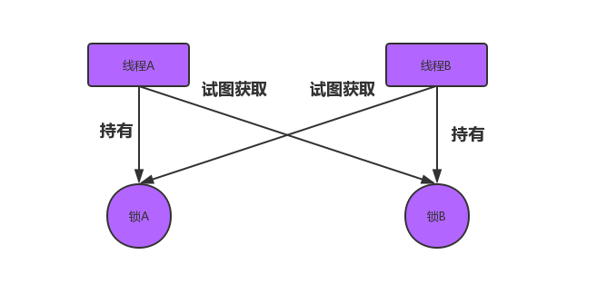

# 并发编程之死锁

## 什么是死锁

​	死锁是指两个或两个以上线程在执行过程中，因争夺资源而造成的一种相互等待的现象，若无外力干涉它们都将无法推进下去，如果系统资源充足，进程的资源请求都能够得到满足，死锁出现的可能性就很低，否则就会因为争夺资源而陷入死锁

​	

## 产生死锁的四个必要条件

1. 互斥条件: 进程对所分配到的资源不允许其他进程访问，若其他进程访问该资源，只能等待，直至占有该资源的进程使用完成后释放该资源
2. 请求核保持条件: 进程获得一定的资源后，又对其他资源发出请求，但是该资源可能被其他进程占有，此时请求阻塞，但又对自己获取的资源保持不放
3. 不可剥夺条件: 指进程已获得的资源，在未使用完成前，不可被剥夺，只能在使用完成后自己释放。
4. 环路等待条件: 是指进程发生死锁后，必然存在一个进程、资源之间的环形链

## 死锁的检查

> jps -l 查看java进程以及java进程主程序的全路径包名

> jstack pid查看java线程信息

## 如何避免死锁

破坏死锁产生的四个条件

