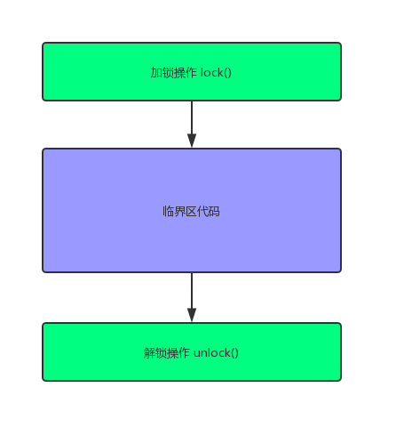
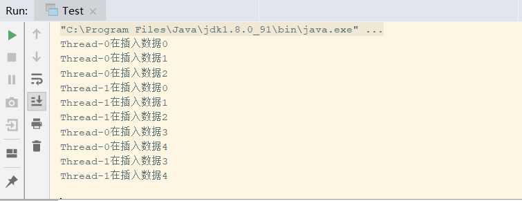
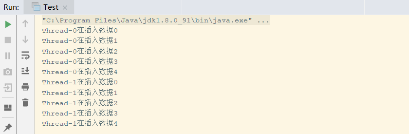

# 05-锁模型


​	在并发编程过程中，对共享资源的保护，我们最常用的方法就是加锁，最简单的锁模型就是下图： 加锁-> 临界区代码->解锁，在java中很很多种类的锁。

​	最简单的synchronized，以及java.util.concurrent.locks包下的各种锁。



## synchronized

​		在了解synchronized关键字的使用方法之前，我们先来看一个概念：互斥锁，顾名思义：能到达到互斥访问目的的锁。

　　举个简单的例子：如果对临界资源加上互斥锁，当一个线程在访问该临界资源时，其他线程便只能等待。

　　在Java中，每一个对象都拥有一个锁标记（monitor），也称为监视器，多线程同时访问某个对象时，线程只有获取了该对象的锁才能访问。

　　在Java中，可以使用synchronized关键字来标记一个方法或者代码块，当某个线程调用该对象的synchronized方法或者访问synchronized代码块时，这个线程便获得了该对象的锁，其他线程暂时无法访问这个方法，只有等待这个方法执行完毕或者代码块执行完毕，这个线程才会释放该对象的锁，其他线程才能执行这个方法或者代码块。

　　下面通过几个简单的例子来说明synchronized关键字的使用：

### synchronized方法

　　下面这段代码中两个线程分别调用insertData对象插入数据：

```java
public class Test {
 
    public static void main(String[] args)  {
        final InsertData insertData = new InsertData();
         
        new Thread() {
            public void run() {
                insertData.insert(Thread.currentThread());
            };
        }.start();
         
         
        new Thread() {
            public void run() {
                insertData.insert(Thread.currentThread());
            };
        }.start();
    }  
}
 
class InsertData {
    private ArrayList<Integer> arrayList = new ArrayList<Integer>();
     
    public void insert(Thread thread){
        for(int i=0;i<5;i++){
            System.out.println(thread.getName()+"在插入数据"+i);
            arrayList.add(i);
        }
    }
}
```



==**对insert方法加synchronized后**==



从上输出结果说明，Thread-1插入数据是等Thread-0插入完数据之后才进行的。说明Thread-0和Thread-1是顺序执行insert方法的。

　　这就是synchronized方法。

　　不过有几点需要注意：

　　1）当一个线程正在访问一个对象的synchronized方法，那么其他线程不能访问该对象的其他synchronized方法。这个原因很简单，因为一个对象只有一把锁，当一个线程获取了该对象的锁之后，其他线程无法获取该对象的锁，所以无法访问该对象的其他synchronized方法。

　　2）当一个线程正在访问一个对象的synchronized方法，那么其他线程能访问该对象的非synchronized方法。这个原因很简单，访问非synchronized方法不需要获得该对象的锁，假如一个方法没用synchronized关键字修饰，说明它不会使用到临界资源，那么其他线程是可以访问这个方法的，

　　3）如果一个线程A需要访问对象object1的synchronized方法fun1，另外一个线程B需要访问对象object2的synchronized方法fun1，即使object1和object2是同一类型），也不会产生线程安全问题，因为他们访问的是不同的对象，所以不存在互斥问题。


### synchronized代码块


https://www.cnblogs.com/dolphin0520/p/3923737.html


https://www.cnblogs.com/zhimingyang/p/5702752.html


