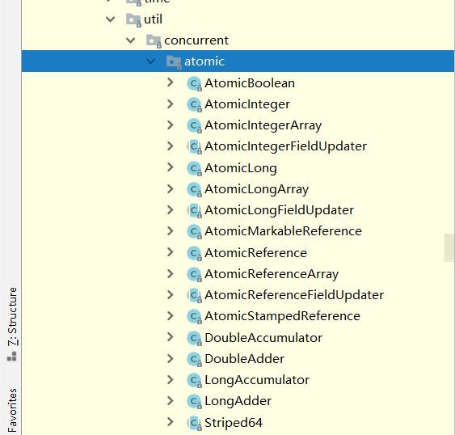

# 06-并发编程之CAS

## 什么是CAS

​	 在计算机科学中，比较和交换（Conmpare And Swap）是用于实现多线程同步的原子指令。 它将内存位置的内容与给定值进行比较，只有在相同的情况下，将该内存位置的内容修改为新的给定值。 这是作为单个原子操作完成的。 原子性保证新值基于最新信息计算; 如果该值在同一时间被另一个线程更新，则写入将失败。 操作结果必须说明是否进行替换; 这可以通过一个简单的布尔响应（这个变体通常称为比较和设置），或通过返回从内存位置读取的值来完成（摘自维基本科）

​	java在jdk1.5版本引入cas，在java.util.concurrent.atomic包下



## java中如何实现CAS

juc.atomic包下有很多原子类，但是实现原理都是相同的，我们以AtomicInteger为例。

```java
package java.util.concurrent.atomic;
import java.util.function.IntUnaryOperator;
import java.util.function.IntBinaryOperator;
import sun.misc.Unsafe;

/**
 *
 * @since 1.5
 * @author Doug Lea
*/
public class AtomicInteger extends Number implements java.io.Serializable {
	 public final int accumulateAndGet(int x,
                                      IntBinaryOperator accumulatorFunction) {
        int prev, next;
        do {
            prev = get();
            next = accumulatorFunction.applyAsInt(prev, x);
        } while (!compareAndSet(prev, next));
        return next;
    }
    public final int addAndGet(int delta) {
        return unsafe.getAndAddInt(this, valueOffset, delta) + delta;
    }
    public final int getAndUpdate(IntUnaryOperator updateFunction) {
        int prev, next;
        do {
            prev = get();
            next = updateFunction.applyAsInt(prev);
        } while (!compareAndSet(prev, next));
        return prev;
    }
    public final int updateAndGet(IntUnaryOperator updateFunction) {
        int prev, next;
        do {
            prev = get();
            next = updateFunction.applyAsInt(prev);
        } while (!compareAndSet(prev, next));
        return next;
    }
    public final int getAndAccumulate(int x,
                                      IntBinaryOperator accumulatorFunction) {
        int prev, next;
        do {
            prev = get();
            next = accumulatorFunction.applyAsInt(prev, x);
        } while (!compareAndSet(prev, next));
        return prev;
    }
     public final int accumulateAndGet(int x,
                                      IntBinaryOperator accumulatorFunction) {
        int prev, next;
        do {
            prev = get();
            next = accumulatorFunction.applyAsInt(prev, x);
        } while (!compareAndSet(prev, next));
        return next;
    }
}
```


我们详细分析getAndIncrement()方法。

```java
private static final Unsafe unsafe = Unsafe.getUnsafe();
public final int getAndIncrement() {
    return unsafe.getAndAddInt(this, valueOffset, 1);
}
```

发现AtomicInteger底层调用的是Unsafe的getAndAddInt(Object o,long l,int i);

```java
public final int getAndAddInt(Object var1, long var2, int var4) {
    int var5;
    do {
        //获取主内存最新值
        var5 = this.getIntVolatile(var1, var2);
        //var1: AtomicInteger对象本身
        //var2: 该对象值的引用地址
        //var5：获取的主内存最新值
        //var4: 增量值
    } while(!this.compareAndSwapInt(var1, var2, var5, var5 + var4));
    return var5;
}
```

* var1 AtomicInteger对象本身
* var2该对象值的引用地址
* var4需要变动的数量
* var5是用过var1，var2找出的主内存中真实的值
* 用改对象当前值与var5比较，如果相同: 更新var5+var4并且返回true；如果不同:继续取值然后再比较，直到更新完成。

> Unsafe类

​	Unsafe类是CAS的核心类，由于Java方法无法直接访问底层系统，需要通过本地(native)方法来访问，Unsafe相当于一个后门，基于该类可以直接操作特定内存的数据。Unsafe类存在与sun,misc包中，其内部方法操作可以像C的指针一样直接操作内存，因为Java中CAS操作的执行依于Unsafe类的方法。

​	==**Unsafe类中所以的方法都是native修饰的，也就是说Unsafe类中的方法都是直接调用操作系统底层资源执行相应任务。Unsafe类底层使用CPU原语来保证原子性**==


## CAS的缺点

* 循环时间长CPU开销大
* 只能保证一个共享变量的原子操作
* 引出来ABA问题


## CAS的ABA问题

```java
static AtomicReference<Integer> atomicReference = new AtomicReference<>(100);

new Thread(() -> {
            atomicReference.compareAndSet(100, 101);
            atomicReference.compareAndSet(101, 100);
            System.out.println(Thread.currentThread().getName() + " 执行完毕");
        }, "t1").start();

new Thread(() -> {
    try {
        TimeUnit.SECONDS.sleep(1);
        System.out.println(atomicReference.compareAndSet(100, 2019));
    } catch (InterruptedException e) {
        e.printStackTrace();
    }
}, "t2").start();

//实际上integer的值的变动轨迹是: 100 -> 101 -> 100 -> 2019

线程t1: 100 -> 101 , 101 -> 100
线程t2: 100 -> 2019
    
实际上线程t2中的期望值100是t1修改2次后的值,这样就会存在问题A->B->A。线程t2对修改没有感知，所以就会出现问题，解决CAS的ABA问题，需要在cas基础上添加一个版本号即可解决。

```

## CAS的ABA问题解决


上一章节中提到，解决CAS的ABA问题需要引入版本号的概念。

下面我们演示java是如何解决CAS的ABA问题的。

```java
//初始化版本号1
static AtomicStampedReference<Integer> stampedReference = new AtomicStampedReference<>(100, 1);

new Thread(() -> {
    int stamp = stampedReference.getStamp();
    System.out.println(Thread.currentThread().getName() + "\t 第一次版本号" + stamp);
    try {
        TimeUnit.SECONDS.sleep(1);
        stampedReference.compareAndSet(100, 101, stampedReference.getStamp(), stampedReference.getStamp() + 1);
        System.out.println(Thread.currentThread().getName() + "\t 第二次版本号" + stamp);
        stampedReference.compareAndSet(101, 100, stampedReference.getStamp(), stampedReference.getStamp() + 1);
        System.out.println(Thread.currentThread().getName() + "\t 第三次版本号" + stamp);
    } catch (InterruptedException e) {
        e.printStackTrace();
    }
}, "t3").start();

new Thread(() -> {
    int stamp = stampedReference.getStamp();
    System.out.println(Thread.currentThread().getName() + "\t 第一次版本号" + stamp);
    try {
        TimeUnit.SECONDS.sleep(3);
    } catch (InterruptedException e) {
        e.printStackTrace();
    }
    boolean result = stampedReference.compareAndSet(101, 2019, stamp, stampedReference.getStamp() + 1);
    System.out.println(Thread.currentThread().getName() + "\t 修改成功：" + result);
    do{
        stamp = stampedReference.getStamp();
        System.out.println(Thread.currentThread().getName() + "\t 当前实际版本号:" + stamp);
    }while (!stampedReference.compareAndSet(100,2019,stamp,stampedReference.getStamp()+1));
    System.out.println(Thread.currentThread().getName() + "\t 最新版本号：" + stampedReference.getStamp() + ",最新值:" + stampedReference.getReference());
}, "t4").start();

//在ABA问题演示的基础上，添加了版本号，每次修改值都对版本号进行加一操作，这样在A->B->A操作之后，先比较版本号，期望值，实际值，修改值，修改后的版本号，这样就会避免ABA问题。
```

