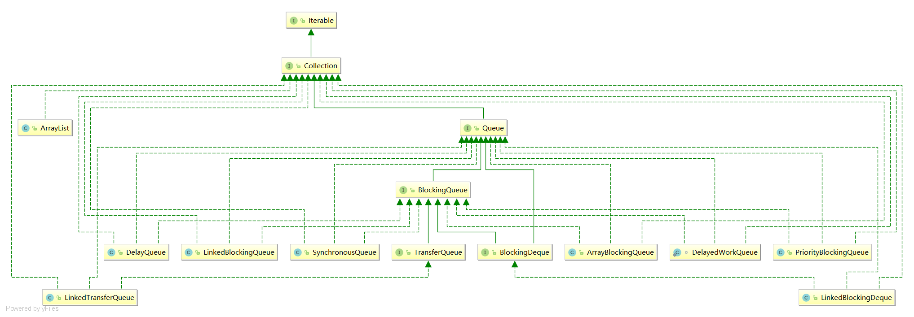

# 11-并发编程之阻塞队列

## 阻塞队列类结构图

## 主要实现类

> ==ArrayBlockingQueue: 由数组结构组成的有界阻塞队列==

> ==LinkedBlockingQueue:由链表结构组成的有界阻塞队列(默认大小位Integer.MAX_VALUE)==

> PriorityBlockingQueue:支持优先级的无界阻塞队列

> DelayQueue:使用优先级队列实现的延迟无界阻塞队列

> ==SynchronousQueue:不存储元素的阻塞队列，也即单个元素的队列==

> LinkedTransferQueue:由链表结构组成的无界阻塞队列

> LinkedBlockDeque:由链表结构组成的双向阻塞队列

## 阻塞队列的核心方法

| 方法类型 | 抛出异常  | 特殊值   | 阻塞   | 超时               |
| -------- | --------- | -------- | ------ | ------------------ |
| 插入     | add(e)    | offer(e) | put(e) | offer(e,time,unit) |
| 移除     | remove()  | poll()   | take() | poll(e,time,unit)  |
| 检查     | element() | peek()   | 不可用 | 不可用             |

| 类型     | 说明                                                         |
| -------- | ------------------------------------------------------------ |
| 抛出异常 | 当阻塞队列满时，再往队列里add元素时会抛出异常:java.lang.IllegalStateException: Queue full               当阻塞队列为空时，再从队列中remove元素会抛出异常:  java.util.NoSuchElementException 当阻塞队列为空时，再检查element队列中元素会抛出异常:  java.util.NoSuchElementException |
| 特殊值   | 插入方法：成功返回true，失败返回false, 移除方法成功返回队列元素，队列中没有元素返回null |
| 阻塞     | 当阻塞队列满时，生产者线程继续往队列中put元素，队列会一直阻塞知道put数据or相应中断 当阻塞队列空时，消费者线程试图从队列中take元素，队列会一直阻塞到队列中有元素take为止。 |
|          |                                                              |
| 超时     |                                                              |

