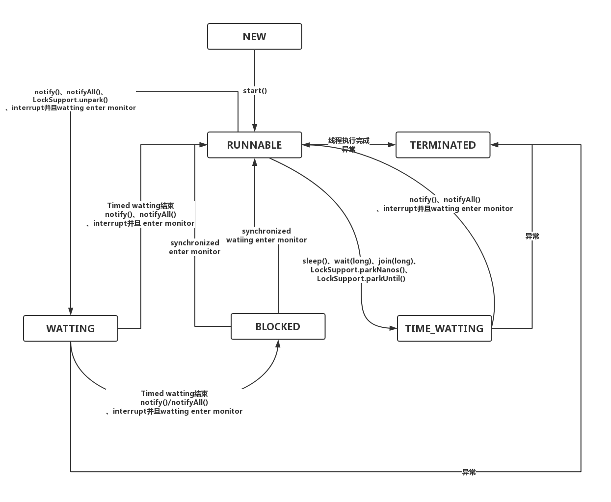

# Java线程

- 初始态（NEW）
  * 创建一个Thread对象，但还未调用start()启动线程时，线程处于初始态。

* 运行态（RUNNABLE），在Java中，运行态包括 就绪态 和 运行态。

  * 就绪态
    * 该状态下的线程已经获得执行所需的所有资源，只要CPU分配执行权就能运
      行。
    * 所有就绪态的线程存放在就绪队列中。

  * 运行态
    * 获得CPU执行权，正在执行的线程。
    * 由于一个CPU同一时刻只能执行一条线程，因此每个CPU每个时刻只有一条
      运行态的线程。

* 阻塞态（BLOCKED）

  * 当一条正在执行的线程请求某一资源失败时，就会进入阻塞态。
  * 而在Java中，阻塞态专指请求锁失败时进入的状态。
  * 由一个阻塞队列存放所有阻塞态的线程。
  * 处于阻塞态的线程会不断请求资源，一旦请求成功，就会进入就绪队列，等待执
    行。

* 等待态（WAITING）

  * 当前线程中调用wait、join、park函数时，当前线程就会进入等待态。
  * 也有一个等待队列存放所有等待态的线程。
  * 线程处于等待态表示它需要等待其他线程的指示才能继续运行。
  * 进入等待态的线程会释放CPU执行权，并释放资源（如：锁）

* 超时等待态（TIMED_WAITING）

  * 当运行中的线程调用sleep(time)、wait、join、parkNanos、parkUntil时，就
    会进入该状态；
  * 它和等待态一样，并不是因为请求不到资源，而是主动进入，并且进入后需要其
    他线程唤醒；
  * 进入该状态后释放CPU执行权 和 占有的资源。
  * 与等待态的区别：到了超时时间后自动进入阻塞队列，开始竞争锁。

* 终止态（TERMINATED）

  * 线程执行结束后的状态。
    

初始态（NEW）
创建一个Thread对象，但还未调用start()启动线程时，线程处于初始态。
运行态（RUNNABLE），在Java中，运行态包括 就绪态 和 运行态。

就绪态
该状态下的线程已经获得执行所需的所有资源，只要CPU分配执行权就能运
行。
所有就绪态的线程存放在就绪队列中。
运行态
获得CPU执行权，正在执行的线程。
由于一个CPU同一时刻只能执行一条线程，因此每个CPU每个时刻只有一条
运行态的线程。

阻塞态（BLOCKED）
当一条正在执行的线程请求某一资源失败时，就会进入阻塞态。
而在Java中，阻塞态专指请求锁失败时进入的状态。
由一个阻塞队列存放所有阻塞态的线程。
处于阻塞态的线程会不断请求资源，一旦请求成功，就会进入就绪队列，等待执
行。

等待态（WAITING）
当前线程中调用wait、join、park函数时，当前线程就会进入等待态。
也有一个等待队列存放所有等待态的线程。
线程处于等待态表示它需要等待其他线程的指示才能继续运行。
进入等待态的线程会释放CPU执行权，并释放资源（如：锁）

超时等待态（TIMED_WAITING）
当运行中的线程调用sleep(time)、wait、join、parkNanos、parkUntil时，就
会进入该状态；
它和等待态一样，并不是因为请求不到资源，而是主动进入，并且进入后需要其
他线程唤醒；
进入该状态后释放CPU执行权 和 占有的资源。
与等待态的区别：到了超时时间后自动进入阻塞队列，开始竞争锁。

终止态（TERMINATED）
    线程执行结束后的状态。
