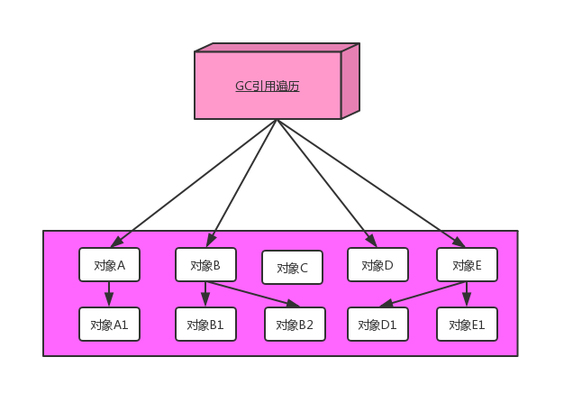

# 1. VM之垃圾回收器

## 1.1 、JVM垃圾回收器是什么

​	C、C++语言中的资源释放都是需要程序员手动操作的，一不小心就会导致资源不释放，内存满了，资源管理一直是C、C++的诟病。

​	Java语言设计之初，就吸收了C、C++语言的优点，弥补了缺点，实现了垃圾自动回收。

​	Java是如何实现垃圾回收的呢，是JVM垃圾回收器在后台自动的回收资源。


### 1.1.1、什么是垃圾

​	简单的说就是内存中不再被使用到的空间就是垃圾。

​	要进行垃圾回收，如何判断一个对象是否可以被回收？

### 1.1.2、判断一个对象是否可以被回收的方法

引用计数器

枚举根节点做可达性分析(根搜索路径)

​	为了解决引用计数器的循环引用问题，Java使用了可达性分析的方法



​	所谓"GC Root"或者说tracing GC的“根集合”就是==**一组必须活跃的引用**==

​	基本思路就是通过一系列名为"GC Root"的对象作为起始点，从这个被称为GC Roots的对象开始向下搜索，如果一个对象到GC Roots没有任何引用链相连时，就说明次对象不可用。也即给定一个集合的引用作为根出发，通过引用关系遍历对象图，能被遍历到的(可到达的)对象就被判定为存活: 没有遍历到的就自然被判定为死亡。

​	上图中的对象C从GC Root不可达，如果GC Root集合都不可达，即判定为死亡


### 1.1.3哪些对象可以作为GC Root

* 虚拟机栈(栈帧中的局部变量取，也叫做局部变量表)中引用的对象
* 方法区中的静态属性引用的对象
* 方法区中常量引用的对象
* 本地方法栈中JNI(Java native Interface、Native方法)引用的对象


## 1.2、JVM参数类型

### 1.2.1、JVM参数类型分类

jvm参数可以大致分为三类: 标配参数、X参数(了解)、XX参数(重点)


#### 1.2.1.1、标配参数

> -version

```shell
java -version

C:\Users\pansf\Documents\GitHub\java-architect\code\jvm>java -version
java version "1.8.0_91"
Java(TM) SE Runtime Environment (build 1.8.0_91-b15)
Java HotSpot(TM) 64-Bit Server VM (build 25.91-b15, mixed mode)
```

> -help

```shell
java -help
```

> -showversion

```shell
java -showversion
```

#### 1.2.1.2、X参数

```shell
C:\Users\pansf\Documents\GitHub\java-architect\code\jvm>java -version
java version "1.8.0_91"
Java(TM) SE Runtime Environment (build 1.8.0_91-b15)
Java HotSpot(TM) 64-Bit Server VM (build 25.91-b15, mixed mode)
```

> -Xint: 解释执行

```shell
C:\Users\pansf\Documents\GitHub\java-architect\code\jvm>java -Xint -version
java version "1.8.0_91"
Java(TM) SE Runtime Environment (build 1.8.0_91-b15)
Java HotSpot(TM) 64-Bit Server VM (build 25.91-b15, interpreted mode)
```

> -Xcomp: 第一次使用就编译本地代码

```shell
C:\Users\pansf\Documents\GitHub\java-architect\code\jvm>java -Xcomp -version
java version "1.8.0_91"
Java(TM) SE Runtime Environment (build 1.8.0_91-b15)
Java HotSpot(TM) 64-Bit Server VM (build 25.91-b15, compiled mode)
```

> ==-Xmixed: 混合模式(默认)==

```shell
C:\Users\pansf\Documents\GitHub\java-architect\code\jvm>java -Xmixed -version
java version "1.8.0_91"
Java(TM) SE Runtime Environment (build 1.8.0_91-b15)
Java HotSpot(TM) 64-Bit Server VM (build 25.91-b15, mixed mode)
```


#### 1.2.1.3、XX参数

##### 1.2.1.3.1、Boolean类型参数

公式: -XX:+ 或者-XX:- 某个属性值,

* -XX:+表示开启
* -XX:-表示关闭

##### 1.2.1.3.2、KV设置类型

##### 1.2.1.3.3、jinfo举例,如何查看当前运行程序的配置

##### 1.2.1.3.4、题外话(坑题)


### 1.2.2、JVM参数默认值

​	查看某个正在运行中的java程序

jps、jinfo

```shell
C:\Users\pansf\Documents\GitHub\java-architect\code\jvm>jps -l
16288
20304 club.javalearn.jvm.gc.GCParamsDemo
29812 sun.tools.jps.Jps
4980 org.jetbrains.jps.cmdline.Launcher
```


```shell
C:\Users\pansf\Documents\GitHub\java-architect\code\jvm>jinfo -flag PrintGCDetails 20304
-XX:-PrintGCDetails
//-XX:-没有开启PrintGCDetails

```

在java程序启动时，添加VM参数: -XX:+PrintGCDetails


使用jinfo查看具体配置：

```java
C:\Users\pansf\Documents\GitHub\java-architect\code\jvm>jps -l
16288
30660 club.javalearn.jvm.gc.GCParamsDemo
6852 sun.tools.jps.Jps
11724 org.jetbrains.jps.cmdline.Launcher

C:\Users\pansf\Documents\GitHub\java-architect\code\jvm>jinfo -flag PrintGCDetails 30660
-XX:+PrintGCDetails

```


## JVM垃圾回收器的分类

### 引用计数器

### 复制

### 标记清除

### 标记整理


## JVM垃圾回收的时候如何确定垃圾？你知道什么是GC Roots？


## jvm调优和参数配置,何如查看jvm系统默认配置

## jvm常用配置有哪些

## 强引用、软引用、弱引用、虚引用分别是什么

## 谈谈你对OOM的认识

## GC垃圾回收算法和垃圾回收器的关系?

## GC垃圾回收算法有哪些，分别是什么？

## G1垃圾回收器的认识

## 怎么查看服务器默认的垃圾回收器是哪个?生产上如何配置垃圾回收器的?谈谈你对垃圾回收器的理解?

## 生产环境服务器变慢，诊断思路和性能评估?

## 假如生产环境出现CPU占用过高，请谈谈你的分析思路和定位？

## 

