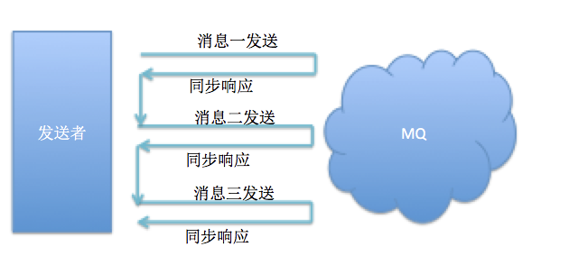
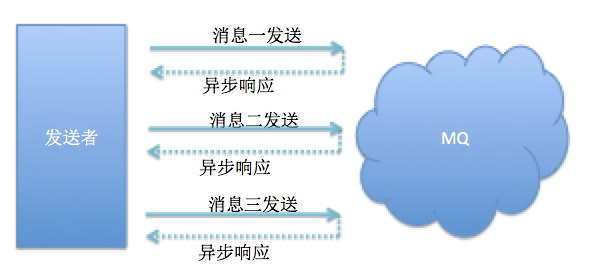
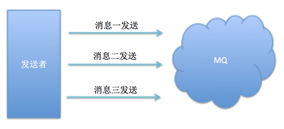

# 06-RocketMQ消息发送

## MQProducer类图结构


```java
package mq;

import org.apache.rocketmq.client.exception.MQBrokerException;
import org.apache.rocketmq.client.exception.MQClientException;
import org.apache.rocketmq.client.producer.DefaultMQProducer;
import org.apache.rocketmq.client.producer.SendCallback;
import org.apache.rocketmq.client.producer.SendResult;
import org.apache.rocketmq.common.message.Message;
import org.apache.rocketmq.remoting.exception.RemotingException;

/**
 * @author king-pan
 * @date 2019/5/13
 * @Description ${DESCRIPTION}
 */
public class ProductDemo {

    private DefaultMQProducer defaultMQProducer;

    public void start() {
        defaultMQProducer = new DefaultMQProducer();
        //设置生产者组
        defaultMQProducer.setProducerGroup("producer_demo");
        defaultMQProducer.setNamesrvAddr("39.104.164.68:9876");
        //生产者重试次数,只有在同步情况下有效果(异步和SendOneWay下配置无效)

        defaultMQProducer.setRetryTimesWhenSendFailed(3);
        try {
            //必须调用producer的start()方法
            defaultMQProducer.start();
        } catch (MQClientException e) {
            e.printStackTrace();
        }
    }

    /**
     * 可靠同步发送
     */
    public void send() throws InterruptedException, RemotingException, MQClientException, MQBrokerException {
        Message message = null;
        for (int i = 0; i < 5; i++) {
            message = new Message("demo_topic", "tag_sync", "key" + i, ("我是第" + i + "条同步消息").getBytes());
            defaultMQProducer.send(message);
        }
    }

    /**
     * 单向（Oneway）发送
     */
    public void sendOneWay() throws InterruptedException, RemotingException, MQClientException, MQBrokerException {
        Message message = null;
        for (int i = 0; i < 5; i++) {
            message = new Message("demo_topic", "tag_one_way", "key" + i, ("我是第" + i + "条oneway消息").getBytes());
            defaultMQProducer.sendOneway(message);
        }
    }

    /**
     * 可靠异步发送
     */
    public void sendCallBack() throws RemotingException, MQClientException, InterruptedException {
        Message message = new Message("demo_topic", "tag_async", "key_async_1", ("我是第1条async消息").getBytes());
        defaultMQProducer.send(message, new SendCallback() {
            public void onSuccess(SendResult sendResult) {
                System.out.println("消息发送成功");
            }

            public void onException(Throwable e) {
                //如果消息发送失败后，进行日志记录或者人工补偿等操作
                System.out.println("消息发送失败,进行人工补偿,错误信息:" + e.getMessage());
            }
        });

    }


    public static void main(String[] args) throws InterruptedException, RemotingException, MQClientException, MQBrokerException {
        ProductDemo productDemo = new ProductDemo();
        productDemo.start();
        productDemo.send();
        productDemo.sendCallBack();
        productDemo.sendCallBack();
    }
}
```


## 消息发送的方式

枚举类CommunicationMode中定义了生产者消息发送类型

```java
package org.apache.rocketmq.client.impl;

public enum CommunicationMode {
    SYNC,
    ASYNC,
    ONEWAY,
}
```

>SYNC:可靠同步发送

​	同步发送是指消息发送方发出数据后，会在收到接收方发回响应之后才发下一个数据包的通讯方式。

```java
  /**
     * 可靠同步发送
     */
public void send() throws InterruptedException, RemotingException, MQClientException, MQBrokerException {
    Message message = null;
    for (int i = 0; i < 5; i++) {
        message = new Message("demo_topic", "tag_sync", "key" + i, ("我是第" + i + "条同步消息").getBytes());
        defaultMQProducer.send(message);
    }
}
```




> ASYNC:可靠异步发送

**发送成功会回调onSuccess方法,发送失败会回调onException方法**

```java
    /**
     * 可靠异步发送
     */
    public void sendCallBack() throws RemotingException, MQClientException, InterruptedException {
        Message message = new Message("demo_topic", "tag_async", "key_async_1", ("我是第1条async消息").getBytes());
        defaultMQProducer.send(message, new SendCallback() {
            public void onSuccess(SendResult sendResult) {
                System.out.println("消息发送成功");
            }

            public void onException(Throwable e) {
                //如果消息发送失败后，进行日志记录或者人工补偿等操作
                System.out.println("消息发送失败,进行人工补偿,错误信息:" + e.getMessage());
            }
        });

    }
```



> ONEWAY: 单向(OneWay)发送

```java
/**
     * 单向（Oneway）发送
     */
public void sendOneWay() throws InterruptedException, RemotingException, MQClientException, MQBrokerException {
    Message message = null;
    for (int i = 0; i < 5; i++) {
        message = new Message("demo_topic", "tag_one_way", "key" + i, ("我是第" + i + "条oneway消息").getBytes());
        defaultMQProducer.sendOneway(message);
    }
}
```




## 适用场景

> SYNC同步发送

​	应用场景：重要邮件通知、报名短信通知、营销短信通知(点对点)

> ASYNC异步发送

​	应用场景: 对RT时间敏感、可以支撑更高的并发、回调成功触发相应的业务，比如注册成功后通知积分系统发放优惠券等

> OneWay: 无需等待响应

​	应用场景：主要是日志收集，适用于某些耗时非常短、但对可靠性要求并不高的场景、也就是LogServer、只负责发送消息，不等服务器回应且没有回调函数触发，即只发送请求不等待响应。


## 三种发送方式的性能比较

| 发送方式         | 发送TPS | 发送结果反馈 | 可靠性   |
| ---------------- | ------- | ------------ | -------- |
| 同步发送         | 快      | 有           | 可靠     |
| 异步发送         | 快      | 有           | 可靠     |
| 单向发送(oneway) | 最快    | 无           | 可能丢失 |

