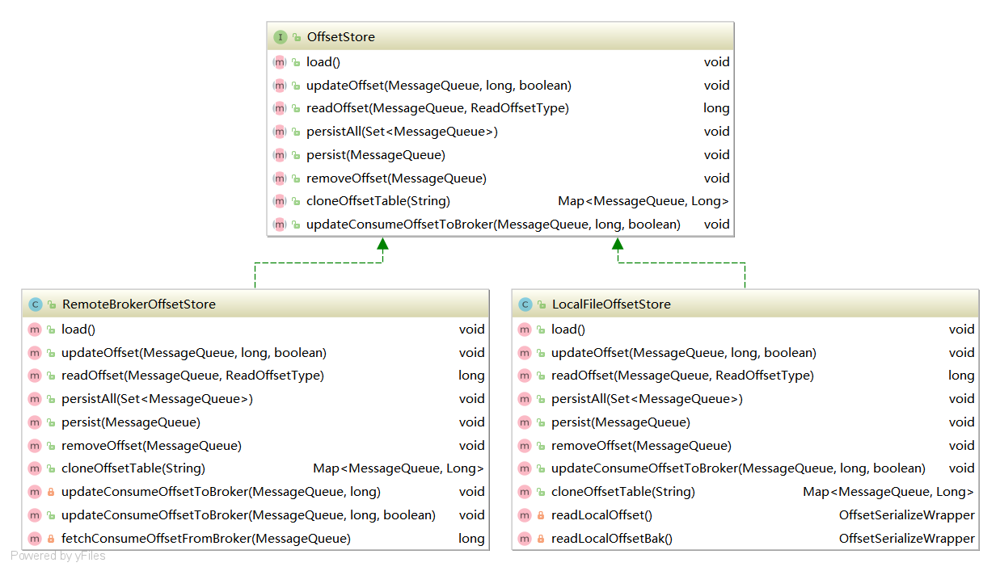

# RocketMQ之offSet

> offSet是消息偏移量

​		message queue是无限长的数组，一条消息进来下标就会加一，下标就是offset，消息再某个Message里的位置，通过offset的值，可以定位到这条消息，或者指示Consumer从这条消息开始向后处理。

​		message queue中的maxOffset表示消息的最大offset，maxOffset并不是最新的那条消息的offset，而是最新消息的offset+1，minOffset则是现存在的最新offset。fileReserveTime=48默认消息存储48小时后消息会被物理地从磁盘删除，message queue的minoffset也就对应增长。所以比minOffset还小的那些消息已经不再broker上了，就无法被消费。

## OffsetStore类结构图



## LocalFileOffsetStroe

​	本地文件存储偏移量:

​	DefaultMQPushConsumer的BROADCASTING模式，各个Consumer没有相互干扰，使用LocalFileOffsetStore把offSet存储在本地。

## RemoteBrokerOffsetStore

​	远程Broker存储偏移量：

​	DefaultMQPushConsumer的CLUSTERING模式，由Broker端存储和控制Offset的值，使用RemoteBrokerOffsetStore存储offSet。


## offSet的作用

* 主要记录消息的偏移量，区分多个消费者的消费情况
* 集群模式下采用RemoteBrokerOffsetStore，broker控制offset的值
* 广播模式下采用LocalFileOffsetStore消费端存储offset的值

## 源码分析

### LocalFileOffsetStore

```java
private ConcurrentMap<MessageQueue, AtomicLong> offsetTable =
        new ConcurrentHashMap<MessageQueue, AtomicLong>();
//从文件中加载offset偏移量
@Override
public void load() throws MQClientException {
    OffsetSerializeWrapper offsetSerializeWrapper = this.readLocalOffset();
    if (offsetSerializeWrapper != null && offsetSerializeWrapper.getOffsetTable() != null) {
        offsetTable.putAll(offsetSerializeWrapper.getOffsetTable());

        for (MessageQueue mq : offsetSerializeWrapper.getOffsetTable().keySet()) {
            AtomicLong offset = offsetSerializeWrapper.getOffsetTable().get(mq);
            log.info("load consumer's offset, {} {} {}",
                     this.groupName,
                     mq,
                     offset.get());
        }
    }
}
//读取本地偏移量
private OffsetSerializeWrapper readLocalOffset() throws MQClientException {
    String content = null;
    try {
        content = MixAll.file2String(this.storePath);
    } catch (IOException e) {
        log.warn("Load local offset store file exception", e);
    }
    if (null == content || content.length() == 0) {
        return this.readLocalOffsetBak();
    } else {
        OffsetSerializeWrapper offsetSerializeWrapper = null;
        try {
            offsetSerializeWrapper =
                OffsetSerializeWrapper.fromJson(content, OffsetSerializeWrapper.class);
        } catch (Exception e) {
            log.warn("readLocalOffset Exception, and try to correct", e);
            return this.readLocalOffsetBak();
        }

        return offsetSerializeWrapper;
    }
}
//从备份文件中读取偏移量
private OffsetSerializeWrapper readLocalOffsetBak() throws MQClientException {
    String content = null;
    try {
        content = MixAll.file2String(this.storePath + ".bak");
    } catch (IOException e) {
        log.warn("Load local offset store bak file exception", e);
    }
    if (content != null && content.length() > 0) {
        OffsetSerializeWrapper offsetSerializeWrapper = null;
        try {
            offsetSerializeWrapper =
                OffsetSerializeWrapper.fromJson(content, OffsetSerializeWrapper.class);
        } catch (Exception e) {
            log.warn("readLocalOffset Exception", e);
            throw new MQClientException("readLocalOffset Exception, maybe fastjson version too low"
                                        + FAQUrl.suggestTodo(FAQUrl.LOAD_JSON_EXCEPTION),
                                        e);
        }
        return offsetSerializeWrapper;
    }

    return null;
}

//更新偏移量
@Override
public void updateOffset(MessageQueue mq, long offset, boolean increaseOnly) {
    if (mq != null) {
        AtomicLong offsetOld = this.offsetTable.get(mq);
        if (null == offsetOld) {
            offsetOld = this.offsetTable.putIfAbsent(mq, new AtomicLong(offset));
        }

        if (null != offsetOld) {
            if (increaseOnly) {
                MixAll.compareAndIncreaseOnly(offsetOld, offset);
            } else {
                offsetOld.set(offset);
            }
        }
    }
}

//持久化所以的队列
@Override
public void persistAll(Set<MessageQueue> mqs) {
    if (null == mqs || mqs.isEmpty())
        return;

    OffsetSerializeWrapper offsetSerializeWrapper = new OffsetSerializeWrapper();
    for (Map.Entry<MessageQueue, AtomicLong> entry : this.offsetTable.entrySet()) {
        if (mqs.contains(entry.getKey())) {
            AtomicLong offset = entry.getValue();
            offsetSerializeWrapper.getOffsetTable().put(entry.getKey(), offset);
        }
    }

    String jsonString = offsetSerializeWrapper.toJson(true);
    if (jsonString != null) {
        try {
            MixAll.string2File(jsonString, this.storePath);
        } catch (IOException e) {
            log.error("persistAll consumer offset Exception, " + this.storePath, e);
        }
    }
}
```


## RemoteBrokerOffsetStore

```java
//一直存储在broker的内存中，不需要加载
@Override
public void load() {
}
//更新偏移量
@Override
public void updateOffset(MessageQueue mq, long offset, boolean increaseOnly) {
    if (mq != null) {
        AtomicLong offsetOld = this.offsetTable.get(mq);
        if (null == offsetOld) {
            offsetOld = this.offsetTable.putIfAbsent(mq, new AtomicLong(offset));
        }

        if (null != offsetOld) {
            if (increaseOnly) {
                MixAll.compareAndIncreaseOnly(offsetOld, offset);
            } else {
                offsetOld.set(offset);
            }
        }
    }
}
//读取队列的偏移量offset
@Override
public long readOffset(final MessageQueue mq, final ReadOffsetType type) {
    if (mq != null) {
        switch (type) {
            case MEMORY_FIRST_THEN_STORE:
            case READ_FROM_MEMORY: {
                AtomicLong offset = this.offsetTable.get(mq);
                if (offset != null) {
                    return offset.get();
                } else if (ReadOffsetType.READ_FROM_MEMORY == type) {
                    return -1;
                }
            }
            case READ_FROM_STORE: {
                try {
                    long brokerOffset = this.fetchConsumeOffsetFromBroker(mq);
                    AtomicLong offset = new AtomicLong(brokerOffset);
                    this.updateOffset(mq, offset.get(), false);
                    return brokerOffset;
                }
                // No offset in broker
                catch (MQBrokerException e) {
                    return -1;
                }
                //Other exceptions
                catch (Exception e) {
                    log.warn("fetchConsumeOffsetFromBroker exception, " + mq, e);
                    return -2;
                }
            }
            default:
                break;
        }
    }

    return -1;
}
//持久化所有队列的偏移量offset
@Override
public void persistAll(Set<MessageQueue> mqs) {
    if (null == mqs || mqs.isEmpty())
        return;

    final HashSet<MessageQueue> unusedMQ = new HashSet<MessageQueue>();
    if (!mqs.isEmpty()) {
        for (Map.Entry<MessageQueue, AtomicLong> entry : this.offsetTable.entrySet()) {
            MessageQueue mq = entry.getKey();
            AtomicLong offset = entry.getValue();
            if (offset != null) {
                if (mqs.contains(mq)) {
                    try {
                        this.updateConsumeOffsetToBroker(mq, offset.get());
                        log.info("[persistAll] Group: {} ClientId: {} updateConsumeOffsetToBroker {} {}",
                                 this.groupName,
                                 this.mQClientFactory.getClientId(),
                                 mq,
                                 offset.get());
                    } catch (Exception e) {
                        log.error("updateConsumeOffsetToBroker exception, " + mq.toString(), e);
                    }
                } else {
                    unusedMQ.add(mq);
                }
            }
        }
    }

    if (!unusedMQ.isEmpty()) {
        for (MessageQueue mq : unusedMQ) {
            this.offsetTable.remove(mq);
            log.info("remove unused mq, {}, {}", mq, this.groupName);
        }
    }
}
//持久化单个消息队列的offset
@Override
public void persist(MessageQueue mq) {
    AtomicLong offset = this.offsetTable.get(mq);
    if (offset != null) {
        try {
            this.updateConsumeOffsetToBroker(mq, offset.get());
            log.info("[persist] Group: {} ClientId: {} updateConsumeOffsetToBroker {} {}",
                     this.groupName,
                     this.mQClientFactory.getClientId(),
                     mq,
                     offset.get());
        } catch (Exception e) {
            log.error("updateConsumeOffsetToBroker exception, " + mq.toString(), e);
        }
    }
}
```

