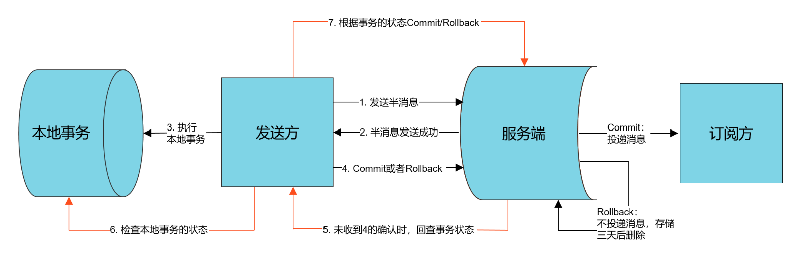

# RocketMQ分布式事务消息

## 分布式事务消息简介

> 什么时分布式事务

* 来源:单体应用->拆分为分布式应用
* 一个接口需要调用多个服务，且操作不同的数据库，数据一致性很难保障。

> 分布式事务常见的解决方案

* 2PC:两阶段提交，基于XA协议
* TCC: Try、Confirm、Cancel
  * 下单
* 事务消息最终一致性
* 其他

> 框架

* GTS->开源Fescar
* LCN





## 注意

TransactionMQProducer的groupName要唯一，不能和普通的MQProducer的groupName一致。

producer调用的是org.apache.rocketmq.client.producer.TransactionMQProducer#sendMessageInTransaction(org.apache.rocketmq.common.message.Message, java.lang.Object)

```JAVA
@Override
public TransactionSendResult sendMessageInTransaction(final Message msg,
                                                      final Object arg) throws MQClientException {
    if (null == this.transactionListener) {
        throw new MQClientException("TransactionListener is null", null);
    }

    return this.defaultMQProducerImpl.sendMessageInTransaction(msg, null, arg);
}
```

