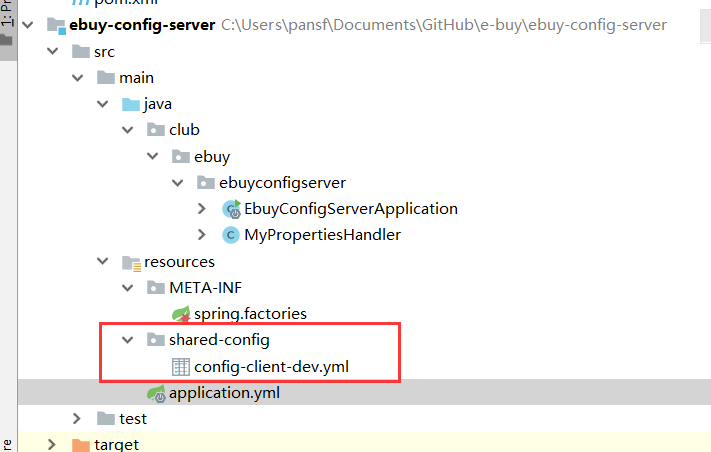
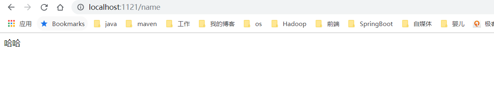
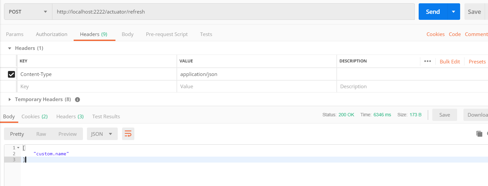
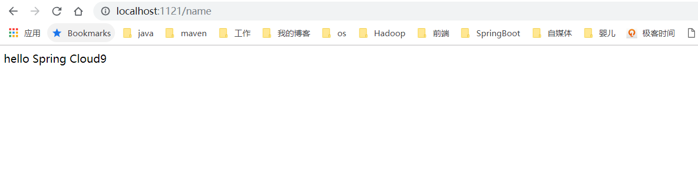

# Spring Cloud Config

## Config Server

> 依赖（没有starter）

```xml
<dependency>
    <groupId>org.springframework.cloud</groupId>
    <artifactId>spring-cloud-config-server</artifactId>
</dependency>
```

> 注解

```java
#在java启动类上添加注解
@EnableConfigServer
```

> 配置

```properties
# 把Config Server注册到注册中心
server:
  port: 1111
spring:
  application:
    name: config-server
  profiles:
    active: native
  cloud:
    config:
      server:
        native:
          #这儿需要使用绝对路径，才能使用自动刷新功能
          search-locations: classpath:/shared-config
        bootstrap: true
eureka:
  client:
    service-url:
      defaultZone: http://localhost:8761/eureka/
```





> shared-config/config-client-dev.yml

```yml
custom:
  name: 哈哈
```


## Config Client

> 配置

请注意，这儿需要使用bootstrap.yml配置文件来启动项目，否则会出现错误

bootstrap.yml加载优先于application.yml

[SpringCloud入门之常用的配置文件 application.yml和 bootstrap.yml区别]: https://www.cnblogs.com/BlogNetSpace/p/8469033.html

bootstrap.yml文件内容:

```yml
spring:
  application:
    name: config-client
  cloud:
    config:
      uri: http://localhost:1111/
      profile: dev
      #label: master
server:
  port: 1121
```

> 测试类

```java
package club.ebuy.ebuyconfigclient;

import org.springframework.beans.factory.annotation.Value;
import org.springframework.cloud.context.config.annotation.RefreshScope;
import org.springframework.web.bind.annotation.RequestMapping;
import org.springframework.web.bind.annotation.RestController;

/**
 * @author king-pan
 * @date 2019/5/30
 * @Description ${DESCRIPTION}
 */
@RestController
public class ConfigConstroller {

    @Value("${custom.name}")
    private String name;

    @RequestMapping("/name")
    public String getName() {
        return this.name;
    }
}
```

> 测试结果

```
http://localhost:1121/name
```



## 动态刷新

> 在客户端中添加actuator

```xml
<!-- 监控和管理生产环境的模块 -->
<dependency>
    <groupId>org.springframework.boot</groupId>
    <artifactId>spring-boot-starter-actuator</artifactId>
</dependency>
```

> 修改配置文件

bootstrap.yml

```yml
spring:
  application:
    name: config-client
  cloud:
    config:
      uri: http://localhost:1111/
      profile: dev
      #label: master
    discovery:
      enabled: true
      client:
        simple:
          local:
            service-id: config-server
server:
  port: 1121
management:
  server:
    port: 2222
  endpoints:
    web:
      exposure:
        include: refresh,health,info
  endpoint:
    health:
      show-details: always
eureka:
  client:
    service-url:
      defaultZone: http://localhost:8761/eureka/
```

> 修改配置中心的文件

config-client-dev.yml

```yml
custom:
  name: hello Spring Cloud9
```

> postman请求refresh



> 客户端请求查看是否更新配置




## 常见异常

>search-locations检查是否配置正确，如果是native查看路径是否存在

```java
If you are using the git profile, you need to set a Git URI in your configuration.  If you are using a native profile and have spring.cloud.config.server.bootstrap=true, you need to use a composite configuration.

```

>Fetching config from server at : http://localhost:8888

```java
2019-05-30 15:35:57.332  INFO 19664 --- [           main] c.c.c.ConfigServicePropertySourceLocator : Fetching config from server at : http://localhost:8888
2019-05-30 15:35:58.426  INFO 19664 --- [           main] c.c.c.ConfigServicePropertySourceLocator : Connect Timeout Exception on Url - http://localhost:8888. Will be trying the next url if available
2019-05-30 15:35:58.427  WARN 19664 --- [           main] c.c.c.ConfigServicePropertySourceLocator : Could not locate PropertySource: I/O error on GET request for "http://localhost:8888/config-client/dev": Connection refused: connect; nested exception is java.net.ConnectException: Connection refused: connect
```

