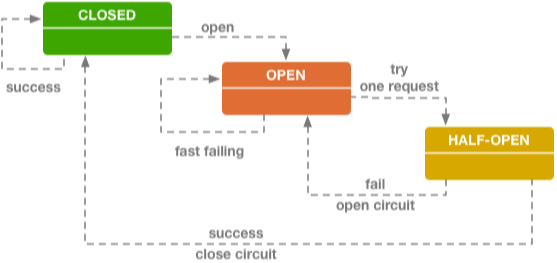

# SpringCloud服务容错Hystrix


[熔断器Hystrix](https://blog.csdn.net/loushuiyifan/article/details/82702522)

​		Hystrix是一个用于处理分布式系统的延迟和容错的开源库，再分布式系统里，许多依赖不可避免的会调用失败，比如：超时、异常等，Hystrix能够保证再一个依赖出问题的情况下，不会导致整体服务失败，避免级联故障，以提高分布式系统的弹性。

​		“断路器“本身是一种开关装置，当某个服务单元发生故障之后，通过断路器的故障监控(类似熔断保险丝)，向调用方返回一个符合预期的，可处理的备选响应(FallBack)，而不是长时间的等待或者抛出调用方无法处理的异常，这样就保障了服务调用方的线程不会被长时间，不必要地占用，从而避免了故障再分布式系统中的蔓延，乃至雪崩。

## 熔断出现的背景

​		分布式系统环境下，服务间类似依赖非常常见，一个业务调用通常依赖多个基础服务。如下图，对于同步调用，当库存服务不可用时，商品服务请求线程被阻塞，当有大批量请求调用库存服务时，最终可能导致整个商品服务资源耗尽，无法继续对外提供服务。并且这种不可用可能沿请求调用链向上传递，这种现象被称为雪崩效应。

​		

## **雪崩效应常见场景**

- 硬件故障：如服务器宕机，机房断电，光纤被挖断等。
- 流量激增：如异常流量，重试加大流量等。
- 缓存穿透：一般发生在应用重启，所有缓存失效时，以及短时间内大量缓存失效时。大量的缓存不命中，使请求直击后端服务，造成服务提供者超负荷运行，引起服务不可用。
- 程序BUG：如程序逻辑导致内存泄漏，JVM长时间FullGC等。
- 同步等待：服务间采用同步调用模式，同步等待造成的资源耗尽。

## **雪崩效应应对策略**

针对造成雪崩效应的不同场景，可以使用不同的应对策略，没有一种通用所有场景的策略，参考如下：

- 硬件故障：多机房容灾、异地多活等。
- 流量激增：服务自动扩容、流量控制（限流、关闭重试）等。
- 缓存穿透：缓存预加载、缓存异步加载等。
- 程序BUG：修改程序bug、及时释放资源等。
- 同步等待：资源隔离、MQ解耦、不可用服务调用快速失败等。资源隔离通常指不同服务调用采用不同的线程池；不可用服务调用快速失败一般通过熔断器模式结合超时机制实现。

综上所述，如果一个应用不能对来自依赖的故障进行隔离，那该应用本身就处在被拖垮的风险中。 因此，为了构建稳定、可靠的分布式系统，我们的服务应当具有自我保护能力，当依赖服务不可用时，当前服务启动自我保护功能，从而避免发生雪崩效应。本文将重点介绍使用Hystrix解决同步等待的雪崩问题。


## 初探Hystrix

​		熔断机制是应对雪崩效应的一种微服务链路保护机制。

​		当扇出链路的某个微服务不可用或者相应超时，会进行服务的降级，进而熔断该节点微服务的调用，快速返回"错误"的响应信息。当检测到该节点微服务调用响应正常后恢复调用链路。在SpringCloud框架中熔断机制是通过Hystrix实现。Hystrix会监控服务间调用的状况，当失败的调用达到一定阈值，缺省是5秒内20此调用失败就会启动熔断机制。熔断机制的注解是@HystrixCommand


Hystrix [hɪst'rɪks]，中文含义是豪猪，因其背上长满棘刺，从而拥有了自我保护的能力。本文所说的Hystrix是Netflix开源的一款容错框架，同样具有自我保护能力。为了实现容错和自我保护，下面我们看看Hystrix如何设计和实现的。

Hystrix设计目标：

- 对来自依赖的延迟和故障进行防护和控制——这些依赖通常都是通过网络访问的
- 阻止故障的连锁反应
- 快速失败并迅速恢复
- 回退并优雅降级
- 提供近实时的监控与告警

Hystrix遵循的设计原则：

- 防止任何单独的依赖耗尽资源（线程）
- 过载立即切断并快速失败，防止排队
- 尽可能提供回退以保护用户免受故障
- 使用隔离技术（例如隔板，泳道和断路器模式）来限制任何一个依赖的影响
- 通过近实时的指标，监控和告警，确保故障被及时发现
- 通过动态修改配置属性，确保故障及时恢复
- 防止整个依赖客户端执行失败，而不仅仅是网络通信

Hystrix如何实现这些设计目标？

- 使用命令模式将所有对外部服务（或依赖关系）的调用包装在HystrixCommand或HystrixObservableCommand对象中，并将该对象放在单独的线程中执行；
- 每个依赖都维护着一个线程池（或信号量），线程池被耗尽则拒绝请求（而不是让请求排队）。
- 记录请求成功，失败，超时和线程拒绝。
- 服务错误百分比超过了阈值，熔断器开关自动打开，一段时间内停止对该服务的所有请求。
- 请求失败，被拒绝，超时或熔断时执行降级逻辑。
- 近实时地监控指标和配置的修改。


## Hystrix使用步骤

### 添加依赖

```xml
<dependency>
    <groupId>org.springframework.cloud</groupId>
    <artifactId>spring-cloud-starter-netflix-hystrix</artifactId>
</dependency>
```

### 添加注解

```java
//在启动类上添加注解
@EnableCircuitBreaker
```

### 在controller的映射方法上添加注解

```java
@RestController
public class HystrixController {

    @GetMapping("/order")
    @HystrixCommand(fallbackMethod = "fallback")
    public String getOrder(){
        RestTemplate restTemplate = new RestTemplate();
        return  restTemplate.postForObject("http://127.0.0.1:1301/product/listForOrder",
                Arrays.asList("1112223333"),
                String.class);
    }

    private String fallback(){
        return "太拥挤了，请稍后再试";
    }
}

```

​		添加注解，需要配置注解的fallbackMethod

### 编写FallBack方法

```java
private String fallback(){
    return "太拥挤了，请稍后再试";
}
```


## SpringCloudApplication注解


```java
@Target({ElementType.TYPE})
@Retention(RetentionPolicy.RUNTIME)
@Documented
@Inherited
@SpringBootApplication
@EnableDiscoveryClient
@EnableCircuitBreaker
public @interface SpringCloudApplication {
}
```

@SpringCloudApplication注解是由@SpringBootApplication、@EnableDiscoveryClient、@EnableCircuitBreaker三个注解组成

@SpringBootApplication注解是由: @SpringBootConfiguration、@EnableAutoConfiguration、@ComponentScan组成

## 容错隔离的方法


### 超时

​		这是一个简单的容错方式。就是指再服务之间调用时，设置一个主动超时时间，超过了这个时间阈值后，如果"被依赖的服务"还没有返回数据的话，”调用者“就主动放弃，防止因"被依赖的服务"的故障所影响。

### 限流

​		顾名思义，就是限制最大流量。系统能提供的最大并发有限，同时来的请求又太多，服务不过来了，就只好排队限流。就跟去景区排队买票，去商场吃饭排队等号的道理一样一样的。

### 降级

​		这个与限流类似，一样是流量太多，系统服务不过来。这个时候可以将不是那么重要的功能模块进行降级处理，停止服务，这样可以释放出更多的资源提供给核心功能取用。同事还可以对用户分层处理，有限处理重要用户的请求，比如VIP收费用户等。

### 延迟处理

​		这个方式是指设置一个流量缓冲池，所有的请求先进入这个缓冲池等待处理，真正的服务处理方按照顺序从这个缓冲池中取出请求依次处理，这种方式可以减轻后端服务的压力，但是对用户来说体验上有延迟。

### 熔断

​		可以理解成就像电闸的保险丝一样，当流量过大或者错误率过大的时候，保险丝就熔断了，链路就端口了，不提供服务了。当流量恢复正常，或者后端服务稳定了，保险丝会自动接上(熔断闭合)，服务又可以正常提供了。这是一种很好的保护后端微服务的一样方式。熔断技术中有个很重要的概念就是: "熔断器",参考下图:



​			断路器其实就是一个状态机原理，有三种状态：Closed（闭合状态，也就是正常状态）、Open（开启状态，也就是当后端服务出故障后链路断开，不提供服务的状态）、Half-Open(半闭合状态，就是允许一小部分流量进行尝试，尝试后发现服务正常就转为Closed状态，服务依旧不正常就转为Open状态)。

## 服务降级

> 优先核心服务，非核心服务不可用或弱可用

> 通过HystrixCommand注解指定

> fallbackMethod（回退函数）中具体实现降级逻辑

> 服务降级不光可以给调用的服务降级，也可以给自己降级


## 核心配置


> 超时时间设置

```java
//默认为1s
execution.isolation.thread.timeoutInMilliseconds=1000
```

单个服务指定超时时间

```java
@HystrixCommand
(commandProperties = {
    @HystrixProperty(name = "execution.isolation.thread.timeoutInMilliseconds",value = "3000")
})
```

> 熔断设置


**单个服务设置熔断配置**

```java
@GetMapping("/order2")
@HystrixCommand
(commandProperties = {
    //设置熔断
    @HystrixProperty(name = "circuitBreaker.enabled",value = "true"),
    //断路器请求阈值
    @HystrixProperty(name = "circuitBreaker.requestVolumeThreshold",value = "10"),
    //断路器休眠时间
    @HystrixProperty(name = "circuitBreaker.sleepWindowInMilliseconds",value = "1000"),
    //断路器错误请求百分比
    @HystrixProperty(name = "circuitBreaker.errorThresholdPercentage",value = "60")
})
public String getOrder2(@RequestParam("num")Integer num){
    //Circuit Breaker: 断路器

    if(num%2==0){
        return "success";
    }
    RestTemplate restTemplate = new RestTemplate();
    return  restTemplate.postForObject("http://127.0.0.1:1301/product/listForOrder",
                                       Arrays.asList("1112223333"),
                                       String.class);
}
```

**全局设置**


#hystrix配置在Greenwich.SR1版本中没有提示

```
hystrix: 
  command:
    default:
      execution:
        isolation:
          thread:
            timeoutInMilliseconds: 1000
```

> 单个请求配置

​		使用@HystrixCommand注解commandKey默认是方法名，这儿为某个服务设置超时时间就是使用的默认方法名，也可以使用commandKey指定。

```yml
hystrix:
  command:
    default:
      execution:
        isolation:
          thread:
            timeoutInMilliseconds: 1000
    getOrder4:
      execution:
        isolation:
          thread:
            timeoutInMilliseconds: 3000
```

## Zuul第一次使用超时

​		Zuul组件启动后，部分组件懒加载，在第一次请求时加载，会导致第一次请求响应时间过长，这是可以设置hystrix的超时时间来解决第一次请求的超时问题。

```yml
hystrix:
  command:
    default:
      execution:
        isolation:
          thread:
            timeoutInMilliseconds: 5000
```


## Hystrix Dashboard

