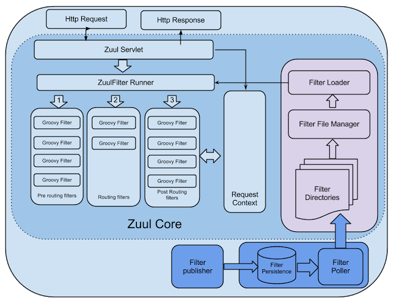
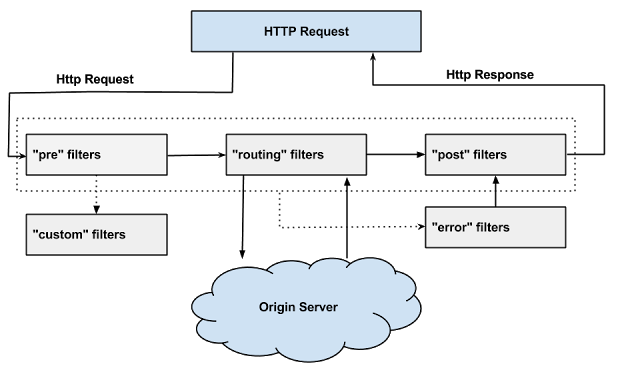
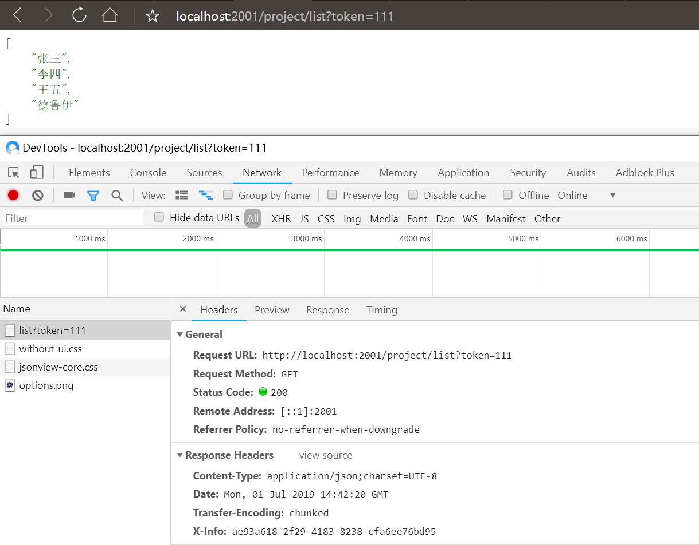
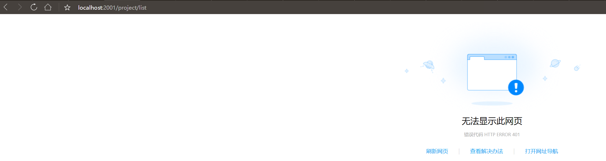

# Zuul

​		

## Zuul简介


​		zuul 是netflix开源的一个API Gateway 服务器, 本质上是一个web servlet应用。

Zuul 在云平台上提供动态路由，监控，弹性，安全等边缘服务的框架。Zuul 相当于是设备和 Netflix 流应用的 Web 网站后端所有请求的前门。

​		zuul的例子可以参考 netflix 在github上的 simple webapp，可以按照netflix 在github wiki 上文档说明来进行使用。

​		路由+过滤器=Zuul

​		Zuul的核心是一系列的过滤器。

过滤器:

- 前置过滤器(Pre)
  - 限流
  - 鉴权
  - 参数校验调整
- 后置过滤器(Post)
  - 统计
  - 日志

## Zuul的工作原理

### 过滤器机制


zuul的核心是一系列的**filters**, 其作用可以类比Servlet框架的Filter，或者AOP。

zuul把Request route到 用户处理逻辑 的过程中，这些filter参与一些过滤处理，比如Authentication，Load Shedding等。  


 

**Zuul提供了一个框架，可以对过滤器进行动态的加载，编译，运行。**

Zuul的过滤器之间没有直接的相互通信，他们之间通过一个RequestContext的静态类来进行数据传递的。RequestContext类中有ThreadLocal变量来记录每个Request所需要传递的数据。

Zuul的过滤器是由Groovy写成，这些过滤器文件被放在Zuul Server上的特定目录下面，Zuul会定期轮询这些目录，修改过的过滤器会动态的加载到Zuul Server中以便过滤请求使用。

下面有几种标准的过滤器类型：

Zuul大部分功能都是通过过滤器来实现的。Zuul中定义了四种标准过滤器类型，这些过滤器类型对应于请求的典型生命周期。

(1) PRE：这种过滤器在请求被路由之前调用。我们可利用这种过滤器实现身份验证、在集群中选择请求的微服务、记录调试信息等。

(2) ROUTING：这种过滤器将请求路由到微服务。这种过滤器用于构建发送给微服务的请求，并使用Apache HttpClient或Netfilx Ribbon请求微服务。

(3) POST：这种过滤器在路由到微服务以后执行。这种过滤器可用来为响应添加标准的HTTP Header、收集统计信息和指标、将响应从微服务发送给客户端等。

(4) ERROR：在其他阶段发生错误时执行该过滤器。

**内置的特殊过滤器**

zuul还提供了一类特殊的过滤器，分别为：StaticResponseFilter和SurgicalDebugFilter

StaticResponseFilter：StaticResponseFilter允许从Zuul本身生成响应，而不是将请求转发到源。

SurgicalDebugFilter：SurgicalDebugFilter允许将特定请求路由到分隔的调试集群或主机。

**自定义的过滤器**

除了默认的过滤器类型，Zuul还允许我们创建自定义的过滤器类型。

例如，我们可以定制一种STATIC类型的过滤器，直接在Zuul中生成响应，而不将请求转发到后端的微服务。

### 过滤器的生命周期

Zuul请求的生命周期如图，该图详细描述了各种类型的过滤器的执行顺序。



### 过滤器调度过程

​		

## Zuul开发步骤

### 添加依赖

```xml
<dependency>
    <groupId>org.springframework.cloud</groupId>
    <artifactId>spring-cloud-starter-netflix-zuul</artifactId>
</dependency>
<dependency>
    <groupId>org.springframework.cloud</groupId>
    <artifactId>spring-cloud-starter-netflix-eureka-client</artifactId>
</dependency>
<dependency>
    <groupId>org.springframework.cloud</groupId>
    <artifactId>spring-cloud-config-client</artifactId>
</dependency>
```

### 添加注解

​		需要在启动类上加上如下注解

```java
//表面这是一个api网关服务 
@EnableZuulProxy
//eureka客户端，好像不用添加这个注释也能注册到注册中心
@EnableDiscoveryClient
```

### 配置文件

​		需要注意的是这儿是bootstrap.yml文件

```yml
spring:
  application:
    name: api-gateway
  cloud:
    config:
      discovery:
        enabled: true
        service-id: config-server
      profile: dev
eureka:
  client:
    service-url:
      defaultZone: http://localhost:8761/eureka/
server:
  port: 2001
zuul:
  routes:
    # 把/myProject/** 路由dao /project/**
    myProject:
      path: /myProject/**
      serviceId: project
#需要暴露routes endpoint
management:
  endpoints:
    web:
      exposure:
        include: '*'
```

​		自定义路由还有中简便的方法

```yml
zuul:
  routes:
    # project是serviceId 后面是映射的路由
    project: /myProject/**
```

### 查看映射

```
http://localhost:2001/actuator/routes
```

### 忽略某些服务

> 配置前


> 配置后

```yml
zuul:
  routes:
    myProject:
      path: /myProject/**
      serviceId: project
  ignored-patterns:
    - /myProject/test
    - /project/test
```

​		这儿需要注意：需要把自定义路由也加入进去，不然通过/myProject/test还可以访问。

​		也可以使用通配符配置

```yml
zuul:
  routes:
    myProject:
      path: /myProject/**
      serviceId: project
  ignored-patterns:
    - /**/test
```

/**/test   可以匹配:  /a/myProject/test 也可以匹配/project/test，使用通配符的时候，需要按照实际需求控制通配范围。

 ***效果如下***


## Zuul中使用Cookie

​		在项目中我们通常都需要获取Cookie，zuul默认过滤掉了Cookie，如果项目中需要使用Cookie需要手动配置。

> ZuulProperties

```java
//默认过滤掉Cookie、Set-Cookie、Authorization
private Set<String> sensitiveHeaders = new LinkedHashSet(Arrays.asList("Cookie", "Set-Cookie", "Authorization"));
```

> 开启Cookie、Set-Cookie、Authorization

```yml
zuul:
  routes:
    myProject:
      path: /myProject/**
      serviceId: project
      #设置sensitiveHeaders为空
      sensitiveHeaders:
```


## 动态刷新路由配置

​		需要从config-server中动态获取配置，然后通过下面的方法动态的刷新zuul配置。

```java
@Component
public class ZuulConfig {


    @ConfigurationProperties("zuul")
    @RefreshScope
    public ZuulProperties zuulProperties(){
        return new ZuulProperties();
    }
}
```

## Zuul自定义过滤器

> 前置过滤器

```java
package club.ebuy.api.gateway.filter;

import com.netflix.zuul.ZuulFilter;
import com.netflix.zuul.context.RequestContext;
import com.netflix.zuul.exception.ZuulException;
import org.apache.commons.lang.StringUtils;
import org.apache.http.HttpStatus;
import org.springframework.stereotype.Component;

import javax.servlet.http.HttpServletRequest;

import static org.springframework.cloud.netflix.zuul.filters.support.FilterConstants.PRE_DECORATION_FILTER_ORDER;
import static org.springframework.cloud.netflix.zuul.filters.support.FilterConstants.PRE_TYPE;

/**
 * @className: TokenFilter
 * @description:
 * @author: King-Pan(pwpw1218@gmail.com)
 * @date: 2019-07-01 22:19
 */
@Component
public class TokenFilter extends ZuulFilter {
    @Override
    public String filterType() {
        return PRE_TYPE;
    }

    @Override
    public int filterOrder() {
        //越小越靠前，越先执行
        return PRE_DECORATION_FILTER_ORDER-1;
    }

    @Override
    public boolean shouldFilter() {
        return true;
    }

    @Override
    public Object run() throws ZuulException {
        RequestContext requestContext = RequestContext.getCurrentContext();
        HttpServletRequest request = requestContext.getRequest();

        //这里从url参数里获取，也可以从cookie，header里获取
        String token = request.getParameter("token");
        if(StringUtils.isEmpty(token)){
            requestContext.setSendZuulResponse(false);
            requestContext.setResponseStatusCode(HttpStatus.SC_UNAUTHORIZED);
        }
        System.out.println("==============================");
        return null;
    }
}

```


> 后置过滤器

```java
package club.ebuy.api.gateway.filter;

import com.netflix.zuul.ZuulFilter;
import com.netflix.zuul.context.RequestContext;
import com.netflix.zuul.exception.ZuulException;
import org.springframework.stereotype.Component;

import javax.servlet.http.HttpServletResponse;

import java.util.UUID;

import static org.springframework.cloud.netflix.zuul.filters.support.FilterConstants.POST_TYPE;
import static org.springframework.cloud.netflix.zuul.filters.support.FilterConstants.SEND_RESPONSE_FILTER_ORDER;

/**
 * @className: AddResponseHeaderFilter
 * @description:
 * @author: King-Pan(pwpw1218@gmail.com)
 * @date: 2019-07-01 22:25
 */
@Component
public class AddResponseHeaderFilter extends ZuulFilter {
    @Override
    public String filterType() {
        return POST_TYPE;
    }

    @Override
    public int filterOrder() {
        return SEND_RESPONSE_FILTER_ORDER-1;
    }

    @Override
    public boolean shouldFilter() {
        return true;
    }

    @Override
    public Object run() throws ZuulException {
        RequestContext requestContext = RequestContext.getCurrentContext();
        HttpServletResponse response = requestContext.getResponse();
        response.setHeader("X-Info", UUID.randomUUID().toString());
        return null;
    }
}
```

> 带token请求结果




> 没带token请求结果




## Zuul限流

​		Zuul限流的时机: 

​		Zuul限流实现方式:

* google guava令牌桶算法

* spring-cloud-zuul-ratelimit

  [spring-cloud-zuul-ratelimit](https://github.com/marcosbarbero/spring-cloud-zuul-ratelimit)

###  guava令牌桶算法限流实现

> 限流过滤器

```java
package club.ebuy.api.gateway.filter;

import club.ebuy.api.gateway.exception.RateLimitException;
import com.google.common.util.concurrent.RateLimiter;
import com.netflix.zuul.ZuulFilter;
import com.netflix.zuul.exception.ZuulException;
import org.springframework.stereotype.Component;

import static org.springframework.cloud.netflix.zuul.filters.support.FilterConstants.PRE_TYPE;
import static org.springframework.cloud.netflix.zuul.filters.support.FilterConstants.SERVLET_DETECTION_FILTER_ORDER;

/**
 * @className: RateFilter
 * @description: 限流拦截器
 * @author: King-Pan(pwpw1218@gmail.com)
 * @date: 2019-07-01 22:58
 */
@Component
public class RateLimitFilter extends ZuulFilter {

    /**
     * google guava 令牌桶算法
     */
    private static final RateLimiter RATE_LIMITER = RateLimiter.create(100);

    @Override
    public String filterType() {
        return PRE_TYPE;
    }

    @Override
    public int filterOrder() {
        return SERVLET_DETECTION_FILTER_ORDER -1;
    }

    @Override
    public boolean shouldFilter() {
        return true;
    }

    @Override
    public Object run() throws ZuulException {
        if(!RATE_LIMITER.tryAcquire()){
            throw new RateLimitException();
        }
        return null;
    }
}
```


## Zuul高可用

### 多个Zuul节点注册到Eureka Server

### Nginx和Zuul“混搭”


## 常见问题

> Zuul请求超时

```
This application has no explicit mapping for /error, so you are seeing this as a fallback.

Sun Jun 30 15:14:04 CST 2019
There was an unexpected error (type=Gateway Timeout, status=504).
com.netflix.zuul.exception.ZuulException: Hystrix Readed time out
```


