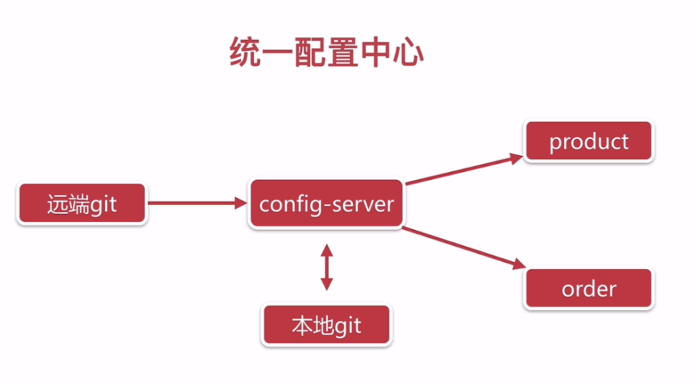

# SpringCloud配置中心


​		

# Spring Cloud Config

https://blog.csdn.net/xlgen157387/article/details/82840553

## 为什么需要统一配置中心

* 不方便维护（一句不方便维护包含了多少苦和累啊）
  * 单机、集群、分布式导致服务器主机的剧增
  * 应用部署数的剧增都会导致维护工作增加
* 配置内容安全与权限
* 更新配置项目需要重启




## 开发配置中心步骤

### 添加依赖

```xml
<dependency>
    <groupId>org.springframework.cloud</groupId>
    <artifactId>spring-cloud-config-server</artifactId>
</dependency>
<dependency>
    <groupId>org.springframework.cloud</groupId>
    <artifactId>spring-cloud-starter-netflix-eureka-client</artifactId>
</dependency>
```

		添加了Eureka Client、Config Server依赖

### 添加注解

		在Spring Boot的启动类上添加注解

```java
@SpringBootApplication
@EnableDiscoveryClient
@EnableConfigServer
public class EbuyConfigServerApplication {

    public static void main(String[] args) {
        SpringApplication.run(EbuyConfigServerApplication.class, args);
    }

}
```

* @EnableDiscoveryClient标注该项目是一个Eureka的Client端
* @EnableConfigServer 标注该项目是一个Config Server

### 添加Git配置

```yml
spring:
  cloud:
    config:
      server:
        git:
          uri: https://gitee.com/King-Pan/config-repo
          username: pwpw1218@gmail.com
          password: xxx
          basedir: /home/ocdc/config-server/config   #需要注意会情况config目录
```

		添加git仓库信息，使用git拉取配置到本地路径下，默认会放入到Temp目录下，生产环境下，需要修改默认路径，需要注意，配置的路径会被config server清空。

 


### 请求测试


/{name}-{profiles}.yml

/{label}/{name}-{profiles}.yml


其中变量含义如下:

* name 服务名
* profiles 环境
* label 分支(branch)


## 动态刷新配置


```xml
<dependency>
    <groupId>org.springframework.cloud</groupId>
    <artifactId>spring-cloud-config-monitor</artifactId>
</dependency>
<dependency>
    <groupId>org.springframework.cloud</groupId>
    <artifactId>spring-cloud-starter-bus-amqp</artifactId>
</dependency>
```

​		然后配置webhook   

```shell
http://dzyw4v.natappfree.cc/monitor?path=*
```

​		如果内网gitlab，可以直接使用ip，公网需要使用natapp做内网穿透


## 配置中心客户端

###  添加依赖

```xml
<dependency>
    <groupId>org.springframework.cloud</groupId>
    <artifactId>spring-cloud-config-client</artifactId>
</dependency>
```

### git配置文件

​		project-dev.yml文件内容

```yml
server:
  port: 1111
person:
  name: king
  age: 30
```

### 修改客户端配置文件名称

​		客户端配置文件名称需要从application.yml修改为bootstrap.yml。

​		bootstrap.yml文件内容

```yml
eureka:
  client:
    service-url:
      defaultZone: http://localhost:8761/eureka/
spring:
  application:
    name: project
  profiles:
    active: dev
  cloud:
    bus:
      id: ${vcap.application.name:${spring.application.name:application}}:${vcap.application.instance_index:${spring.cloud.config.profile:${local.server.port:${server.port:0}}}}:${vcap.application.instance_id:${random.value}}
    config:
      uri: http://localhost:8080/
  rabbitmq:
    host: localhost
    port: 5672
    username: guest
    password: guest
server:
  port: 1001
management:
  endpoints:
    web:
      exposure:
        include: '*'
```

​		这儿需要配置注册中心的uri以及spring.cloud.bus.id，并且打开了actuator的所有web endpoint

​		这儿的rabbitmq是默认连接本地的，如果需要修改配置请使用下列参数配置:

```properties
spring.rabbitmq.host=ip
spring.rabbitmq.port=端口
spring.rabbitmq.username=用户名
spring.rabbitmq.password=密码
```


### 自动刷新配置

```java
package club.javalearn.ebuyprojectweb.web;

import club.javalearn.ebuyprojectweb.config.Person;
import org.springframework.beans.factory.annotation.Autowired;
import org.springframework.cloud.context.config.annotation.RefreshScope;
import org.springframework.web.bind.annotation.GetMapping;
import org.springframework.web.bind.annotation.RestController;

/**
 * @className: AutoRefreshController
 * @description:
 * @author: King-Pan(pwpw1218@gmail.com)
 * @date: 2019-06-25 23:56
 */
@RefreshScope
@RestController
public class AutoRefreshController {

    @Autowired
    private Person person;

    @GetMapping("/test")
    public String test() {
        return person.getName() + "," + person.getAge();
    }
}
```


## 配置中心的高可用

​		上面我们做的配置中心是单节点，如果配置中心挂了，我们的服务就会出现问题。那么需要我们实现配置中心的高可用，来保障其他应用服务的可用性。


> 使用eureka的服务列表调用配置中心

​		主要是去掉了`spring.cloud.config.uri`直接指向 Server 端地址的配置，增加了最后的三个配置：

- `spring.cloud.config.discovery.enabled`：开启 Config 服务发现支持
- `spring.cloud.config.discovery.serviceId`：指定 Server 端的 name, 也就是 Server 端`spring.application.name`的值
- `eureka.client.service-url.defaultZone`：指向配置中心的地址

> git网站上配置多个webhook触发自动刷新


> eureka高可用，使用多个注册中心保障服务的高可用。