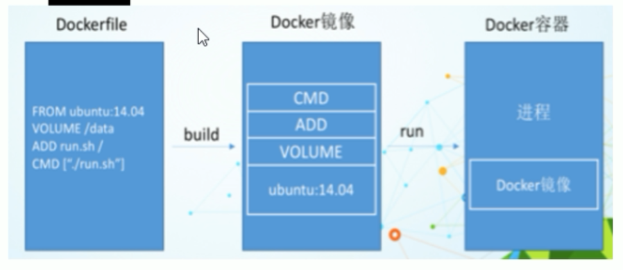
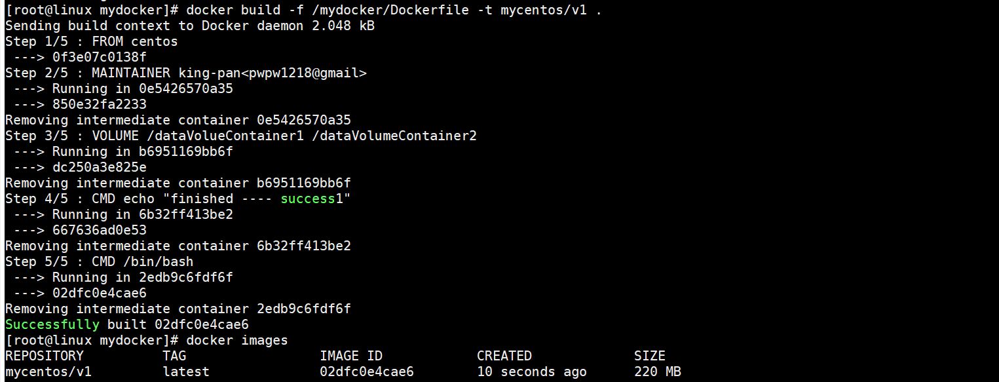

# Dockerfile构建镜像

## Dockerfile是什么

​		Dockerfile是镜像的构建文件


## Dockerfile解析流程

### 规范

每条保留字指令都必须为大写字母且后面要跟随至少一个参数

### 执行顺序

指令按照从上到下，顺序执行

### 注解

Dockerfile中使用#注解

### 镜像层

每条指令都会创建一个新的镜像层，并对镜像层进行提交

### 执行流程

1. **docker从基础镜像运行一个容器**
2. **执行一条指令并对容器进行修改**
3. **执行类似docker commit的操作提交一个新的镜像层**
4. **docker再基于刚提交的镜像运行一个新容器**
5. **执行dockerfile中的下一条执行直到所有指令都执行完**


### 总结

从应用软件的角度来看，Dockerfile、docker镜像与Docker容器分别代表软件的三个不同阶段

* dockerfile是软件的源码
* docker镜像是软件的交付文件
* docker容器则可以认为是软件的运行态。

Dockerfile面向开发，Docker镜像成为交付标准，Docker容器则涉及部署与运维，三者缺一不可，合力充当Docker体系的基石。



## Dockerfile构建流程

> 编写Dockerfile文件

> 使用docker build构建自定义镜像

> 使用docker run运行镜像

## 自定义构建镜像

https://www.cnblogs.com/panwenbin-logs/p/8007348.html

```sh
[root@linux dockerfile]# vim Dockerfile
FROM centos                               ---基础镜像
MAINTAINER king-pan<pwpw1218@gmail.com>   ---作者
ADD apache-tomcat-9.0.29.zip  /usr/local  ---安装 tomcat9
ADD jdk-8u171-linux-x64.tar.gz /usr/local ---安装jdk8

```

> 构建一个简单的镜像

```dockerfile
FROM centos
MAINTAINER king-pan<pwpw1218@gmail.com>
VOLUME ["/dataVolueContainer1","/dataVolumeContainer2"]
CMD echo "finished ---- success1"
CMD /bin/bash
```

***解释***

* **FROM基于哪个镜像构建新的镜像**
* **MAINTAINER作者信息**
* **VOLUME 指定持久化目录**
* **CMD：构建容器后调用，也就是在容器启动时才进行调用。**


> 执行命令构建镜像

```sh
docker bulid -f /xx/Dockerfile -t mycentos/v1 .
```

**参数解释**

* **-f：指定dockerfile目录**
* **-t： 指定构建成镜像的仓库/标签** 

