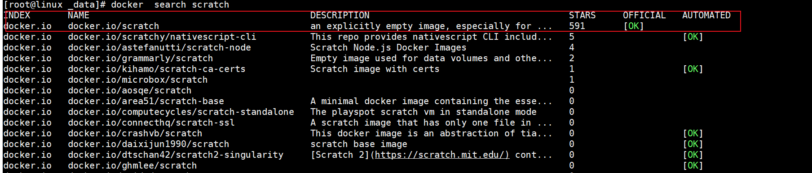
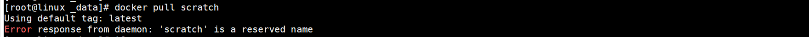
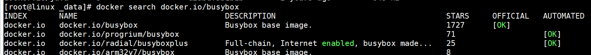

> scratch镜像【空镜像】           

注意：scratch镜像是不能pull的

> busybox 【软件工具箱】

 		busybox是一个软件工具箱，里边集成了linux中几百个常用的[linux](http://www.21yunwei.com/archives/category/linux)命令以及工具。很多时候我们可能需要安装一些虚拟系统包括里边配置一些环境，那么就需要下载一些操作系统镜像，比如ubuntu 、centos等等。 

