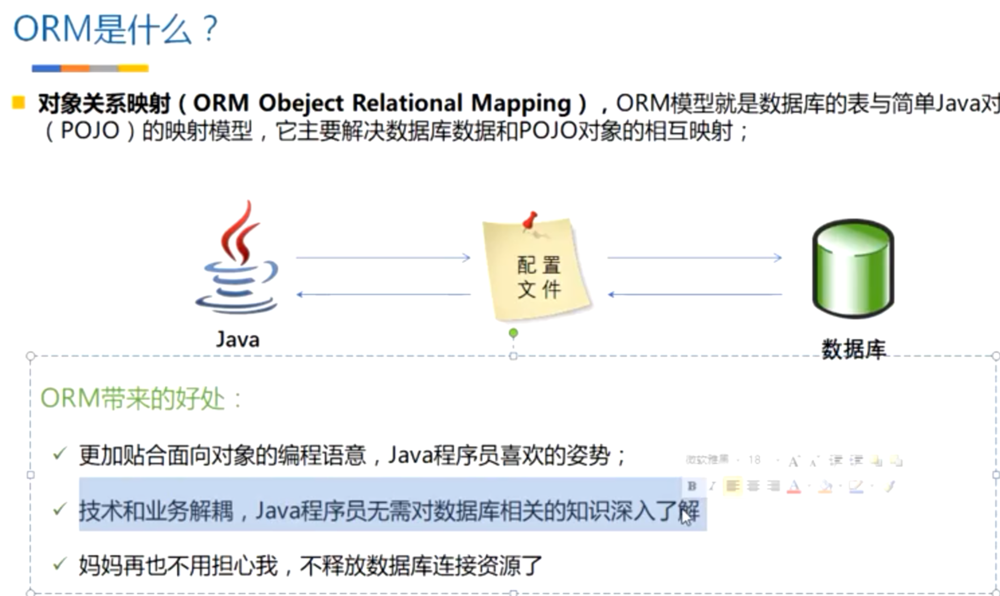
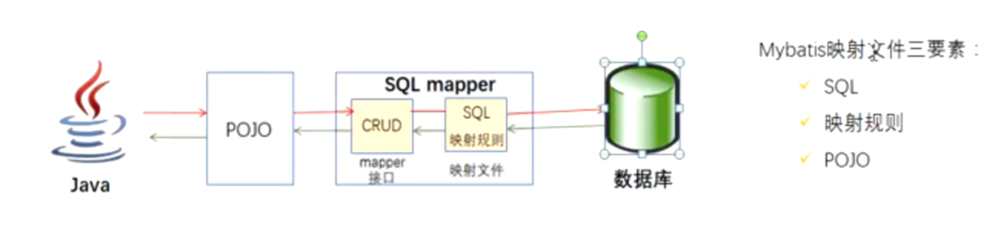
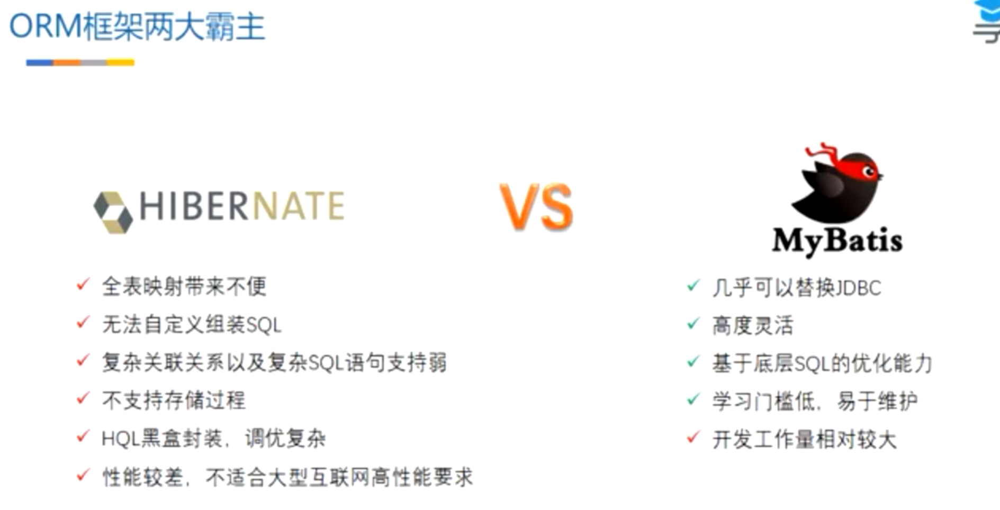

# Mybatis

## ORM框架简介

		### 什么是ORM

​		对象关系映射(ORM Object Relational Mapping)，ORM模型就是数据库的表与简单Java对象(POJO)的映射模型，它主要解决数据库和POJO对象的相互映射；

ORM带来的好处:

* 更加贴合面向对象的编程思想 
* 技术和业务解耦，Java程序员无需对数据库相关的知识深入了解
* 程序员不需要管理数据库连接资源

## Mybatis是什么?

Mybatis前身是iBatis，其源于"Internate"和"ibatis"的组合，本质是一种半自动的ORM框架，除了POJO和映射关系之外，还需要编写SQL语句。

## Mybatis与Hibernate的区别

Hibernate特点:

* 全表映射带来不便
* 无法自定义组装SQL
* 复杂关联关系以及复杂SQL语句支持弱
* 不支持存储过程
* HQL黑盒封装，调优复杂
* 性能较差，不适合大型互联网高性能要求

MyBatis： 

* 性能几乎可以赶上JDBC
* 高度灵活的SQL
* 基于底层SQL的优化能力
* 学习门槛低，易于维护
* 开发工作量较大

## MyBatis快速入门

* 加入MyBatis依赖
* 添加MyBatis配置文件
* 编写实体类，mapper接口以及mapper xml文件
* 编写实例代码

