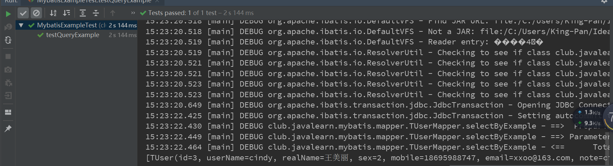

# Mybatis之Example

​		对SQL性能要求比较高的项目，不建议使用Example，不能通过调整SQL优化性能。


## 1、代码生成工具生成Example代码

​		生成的代码如下:

* TUser.java
* TUserExample
* TUserMapper.xml
* TUserMapper.java

与普通的Mybatis项目有一下区别:

* 多了一个TUserExample类
* TUserMapper中多了很多Example方法和xml配置


> 注意，代码生成工具需要如下配置

```xml
<!-- shema 数据库 tableName表明 -->
<!--        <table schema="${jdbc_username}" tableName="t_user"   enableCountByExample="false"-->
<!--               enableUpdateByExample="false" enableDeleteByExample="false"-->
<!--               enableSelectByExample="false" selectByExampleQueryId="false">-->
<!--            <generatedKey column="id" sqlStatement="MySql"/>-->
<!--        </table>-->
<table schema="${jdbc_username}" tableName="t_user">
    <generatedKey column="id" sqlStatement="MySql"/>
```

默认是生成Example的。

## 2、实例代码

> 测试类

```java
public class MybatisExampleTest {

    private SqlSessionFactory sqlSessionFactory;

    @Before
    public void before()throws IOException {
        String resource = "mybatis-config.xml";
        InputStream inputStream = Resources.getResourceAsStream(resource);
        // 1.读取mybatis配置文件创SqlSessionFactory
        sqlSessionFactory = new SqlSessionFactoryBuilder().build(inputStream);
        inputStream.close();
    }


    @Test
    public void testQueryExample(){
        //2. 获取sqlsession
        SqlSession sqlSession = sqlSessionFactory.openSession();

        //3. 获取mapper
        TUserMapper mapper = sqlSession.getMapper(TUserMapper.class);

        TUserExample example = new TUserExample();
        TUserExample.Criteria criteria = example.createCriteria();
        criteria.andEmailLike("%163.com");
        criteria.andSexEqualTo((byte) 2);

        List<TUser> userList = mapper.selectByExample(example);
        System.out.println(userList);

    }

}
```

## 3、测试结果

> 测试结果

```java
15:23:22.430 [main] DEBUG club.javalearn.mybatis.mapper.TUserMapper.selectByExample - ==>  Preparing: select id, user_name, real_name, sex, mobile, email, note, position_id from t_user WHERE ( email like ? and sex = ? ) 
15:23:22.449 [main] DEBUG club.javalearn.mybatis.mapper.TUserMapper.selectByExample - ==> Parameters: %163.com(String), 2(Byte)
15:23:22.464 [main] DEBUG club.javalearn.mybatis.mapper.TUserMapper.selectByExample - <==      Total: 1
[TUser(id=3, userName=cindy, realName=王美丽, sex=2, mobile=18695988747, email=xxoo@163.com, note=cindy's note, positionId=1)]
```

