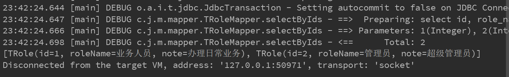
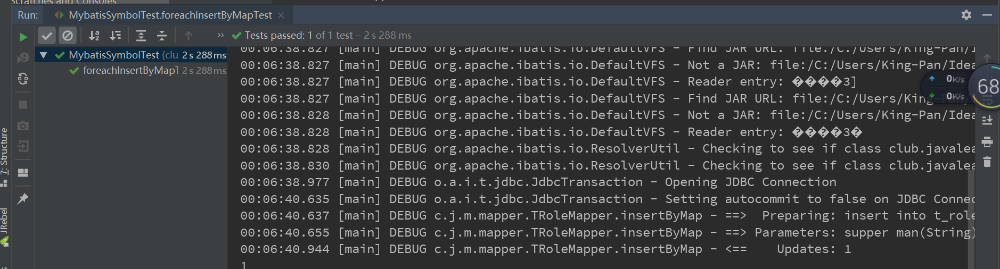

# Mybatis动态SQL

​		Mybatis的动态SQL实现：通过标签的方式，如果标签中的条件表达式成立，则把标签中的内容以sql片段的形式拼接成一个完整的SQL，从而实现Mybatis的动态SQL。

| 元素                      | 作用                  | 备注                                       |
| ------------------------- | --------------------- | ------------------------------------------ |
| if                        | 判断语句              | 单条件分支判断                             |
| choose（when、otherwise） | 相当于java的case when | 多条件分支判断                             |
| trim(where、set)          | 辅助元素              | 用于处理sql拼装问题                        |
| foreach                   | 循环语句              | 在in语句等列举条件常用，常用于实现批量操作 |

## 1、if

### 1.1、基本属性

| 属性名 | 备注                                                         |
| ------ | ------------------------------------------------------------ |
| test   | 条件表达式，条件成立，拼接if里面的sql；条件不成立，忽略if里面的sql |

​		if中的test表达式成立则把if标签中的内容拼接到sql中，从而实现动态sql

### 1.2、实例

```XML
<select id="selectById" resultMap="BaseResultMap"	parameterType="TUser">
    select
    <include refid="Base_Column_List"/>
    from t_user
    where 1=1
    <if test="userName !=null and userName != ''">
        and user_name = #{userName,jdbcType=VARCHAR}
    </if>
    <if test="realName !=null and realName != ''">
        and real_name like CONCAT('%',#{realName,jdbcType=VARCHAR},'%') 
    </if>
</select>
```

## 2、where

### 2.1、基本属性

​		where没有属性

### 2.2、实例

```xml
<select id="selectById" resultMap="BaseResultMap"	parameterType="TUser">
    select
    <include refid="Base_Column_List"/>
    from t_user
    where 1=1
    <where>
        <if test="userName !=null and userName != ''">
            and user_name = #{userName,jdbcType=VARCHAR}
        </if>
        <if test="realName !=null and realName != ''">
            and real_name like CONCAT('%',#{realName,jdbcType=VARCHAR},'%')
        </if>
    </where>
</select>
```

## 3、set

### 3.1、基本属性

​		set没有基本属性

### 3.2、实例

* 当在update语句中使用if标签时，如果前面的if没有执行，则或导致逗号多余错误。使用set标签可以将动态的配置SET 关键字，和剔除追加到条件末尾的任何不相关的逗号。
* 在insert、update去除逗号

没有使用if标签时，如果有一个参数为null，都会导致错误，如下示例：

```xml
<update id="update" parameterType="TUser">
    update t_user
    real_name = #{realName,jdbcType=VARCHAR},
    user_name = #{userName,jdbcType=VARCHAR}
    where id = #{id,jdbcType=INTEGER}
</update>
```

需要解决更新字段后面的，如果是最后的一个更新字段不能有","的问题

> 使用set前

```xml
<update id="update" parameterType="TUser">
    update t_user set
    <if test="realName != null and realName != ''">
        real_name = #{realName,jdbcType=VARCHAR},
    </if>
    <if test="userName != null and userName != ''">
        user_name = #{userName,jdbcType=VARCHAR},
    </if>
    id = #{id}
    where id = #{id,jdbcType=INTEGER}
</update>
```

> 使用set后

```xml
<update id="update" parameterType="TUser">
    update t_user
    <set>
        <if test="realName != null and realName != ''">
            real_name = #{realName,jdbcType=VARCHAR},
        </if>
        <if test="userName != null and userName != ''">
            user_name = #{userName,jdbcType=VARCHAR},
        </if>
    </set>
    where id = #{id,jdbcType=INTEGER}
</update>
```

## 4、trim

### 4.1、基本属性

| 属性            | 备注                                                         |
| --------------- | ------------------------------------------------------------ |
| prefix          | 给sql语句拼接的前缀                                          |
| prefixOverrides | 去除sql语句前面的关键字或者字符，该关键字或者字符由prefixOverrides属性指定，假设该属性指定为"AND"，当sql语句的开头为"AND"，trim标签将会去除该"AND" |
| suffix          | 给sql语句拼接的后缀                                          |
| suffixOverrides | 去除sql语句后面的关键字或者字符，该关键字或者字符由suffixOverrides属性指定 |

### 4.2、实例

> trim实现where

```xml
<select id="selectByUser" resultMap="BaseResultMap"	parameterType="TUser">
    select
    <include refid="Base_Column_List"/>
    from t_user
    <trim prefix="where" prefixOverrides="and | or">
        <if test="userName !=null and userName != ''">
            and user_name = #{userName,jdbcType=VARCHAR}
        </if>
        <if test="realName !=null and realName != ''">
            and real_name like CONCAT('%',#{realName,jdbcType=VARCHAR},'%')
        </if>
    </trim>
</select>
```

> trim实现set

```xml
<update id="update" parameterType="TUser">
    update t_user
    <trim prefix="set" suffixOverrides=",">
        <if test="realName !=null and realName != ''">
            real_name = #{realName,jdbcType=VARCHAR},
        </if>
        <if test="userName !=null and userName != ''">
            user_name = #{userName,jdbcType=VARCHAR},
        </if>
    </trim>
    where id = #{id,jdbcType=INTEGER}
</update>
```

## 5、foreach

### 5.1、基本属性

| 属性       | 备注                                                         |
| ---------- | ------------------------------------------------------------ |
| collection | 必须指定，当传入的参数为list类型，为list;当传入的参数为array类型，为array;当传入的参数为map类型，为map的键key（较少使用）； |
| item       | 迭代集合时，元素的别名                                       |
| index      | 在list和数组中,index是元素的序号，在map中，index是元素的key  |
| open       | 包裹被迭代集合元素的开始符号，一般为"("                      |
| close      | 包裹被迭代集合元素的结束符号，一般为")"                      |
| separator  | 被迭代元素之间的分隔符，一般为","                            |

### 5.2、实例

​		**在使用foreach的时候最关键的也是最容易出错的就是collection属性，该属性是必须指定的，但是在不同情况 下，该属性的值是不一样的，主要有一下3种情况：**

* 如果传入的是单参数且参数类型是一个List的时候，collection属性值为list
* 如果传入的是单参数且参数类型是一个array数组的时候，collection的属性值为array
* 如果传入的参数是多个的时候，我们就需要把它们封装成一个Map了，当然单参数也可以封装成map，实际上如果你在传入参数的时候，在MyBatis里面也是会把它封装成一个Map的，map的key就是参数名，所以这个时候collection属性值就是传入的List或array对象在自己封装的map里面的key.

> foreach之list

mapper.xml文件内容

```xml
<select id="selectByIds" resultMap="BaseResultMap">
    select
    id, role_name, note
    from t_role
    where id in
    <foreach collection="list" index="index" item="item" open="(" close=")" separator=",">
      #{item}
    </foreach>
  </select>
```

Mapper.java内容

```java
public interface TRoleMapper {

    List<TRole> selectByIds(List<Integer> ids);

}
```

测试代码

```java
private SqlSessionFactory sqlSessionFactory;


@Before
public void init() throws IOException {

    String resource = "mybatis-config.xml";
    InputStream inputStream = Resources.getResourceAsStream(resource);
    // 1.读取mybatis配置文件创SqlSessionFactory
    sqlSessionFactory = new SqlSessionFactoryBuilder().build(inputStream);
    inputStream.close();
}

@Test
public void foreachTest1(){
    // 2.获取sqlSession
    SqlSession sqlSession = sqlSessionFactory.openSession();
    // 3.获取对应mapper
    TRoleMapper mapper = sqlSession.getMapper(TRoleMapper.class);
    //4.执行
    List<Integer> ids = new ArrayList<>(10);
    ids.add(1);
    ids.add(2);
    ids.add(3);
    List<TRole> roleList = mapper.selectByIds(ids);
    System.out.println(roleList);
}
```

测试结果：



> foreach之array

**mapper.xml内容:**

```xml
<select id="selectByArray" resultMap="BaseResultMap">
    select
    id, role_name, note
    from t_role
    where id in
    <foreach collection="array" index="index" item="item" open="(" close=")" separator=",">
      #{item}
    </foreach>
  </select>
```

**mapper.java内容：**

```java
List<TRole> selectByArray(Integer[] ids);
```

**测试代码：**

```java
@Test
public void foreachTest2(){
    // 2.获取sqlSession
    SqlSession sqlSession = sqlSessionFactory.openSession();
    // 3.获取对应mapper
    TRoleMapper mapper = sqlSession.getMapper(TRoleMapper.class);
    //4.执行
    List<Integer> ids = new ArrayList<>(10);
    ids.add(1);
    ids.add(2);
    ids.add(3);
    ids.add(4);
    List<TRole> roleList = mapper.selectByArray(ids.toArray(new Integer[]{}));
    System.out.println(roleList);
}
```

**测试结果：**

```java
23:48:42.208 [main] DEBUG o.a.i.t.jdbc.JdbcTransaction - Setting autocommit to false on JDBC Connection [com.mysql.cj.jdbc.ConnectionImpl@47faa49c]
23:48:42.211 [main] DEBUG c.j.m.m.TRoleMapper.selectByArray - ==>  Preparing: select id, role_name, note from t_role where id in ( ? , ? , ? , ? ) 
23:48:42.231 [main] DEBUG c.j.m.m.TRoleMapper.selectByArray - ==> Parameters: 1(Integer), 2(Integer), 3(Integer), 4(Integer)
23:48:42.245 [main] DEBUG c.j.m.m.TRoleMapper.selectByArray - <==      Total: 2
[TRole(id=1, roleName=业务人员, note=办理日常业务), TRole(id=2, roleName=管理员, note=超级管理员)]
```


> foreach之map

**mapper.xml文件内容：**

```xml
<insert id="insertByMap">
    insert into t_role
    <foreach collection="params.keys" item="item" open="(" separator="," close=")">
        ${item}
    </foreach>
    values
    <foreach collection="params.keys" item="item" open="(" separator="," close=")">
        #{params[${item}]}
    </foreach>
</insert>
```

**mapper.java文件内容：**

```java
int insertByMap(@Param("params") Map<String,Object> map);
```

**测试代码：**

```java
@Test
public void foreachInsertByMapTest(){
    // 2.获取sqlSession
    SqlSession sqlSession = sqlSessionFactory.openSession();
    // 3.获取对应mapper
    TRoleMapper mapper = sqlSession.getMapper(TRoleMapper.class);
    //4.执行
    Map<String,Object> map = new HashMap<>(10);
    map.put("id",5);
    map.put("role_name","supper man");
    map.put("note","超级管理员");
    int result = mapper.insertByMap(map);
    //提交事务
    sqlSession.commit();
    System.out.println(result);
}
```

**测试结果：**

```java
00:06:40.635 [main] DEBUG o.a.i.t.jdbc.JdbcTransaction - Setting autocommit to false on JDBC Connection [com.mysql.cj.jdbc.ConnectionImpl@6da21078]
00:06:40.637 [main] DEBUG c.j.m.mapper.TRoleMapper.insertByMap - ==>  Preparing: insert into t_role ( role_name , note , id ) values ( ? , ? , ? ) 
00:06:40.655 [main] DEBUG c.j.m.mapper.TRoleMapper.insertByMap - ==> Parameters: supper man(String), 超级管理员(String), 5(Integer)
00:06:40.944 [main] DEBUG c.j.m.mapper.TRoleMapper.insertByMap - <==    Updates: 1
```



> foreach之map2

**mapper.xml文件内容：**

```xml
<select id="selectByMap" resultMap="BaseResultMap" >
    select
    id, role_name, note
    from t_role
    where id in
    <foreach collection="ids" index="index" item="key" open="(" close=")" separator=",">
        #{key}
    </foreach>
    <if test="roleName != null and roleName !=''">
        and role_name like concat('%',#{roleName},'%')
    </if>
</select>
```

**mapper.java文件内容：**

```java
List<TRole> selectByMap(Map<String,Object> map);
```

**测试代码：**

```java
@Test
public void foreachSelectByMapTest(){
    // 2.获取sqlSession
    SqlSession sqlSession = sqlSessionFactory.openSession();
    // 3.获取对应mapper
    TRoleMapper mapper = sqlSession.getMapper(TRoleMapper.class);
    //4.执行
    Map<String,Object> map = new HashMap<>(10);
    map.put("ids",new Integer[]{1,3,5,6});
    map.put("roleName","supper");
    map.put("note","超级管理员");
    List<TRole> roleList = mapper.selectByMap(map);
    System.out.println(roleList);
}
```

**测试结果：**

```java
01:04:45.879 [main] DEBUG c.j.m.mapper.TRoleMapper.selectByMap - ==>  Preparing: select id, role_name, note from t_role where id in ( ? , ? , ? , ? ) and role_name like concat('%',?,'%') 
01:04:45.897 [main] DEBUG c.j.m.mapper.TRoleMapper.selectByMap - ==> Parameters: 1(Integer), 3(Integer), 5(Integer), 6(Integer), supper(String)
01:04:45.911 [main] DEBUG c.j.m.mapper.TRoleMapper.selectByMap - <==      Total: 1
[TRole(id=5, roleName=supper man, note=超级管理员)]
```


### 5.3、注意事项

* foreach标签中遍历的内容，如果是用在列名的获取，要用${value}获取值，也就是直接去拼接，而不是预编译，否则会报错。用在条件遍历是预编译会更好一些（防止SQL注入），即#{value}。

* 参数为Map类型时，collection=”params.values”取的是值，而 
  collection=”params.keys”取的是键。

* 不管是任何参数，@Param(“key”)注解的中key才是collection=”key”中取到的值（或者是键）。
* 当collection为map时，可以使用@Param("xxx")注解，在foreach中可以使用xxx.keys或者xxx.values
* 当collection为map时，可以直接使用map中的key来获取值。


