# idea高效开发

​	高效编码、快捷部署、简单测试

​	2个特性：Postfix Completion、Live Templates

​	2个工具：JRebel 、Idea 自带Http Client工具

## Postfix Completion

### 什么是Postfix Completion

​		按照字面的意思就是后缀“后缀完成”。它能通过后缀自动补全功能快速的实现一些代码，从而提升我们的工作效率。

例如: 我在开发过程中，需要调用一个方法  personDao.list()，在测试的时候，可能需要把结果输出:

那么现在我需要这样操作： 剪切personDao.list() 然后写System.out.println(); 最后把personDao.list()拷贝到System.out.println(personDao.list())中。

假如今后我可以使用下面的方法快速实现上面的操作: personDao.list().sout

### 分类

#### 变量创建

>创建对象

```java
//Person.new
new Person();
```

>局部变量

```java
//new.String().var 会自定实现下列效果、并且光标在s出方便重新定义变量名
String s = new String();
```
>全局变量

```java
//new Person().field 创建全局变量

//1. 在类方法中创建的是private static 全局变量
//2. 在实例方法中创建的是实例变量
private static Person p;
private String name;
public static void main(String[] args) {    
    //new Person().var 创建局部变量    
    Person person = new Person();    
    String ss = new String();   
    //new Person().field 创建全局变量   
    // 如果是类方法创建的就是私有的静态属性   
    // 如果是实例方法创建的就是实例属性   
    p = new Person();
}
public void t1(){   
    //    
    name = new String();
}

```

>强制类型转换

```java
//new Object().cast
 (String) new Object();
 //然后可以在后面继续追加.var命令创建变量
 String title = (String)new Object();
 
```

>强制类型转换并且创建变量

```java
//new Object().castvar
String title = (String)new Object();
```

#### 判断

>是否为null

```java

//Person.new + 回车+ .var
Person person = new Person();

//person.null
if(person == null){
    
}

//如果变量为boolean类型
boolean deleted = true;
//deleted.if
if(deleted){

}

//deleted.while
while(deleted){
    
}
//deleted.not -> !deleted deleted取反
```


>是否不为null

```java
//1. person.notnull
//2. person.nn
```

#### 输入、输出

>输出

```java

Person person = new Person();

//person.sout
System.out.println(person);

//person.soutv
System.out.println("person = " + person);
```

>输入

```java
//person.return
return person;
```

#### 循环

>数组循环

```java
String[] names = new String[]{"zs","ls","ww"}

//names.fori 正序循环
for(int i=0;i<names.length;i++){

}

//names.forr 倒序循环
for(int i=names.length-1;i>=0;i--){

}

//names.for 增强for循环
for(String name:names){

}
String tile ="";
//title.switch
switch (title) {  

}

int i =0;
//i.switch
switch (i) {
    
}


```

#### 异常捕获


```java
//t1.try
try {    
    t1()
} catch (Exception e) {  
    e.printStackTrace();
}

```

### 配置路径


File | Settings | Editor | General | Postfix Completion

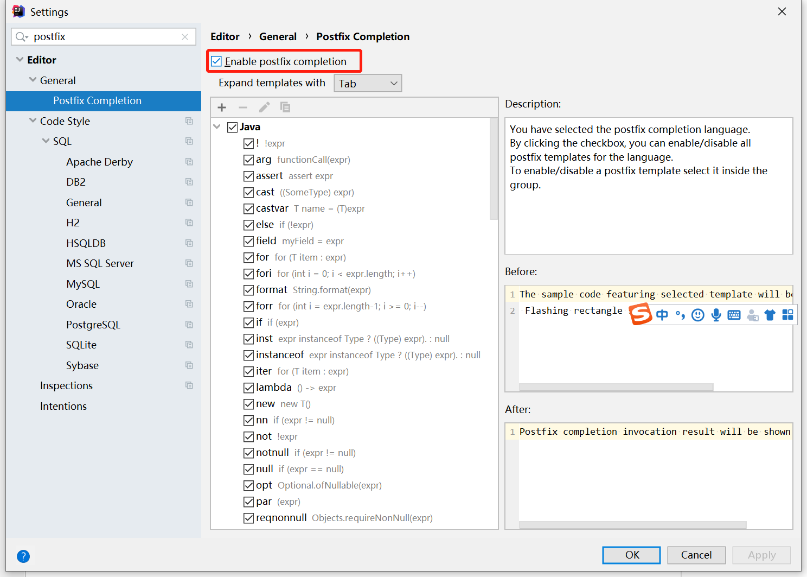


### 自定义Postfix Completion

#### err

> 配置

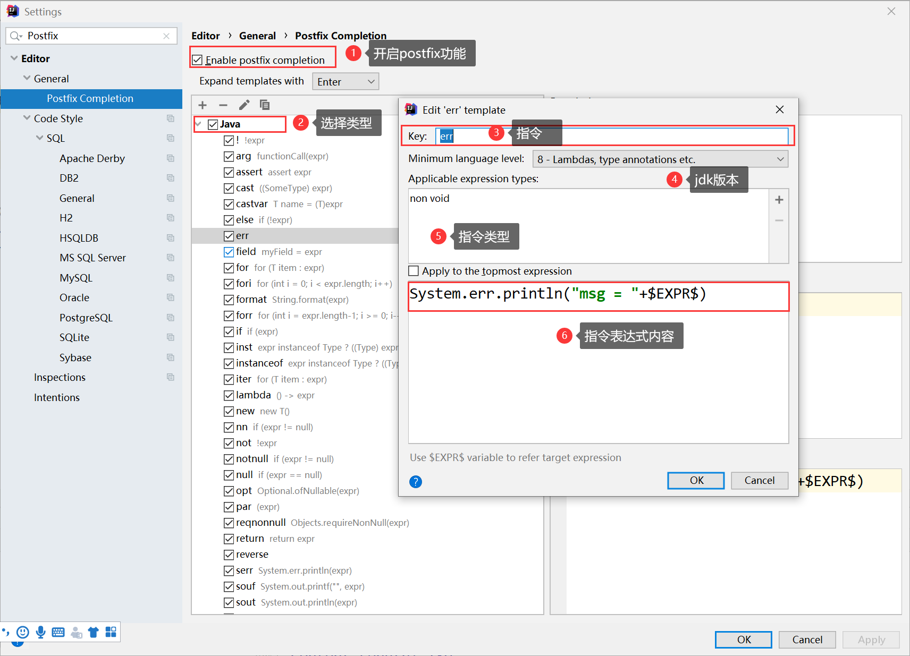


> 指令内容

```java
System.err.println("msg = "+$EXPR$)
```

> 效果

```java
// msg.err
System.out.println("msg = " + msg);
```

> 注意

$EXPR$内置变量，“.”号前面的内容

#### reverse

> 配置


> 指令内容

```java
char[] chars = $EXPR$.toCharArray();
StringBuilder reverse = new StringBuilder();
for (int i = chars.length - 1; i >= 0; i--) {
    reverse.append(chars[i]);
}
System.out.println(reverse.toString());
```

> 效果

```java
//title.reverse
char[] chars = title.toCharArray();
StringBuilder reverse = new StringBuilder();
for (int i = chars.length - 1; i >= 0; i--) {
    reverse.append(chars[i]);
}
System.out.println(reverse.toString());
```

> 注意事项

* 指令的应用范围是字符串类型
* $EXPR$内置变量，“.”号前面的内容 eg: title.reverse  那么$EXPR$变量即为title变量


## Live Templates


### Live Templates是什么

​	Live Teplates可以实现对代码模块的快速定义，就像平时常用的fori，sout，foreach，fvd等都是常用的ide自带的已经定义好的模板，Live Teplates可以帮助我们快速开发，通过快捷键快速写出我们定义的代码，下面看一下怎么自定义Live Teplates。

Live Templates的优点:

- 1.提高编码效率；
- 2.统一代码风格；

### Live Temlates设置

#### 配置路径

File | Settings | Editor | Live Templates

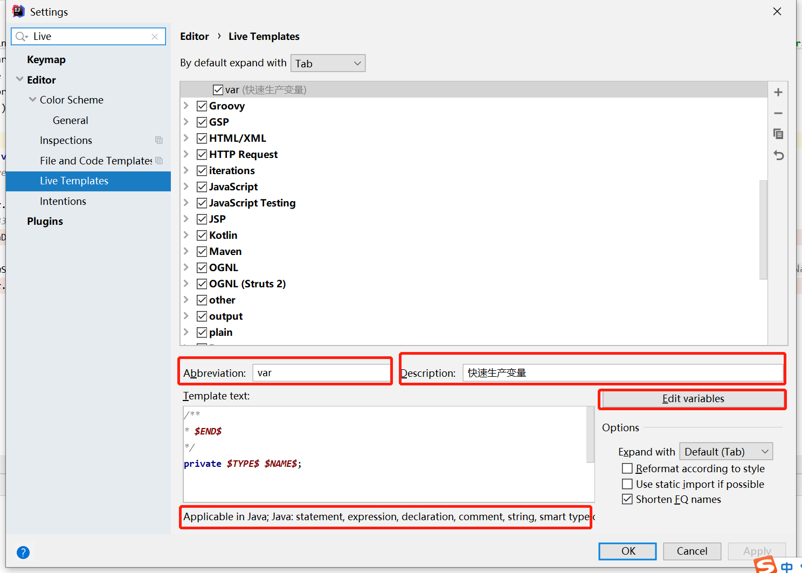


#### 配置详情

> Abbreviation: 

动态模板缩写

> Description: 描述

动态模板描述--这个模板干啥用的

> Template Text: 模板内容，

模板内容中的$TYPE$、$NAME$等都是变量，可以使用idea内置的函数或者自定义groovy函数给变量赋值

例如常用的内置函数有: date()、date("yyyy-MM-dd")、user()

> Application Context Define: 

指明在什么文件什么情况下使用。一般默认勾选java就可以

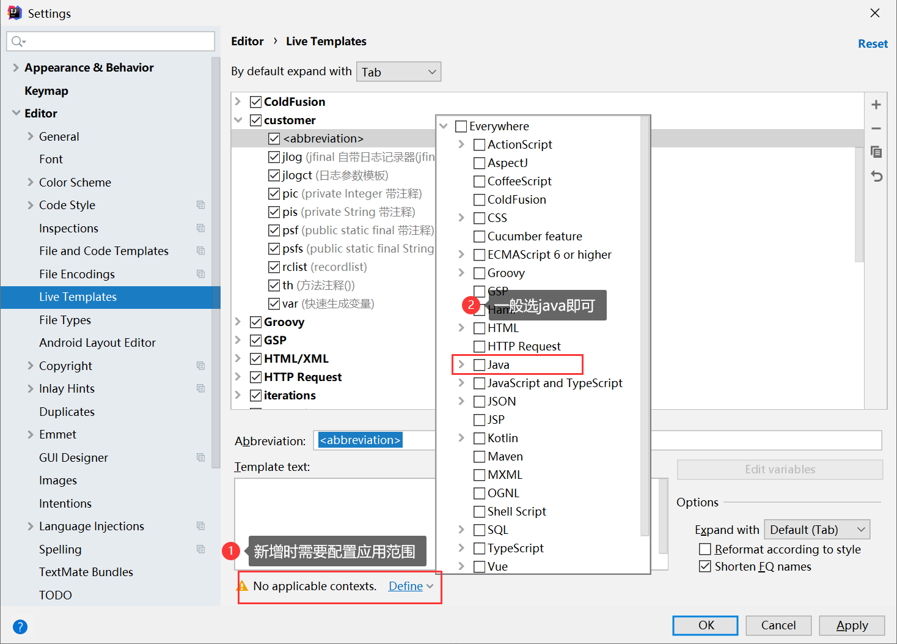

> Edit Variables: 编辑变量

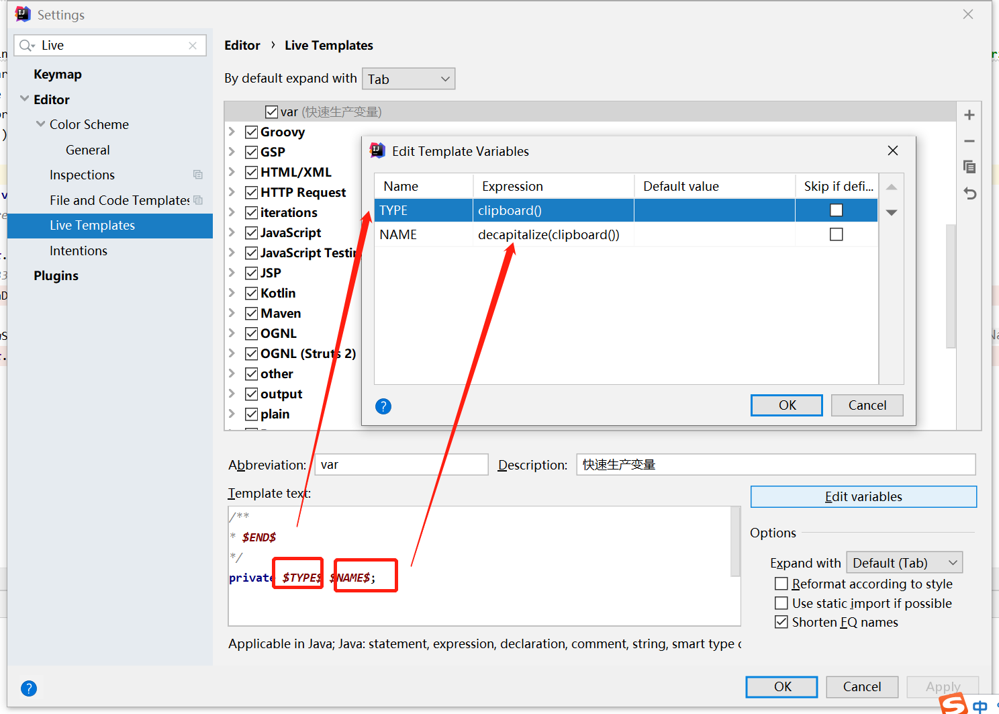

**编辑模板变量**

* Name: 变量名称 Template text中$$包含的名称

* Expression: 表达式 idea内置函数、groovy自定义函数

  [idea 内置函数](https://www.jetbrains.com/help/idea/2016.1/live-template-variables.html)

* Default value: 默认值

* Skip if defined: 勾选上后 光标便不再在这个变量处停留
* $END$ 是个比较特殊的变量指定了模板内容加载完成后光标显示的位置；如果想要指定结束光标的位置则需要把每个变量的 Skip if defined 勾选上

**Abbreviation（缩进名）**：即之后代码输入pssd按快捷键即可生成private static String var;
 **Edit variables（编辑编写）**：编辑变量，包括顺序，变量功能等，详见下方备注
 **Description（注释）**：注释模板功能
 **Template text（模板主体）**：$x$ x为变量，$END$ 为自带变量，即最后光标停留位置

 **options（快捷键）**：即输入pssd后按下Enter还是Tab生成模板。作者一般使用Tab键，一方面是防止与自带模板冲突，另一方面与shell快捷键一至
 **Reformate According to Style**：自动进行代码格式化。不勾选代码不会自动缩进换行


### 实例

#### jfinal LOG

> jfinal 日志记录器

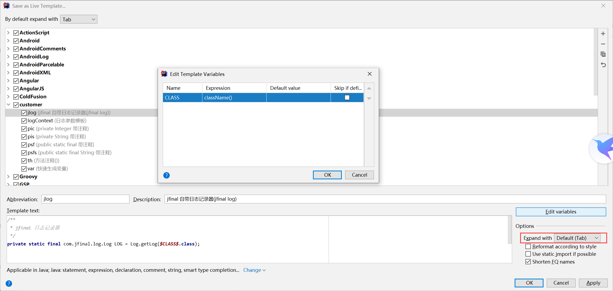


> Template Text内容:

```java
private static final com.jfinal.log.Log LOG = Log.getLog($CLASS$.class);
```

$CLASS$: 取值函数是className() 获取当前类的ClassName


#### jfinal日志快速输出方法入参

> jfinal日志快速输出方法入参

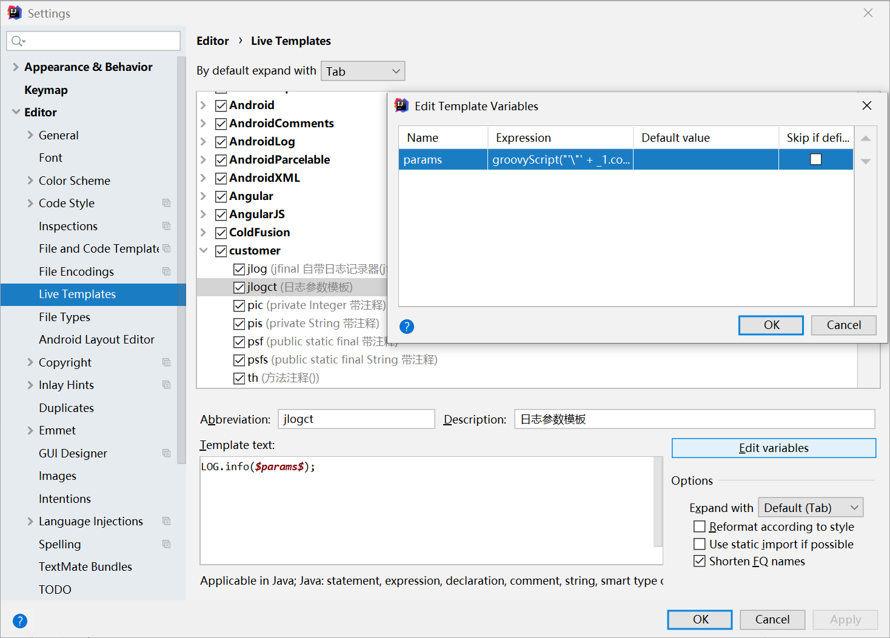

```groovy
groovyScript("'\"' + _1.collect { it + ' = [\" + ' + it + ' + \"]'}.join(', ') + '\"'", methodParameters())
```

> **实现效果**

```java
public long add(int a, double b) {
    //jlogct+回车
    LOG.info("a = [" + a + "], b = [" + b + "]");
    return 1L;
}
```

#### 方法注释模板

> 方法注释模板

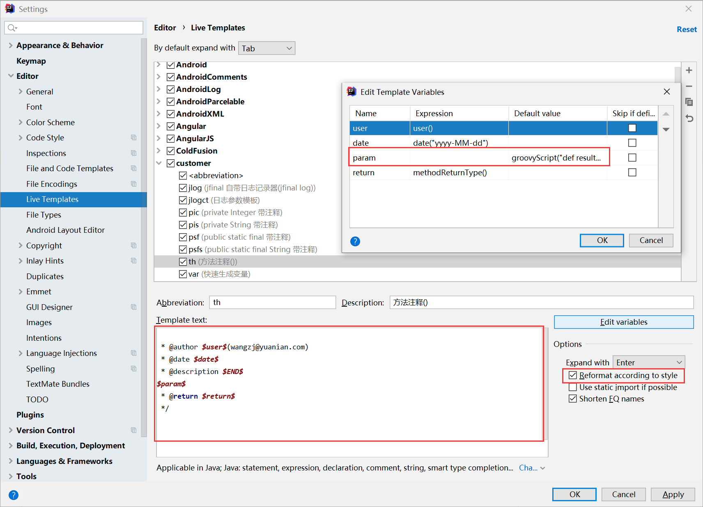

> Templates Text

```

 * @author $user$(wangzj@yuanian.com)
 * @date $date$
 * @description $END$
$param$
 * @return $return$
 */
```

> $param$参数

$param$参数: 配置default value 

```groovy
groovyScript("def result=''; def params=\"${_1}\".replaceAll('[\\\\[|\\\\]|\\\\s]', '').split(',').toList(); for(i = 0; i < params.size(); i++) {if(params[i] == '') return result;if(i==0) result += '\\n'; result+=' * @param ' + params[i] + ((i < params.size() - 1) ? '\\n' : '')}; return result", methodParameters())
```

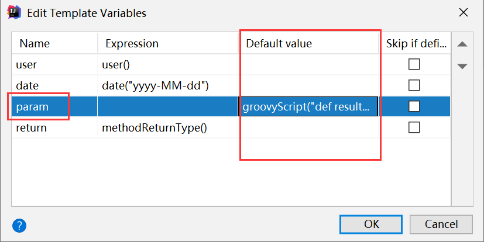

> 注意事项:

* $param$参数: 配置default value 
* 注释样式不规范需要勾选: Reformat according to style

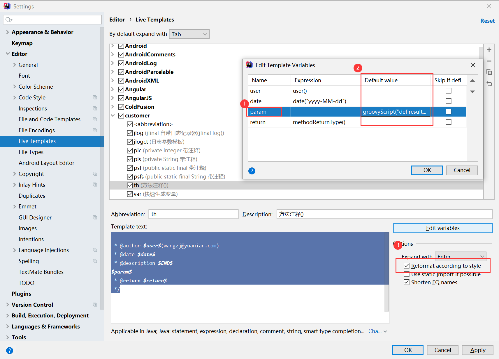

> 效果

```java
// /**th+回车
/**
    * @author king-pan(wangzj@yuanian.com)
    * @date 2020-03-29
    * @description 
    * @Param a
    * @Param b
    * @return long
    */
public long add(int a, double b) {
    //jlogct+回车
    LOG.info("a = [" + a + "], b = [" + b + "]");
    return 1L;
}
```

#### 项目开发实际场景

> record 列表查询

```java
List<Record> result = Db.use("ykb_route_rule").find("select id as supplier_id, supplier_name from " + SysTable.YKB_SUPPLIER_FLIGHT);
```

我们需新建一个live template:

操作步骤如下:

1. 选中当前代码，菜单栏找到: tools->Save as Live Template 直达Live template配置界面，并且把我们选中的代码块赋值给template text

   

2. 然后可以把"ykb_route_rule"抽象成一个变量$configName$，把find()方法中的参数抽象成一个变量$sql$，最后template text的值如下:

   

```java
java.util.List<com.jfinal.plugin.activerecord.Record> result = com.jfinal.plugin.activerecord.Db.use($configName$).find($sql$);
```

**注意：**如果模板内容中的类不是全路径类名，需要手动导包；

3. 配置如下:


4. 实际效果

```java
//rclist+回车
List<Record> result = Db.use(光标所在处).find();
List<Record> result = Db.use("ykb_admin").find("select id,name from sys_user");
```

### 快速配置实时模板

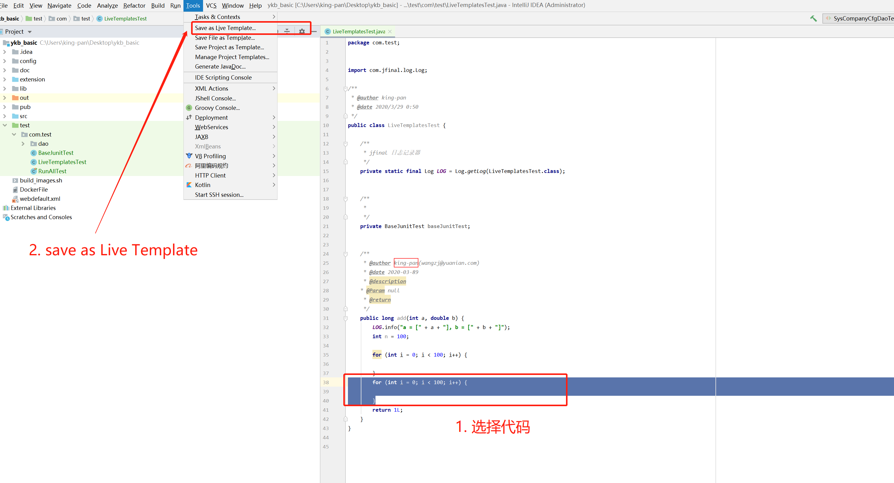

## JRebel热部署插件

### 安装JRebel

安装和使用JRebel需要注意两点：激活和设置
1、在IDEA中一次点击 File->Settings->Plugins->Brows Repositories
2、在搜索框中输入JRebel进行搜索
3、找到JRebel for intellij
4、install
5、安装好之后需要restart IDEA

### 激活JRebel

#### 下载激活工具

[激活工具下载](https://github.com/ilanyu/ReverseProxy/releases/tag/v1.4)

window版本工具：附件《ReverseProxy_windows_amd64.exe》，其他系统请通过链接下载激活工具

#### 运行激活工具

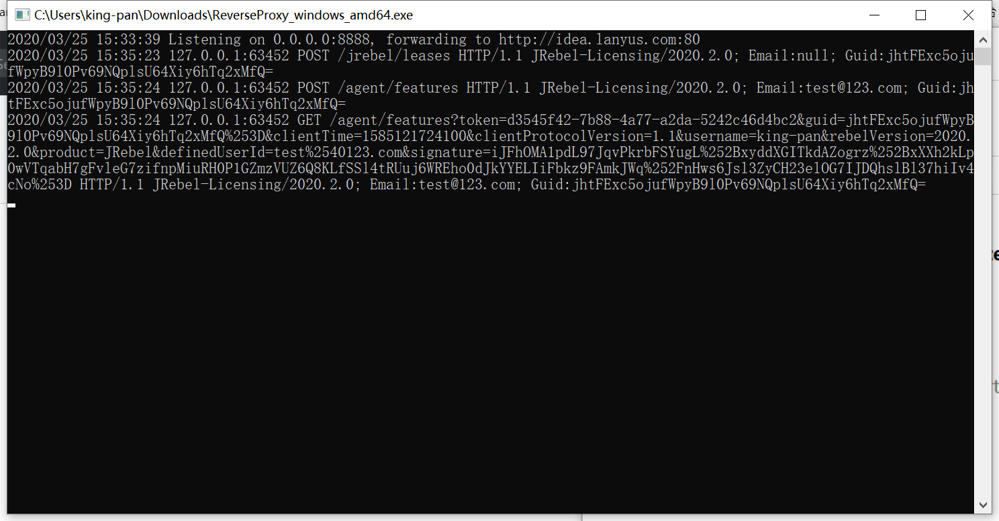

#### 配置JRebel

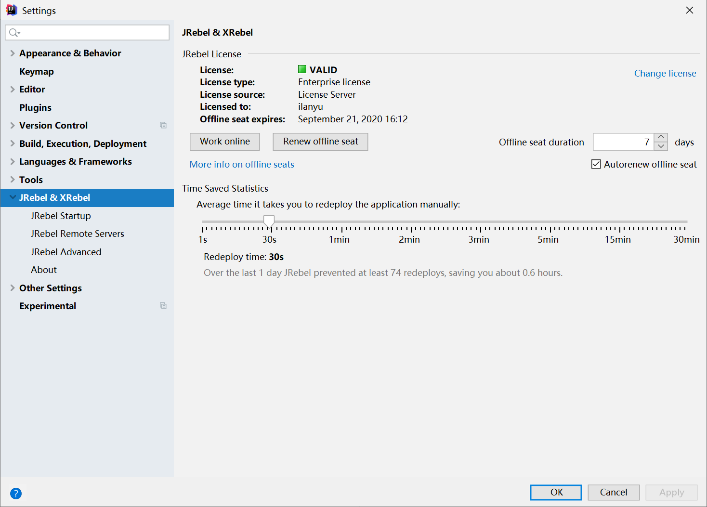

> 选择JRebel activated中的 connect to online licensing service      

* 第一行输入 http://127.0.0.1:8888/d3545f42-7b88-4a77-a2da-5242c46d4bc2      

* 第二行输入正确的邮箱格式，例如： [test@123.com](mailto:test@123.com)

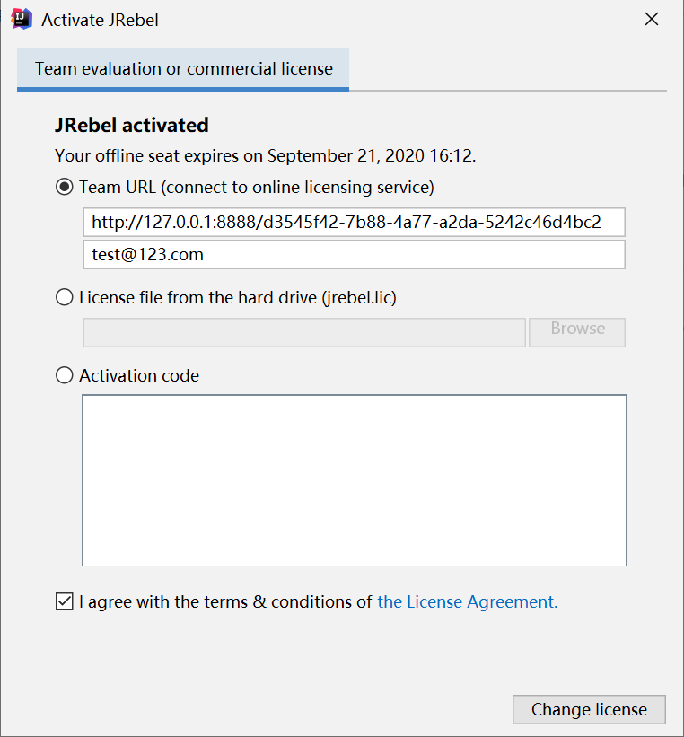


> **设置JRebel为OffLine模式**

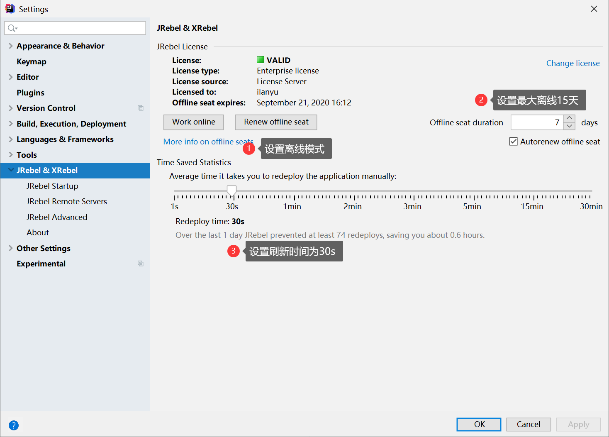

* 设置最大离线时间为15天(最长15天)
* 设置刷新时间为30秒

### 使用JRebel


使用debug模式启动JRebel后，控制台会打印如下日志，则证明配置启动成功

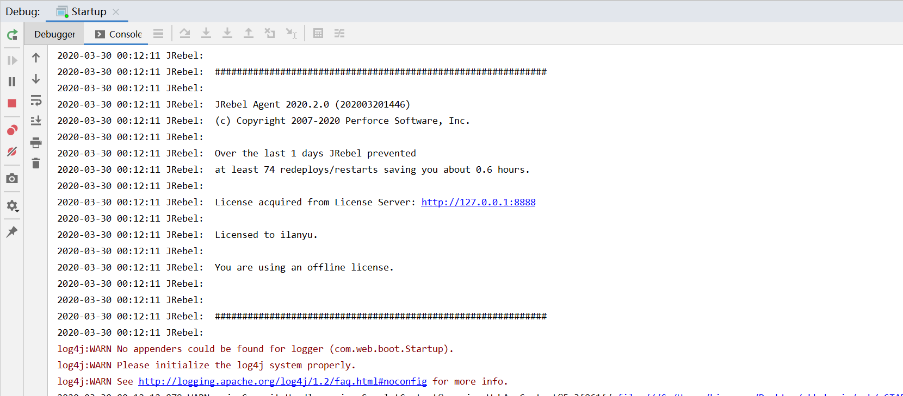


> 在本地开发过程中，需要对某个类进行修改后，无需重新启动服务，等待30s左右，控制台出现如下信息则证明热部署成功，修改后的代码已经生效，可以继续测试


```
2020-03-30 00:15:59 JRebel: Reloading class 'com.app.controller.admin.CompanyCfgController'.
```


## Idea Http Client

​		为什么推荐大家使用idea自带的http client工具呢？

1. 很轻，编码测试在一个工具中完成、高效
2. 测试脚本可以方便git管理、不会丢失
3. http脚本语法简单、5分钟上手
4. 它香

### 插件入口

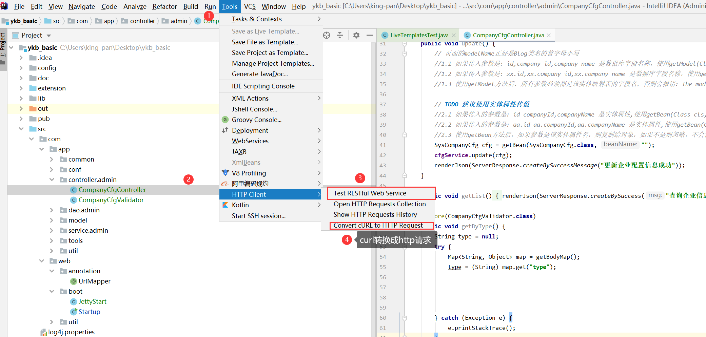


### 插件使用步骤

1. 打开工具

2. 使用图形化解决配置URL、请求头、请求参数等

3. 存储的http文件可以通过Project视图找到

   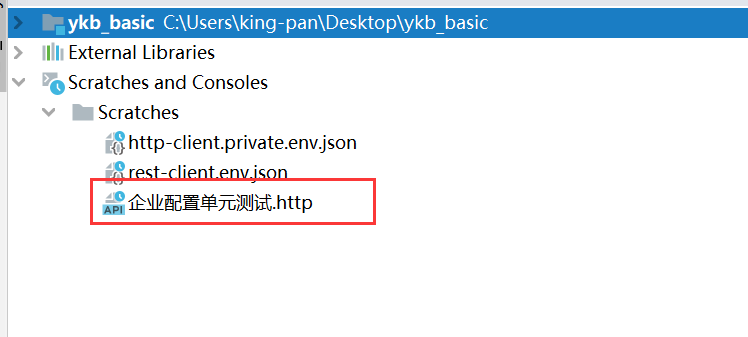

4. 具体说明如下


### 高级用法

#### 配置环境变量

> 新建一个rest-client.env.json文件，放在项目中。放在项目中。放在项目中

```json
{
  "utest": {
    "baseUrl": "http://ykb-basic:10020/"
  },
  "dev": {
    "baseUrl": "http://localhost:10020/"
  }
}
```

定义了2个环境，utest、dev。每个环境都有一个变量baseUrl。后面我们的接口测试脚本中可以通过{{baseUrl}}引用改变量


#### http脚本如下


> get请求

```http
###查询测试
GET  {{baseUrl}}/company/cfg/getList?id=1&name=zs
Accept: */*
Cache-Control: no-cache

<> 2020-03-26T020919.200.json
<> 2020-03-26T020801.200.json

###
```

工具默认记录最近50此的测试结果，结果都存储在json文件中<> 2020-03-26T020919.200.json、<> 2020-03-26T020801.200.json，可以直接点击查看运行结果

> 普通post请求

```http
###新增测试
POST {{baseUrl}}/company/cfg/update
Accept: */*
Cache-Control: no-cache
Content-Type: application/x-www-form-urlencoded

name=1111&orderVal=10&id=1&companyName=淘宝有限公司&companyId=1111&aaa=1&BBB=ZSDFEF
```

> post请求，request body 为json

```http
###通过Type查询测试
POST http://localhost:10020/company/cfg/getByType
Accept: */*
Cache-Control: no-cache
Content-Type: application/json;charset=utf-8
Accept: application/json

{
"type": "train_simulation_ticket"
}

<> 2020-03-26T020919-1.200.json
<> 2020-03-26T020812.200.json

###
```

注意：请求地址、请求头、请求体最好间隔一行


#### 执行测试

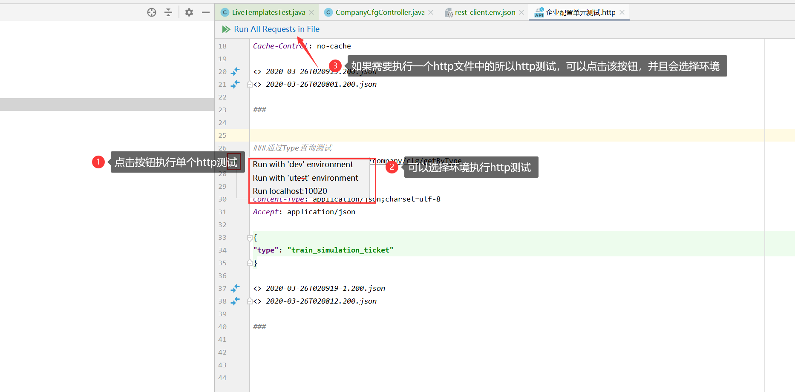