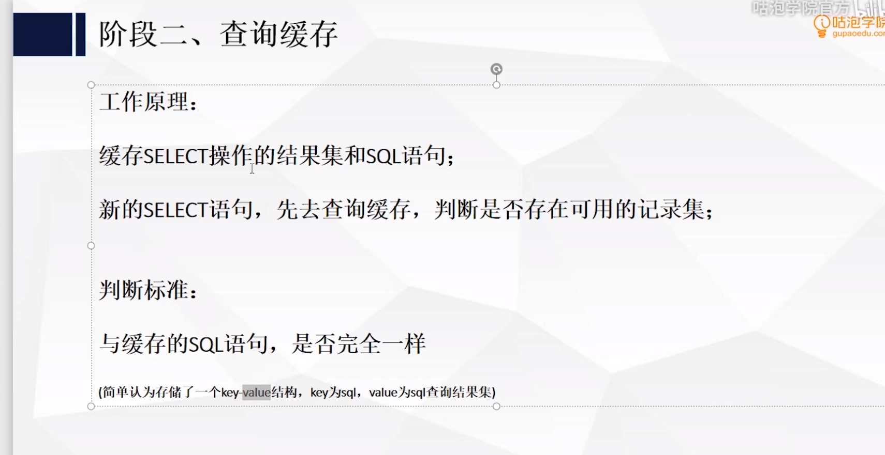
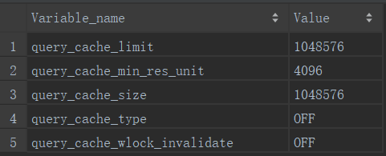
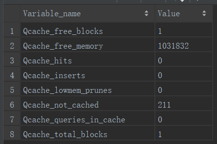
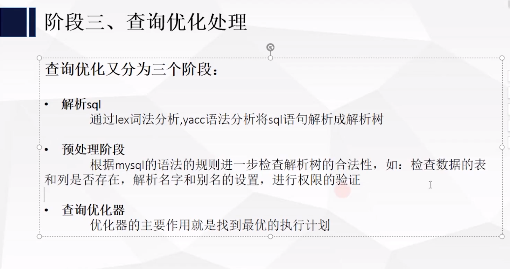
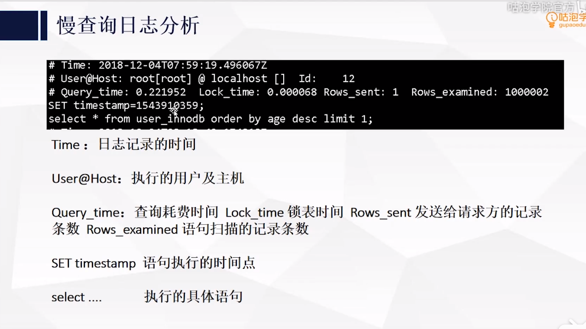
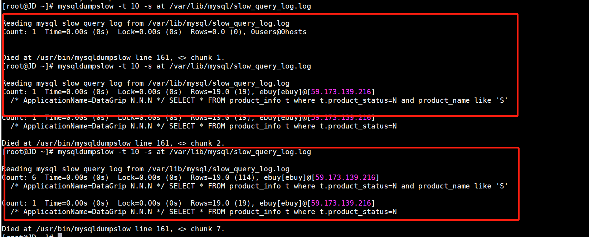

## 查看所有客户端连接

```sql
show full processlist;
```


> mysql客户端/服务端通信状态查询


​		使用show full processlist;命令查询所有的客户端连接


查询结果字段分析:

* Id：线程id（可以使用kill Id强制杀掉连接）
* User：连接的用户名
* Host：客户端的IP和端口

客户端/服务端通信状态:

* Sleep：线程正在等待客户端发送数据
* Query：连接正在执行查询
* Locked：线程正在等待表锁的释放
* Sorting Result：线程正在对结果进行排序
* Sending data: 向请求端返回数据


> 杀掉连接

```sql
kill {id}
```


## 2、查询缓存




> 查看缓存配置参数

```sql
show variables like 'query_cache%'
```



​		如果需要开启查询缓存，需要在my.ini文件中配置

​		

```ini
query_cache_type=
```

query_cache_type取值:

* 0：关闭，默认值
* 1：全开(sql语句满足条件就缓存)
* 2：按需打开(包含某个关键字)

关键参数：

* query_cache_limit：MySQL能缓存的最大查询结果
* query_cache_min_res_unit：在查询缓存中分配内存块的最小单位
* query_cache_size：查询缓存使用总空间（淘汰策略：淘汰最早的缓存）
* query_cache_type：是否打开查询缓存。可以设置为（OFF、ON、DEMAND）对应的数值：0、1、2。DEMAND表示只有在查询语句中明确标记SQL_CACHE的语句才放入查询缓存。
* query_cache_wlock_invalidate：如果某个数据表被其他的连接锁住，是否仍然从查询缓存中返回结果。


> 相同sql的判断依据

相同sql判断依据:

* SQL语句完全一致
* ;后面的空格不影响SQL判断

> 查看缓存状态

```sql
show status like 'Qcache%';
```




> 哪些状态下不会放入查询缓存

* 在sql中明确指出不需要查询缓存

```sql
select sql_no_cache * from user limit 10;
```

* 查询结果大于参数query_cache_limit
* sql查询中包含了一些函数
* 查询的表是系统表
* 操作视图、存储过程

> 查询缓存的局限性

* 表中任何记录发生变化，与该表相关的缓存都会失效


## 3、查询优化处理





## 4、调用执行引擎

​		调用插件式的存储引擎的原子API的功能进行执行计划的执行

## 5、返回客户端

1. 有需要做缓存的，执行缓存操作

2. 增量的返回结果。

   * 开始生产第一条结果时，Mysql就开始往请求方逐步返回数据

   * 好处：Mysql服务器无需保存过多的数据，浪费内存，用户体验好，马上就拿到了数据

   


查询优化器

* 静态优化(使用等价变化规则)
  * where 1=1 and a>5 优化成 where a>5
  * where a<b and a=5 优化成 where a=5 and b>5
  * key(a,b,c)   where b=1 and a=2 and c=3 优化成   where a=2 and b=1 and c=3
  * 

* 动态优化规则

  * select count(*) from users; myisam引擎直接优化count获取表数据总量

    ```sql
    --查询myisam
    explain select count(*) from user_myisam \G;
    --查询innodb
    explain select count(*) from user_innodb \G;
    ```

  * select max(id) from users; 如果id是主键索引，那么直接获取索引的最后一个节点的最后一个；min同理

  * 覆盖索引扫描: 

    ```SQL
    explain select id ,uname from users where uname='king' \G;
    ```

  * 子查询优化:

    ```sql
    explain select * from (select id,uname from users ) t
    ```

  * 提前终止优化:
    * id=-1/id=10000000 小于最小，大于最大
    * limit   判断出满足数据后，后面的就不处理了， limit 100000，100  这种情况下需要先找到100000条数据，然后再取100条数据

  * in的优化
    * or/in的逻辑是一致的，全表扫描情况下in
    * select * from users where a=1 or a=2 or a=3 or a=4   O(n)复杂度
    * select * from users where a  in(1,2,3,4) 二分查找   O(LOG2N)

MYSQL的查询优化器是基于成本计算的原则。它会尝试各种执行计划。如要数据抽样进行试验(随机的读取一个4K的数据块进行分析)


## 执行计划报告


```SQL
mysql> explain select * from product_info where product_name ='1' \G;
*************************** 1. row ***************************
           id: 1
  select_type: SIMPLE
        table: product_info
   partitions: NULL
         type: ALL
possible_keys: NULL
          key: NULL
      key_len: NULL
          ref: NULL
         rows: 1
     filtered: 100.00
        Extra: Using where
1 row in set, 1 warning (0.02 sec)
```


### 执行计划-id

select查询的序列号，标识执行的顺序

* id相同，执行顺序由上至下
* id不同，如果是子查询，id的序列号会递增，id值越大优先级越高，越先被执行。
* id相同又不同即两种情况同时存在，id如果相同，可以认为时一组，从上往下顺序执行；在所有组中，id值越大，优先级越高，越先执行。

### 执行计划-select_type

查询的类型，主要是用于区分普通查询、联合查询、子查询等

* SIMPLE: 简单的select查询，查询中不包含子查询或者union
* PRIMARY: 查询中包含子部分，最外层查询则被标记为primary
* SUBQUERY/MATERIALIZED: SUBQUERY表示在select或where列表中包含了子查询；MATERIALIZED表是where后面in条件的子查询
* UNION:若第二个select出现在union之后，则被标记为union；
* UNION RESULT: 从union表获取结果的select


### 执行计划-table

列举行所引用的表

### 执行计划-partitions


### 执行计划-type

访问类型，SQL查询优化中一个很重要的指标，结果值从好到坏依次是:

system>const>eq_ref>ref>range>index>ALL

* system：表中只有一行记录(等于系统表)，const类型的特例，基本不会出现，可以忽略不记
* const：表示通过索引一次就找到了，const代表primary key 或者unique索引
* eq_ref：唯一索引扫描，对于每个索引键，表中只有一条记录与之匹配。常见于主键或唯一索引扫描
* ref：非唯一性索引扫描，返回匹配某个单独值的所有行，本质也是一种索引访问。
* range：只建设给定范围的行，使用一个索引来选中行
* index：Full Index Scan，索引全表扫描，把索引从头到尾扫描一遍
* ALL：Full Table Scan，遍历全表以找到匹配的行
* 一般要求优化级别要达到range，最好是const级别

### 执行计划-possible_keys

查询过程中有可能用到的索引

### 执行计划-key

实际使用的索引，如果为NULL，则没有使用索引

### 执行计划-key_len

如果使用了索引，就显示索引的长度,单位时bit

### 执行计划-rows

根据表统计信息或者索引选用情况，大致估算出找到所需的记录所需要读取的行数

### 执行计划-filtered

它指返回结果的行占需要读到的行(rows列的值)的百分比，表示返回结果行数占需读取行数的百分比，filtered的值越大越好。

### 执行计划-Extra

包含不适合在其他列中显示但十分重要的额外信息。

* using index：表示使用了覆盖索引,覆盖索引:表示索引包含了返回和查询的所有列 而不需要读取文件
* using where：Using where的作用只是提醒我们MySQL将用where子句来过滤结果集
* NULL： 如果查询和返回返回非索引字段
* Using temporary：使用临时表保存中间结果，也就是说mysql在对查询结果排序时使用了临时表，没有使用索引排序，常见于order by或group by
* Using filesort：mysql对数据使用了一个外部的文件内容进行了排序，而不是按照表内的索引进行排序读取

## MYSQL慢查询

```sql
# 查看慢查询是否开启
show variables like 'slow_query_log'
# 开启慢查询
set global slow_query_log=on
# 设置慢查询日志文件
set global slow_query_log_file='/var/lib/mysql/slow_query_log.log'
# 开启查询没有使用索引查询语句
set global log_queries_not_using_indexes=on
# 设置慢查询超时时间(单位是秒)
set global long_query_time=0.1
```




### 使用mysqldumpslow 工具分析慢查询日志 

慢查询日志主要是记录超时的sql，方便dba分析sql、优化sql

```shell
[root@JD ~]# mysqldumpslow --help
Usage: mysqldumpslow [ OPTS... ] [ LOGS... ]

Parse and summarize the MySQL slow query log. Options are

  --verbose    verbose
  --debug      debug
  --help       write this text to standard output

  -v           verbose
  -d           debug
  -s ORDER     what to sort by (al, at, ar, c, l, r, t), 'at' is default
                al: average lock time
                ar: average rows sent
                at: average query time
                 c: count
                 l: lock time
                 r: rows sent
                 t: query time
  -r           reverse the sort order (largest last instead of first)
  -t NUM       just show the top n queries
  -a           don't abstract all numbers to N and strings to 'S'
  -n NUM       abstract numbers with at least n digits within names
  -g PATTERN   grep: only consider stmts that include this string
  -h HOSTNAME  hostname of db server for *-slow.log filename (can be wildcard),
               default is '*', i.e. match all
  -i NAME      name of server instance (if using mysql.server startup script)
  -l           don't subtract lock time from total time


```

> 使用命令分析慢查询

```shell
mysqldumpslow -t 10 -s at /var/lib/mysql/slow_query_log.log
```



```shell
[root@JD ~]# mysqldumpslow -t 10 -s at /var/lib/mysql/slow_query_log.log

Reading mysql slow query log from /var/lib/mysql/slow_query_log.log
Count: 1  Time=0.00s (0s)  Lock=0.00s (0s)  Rows=19.0 (19), root[root]@localhost
  SELECT product_id,product_name,product_price,product_stock FROM product_info t where t.product_status=N and product_name like 'S'

Count: 6  Time=0.00s (0s)  Lock=0.00s (0s)  Rows=19.0 (114), ebuy[ebuy]@[59.173.139.216]
  /* ApplicationName=DataGrip N.N.N */ SELECT * FROM product_info t where t.product_status=N and product_name like 'S'

Count: 1  Time=0.00s (0s)  Lock=0.00s (0s)  Rows=19.0 (19), ebuy[ebuy]@[59.173.139.216]
  /* ApplicationName=DataGrip N.N.N */ SELECT * FROM product_info t where t.product_status=N

Died at /usr/bin/mysqldumpslow line 161, <> chunk 7.

```


### 其他MySQL工具

* mysqlsla
* pt-query-digest

### mysqlsla分析工具

> 工具安装

[mysqlsla工具安装教程](https://www.cnblogs.com/ding2016/p/9755468.html)

> 参数说明

*"--log-type (-lt) TYPE LOGS"　　// 指定日志类型*
*Parse MySQL LOGS of TYPE. Default none. TYPE must be either slow, general, binary, msl or udl. LOGS is a space-separated list of MySQL log files.*

------

 *"--statement-filter (-sf) CONDTIONS"　　// 语句过滤，“+”和“-”分别表示“仅显示”和“仅去掉”*

*Set SQL statement filter using CONDITIONS. Default none. CONDITIONS is a comma-separated list of SQL statement types in the form:*
*[+-][TYPE],[TYPE],etc.*

------

 *"--top N"　　// 最top的N条，默认显示top 10*

*After sorting display only the top N queries. Default 10.*

------

 *"--sort META"　　// 按指定排序，默认慢查询和微秒查询会按照总执行时间“t_sum”来排序，其他日志默认按照“c_sum”*

*Sort queries according to META. Default t_sum for slow and msl logs, c_sum for all others. META is any meta-property name.*

------

 *"--databases (-db) (-D) DATABASES" 　　// 指定数据库*

*Try EXPLAINing queries which have no known database using DATABASES. Default none. DATABASES is a comma-separated list of database names (withoutspaces). Only used when option explain is used too.*

------

 *其他参数可通过man mysqlsla查询。*

> 工具生产分析结果

```sql
#查询记录最多的20个sql语句，并写到select.log中去。
mysqlsla -lt slow --sort t_sum --top 20 /var/lib/mysql/slow_query_log.log > /tmp/select.log


#统计慢查询文件为mysql-slow.log中的所有select的慢查询sql，并显示执行时间最长的100条sql，并写到#sql_select.log中去
mysqlsla -lt slow  -sf "+select" -top 100  mysql-slow.log >/tmp/sql_select.log


#统计慢查询文件为mysql-slow.log的数据库为mydata的所有select和update的慢查询sql，并查询次数最多的100
#条sql，并写到sql_num.sql中去
mysqlsla -lt slow  -sf "+select,update" -top 100 -sort c_sum  -db mydata mysql-slow.log>/tmp/sql_num.log

```


> 查看分析结果

```sql
[root@JD tmp]# more select.log
Report for slow logs: /var/lib/mysql/slow_query_log.log
19 queries total, 2 unique
Sorted by 't_sum'
Grand Totals: Time 0 s, Lock 0 s, Rows sent 361, Rows Examined 361


______________________________________________________________________ 001 ___
Count         : 12  (63.16%)
Time          : 5.705 ms total, 475 ▒s avg, 191 ▒s to 3.438 ms max  (76.72%)
  95% of Time : 2.267 ms total, 206 ▒s avg, 191 ▒s to 225 ▒s max
Lock Time (s) : 4.397 ms total, 366 ▒s avg, 94 ▒s to 3.27 ms max  (88.33%)
  95% of Lock : 1.127 ms total, 102 ▒s avg, 94 ▒s to 118 ▒s max
Rows sent     : 19 avg, 19 to 19 max  (63.16%)
Rows examined : 19 avg, 19 to 19 max  (63.16%)
Database      : ebuy
Users         :
        root@localhost  : 100.00% (12) of query, 63.16% (12) of all users

Query abstract:
SET timestamp=N; SELECT product_id,product_name,product_price,product_stock FROM product_info t WHERE t.product_status=N AND product_name LIKE 'S';

Query sample:
SET timestamp=1563123881;
SELECT product_id,product_name,product_price,product_stock FROM product_info t where t.product_status=0 and product_name like '%机%';

______________________________________________________________________ 002 ___
Count         : 7  (36.84%)
Time          : 1.731 ms total, 247 ▒s avg, 191 ▒s to 442 ▒s max  (23.28%)
Lock Time (s) : 581 ▒s total, 83 ▒s avg, 56 ▒s to 162 ▒s max  (11.67%)
Rows sent     : 19 avg, 19 to 19 max  (36.84%)
Rows examined : 19 avg, 19 to 19 max  (36.84%)
Database      : ebuy
Users         :
        ebuy@ 59.173.139.216 : 100.00% (7) of query, 36.84% (7) of all users

Query abstract:
SET timestamp=N;

Query sample:
SET timestamp=1563122257;

```


## SQL语句的一般执行顺序

SQL语句的执行顺序按照优先级先后顺序排序:

* from
* join
* on
* where
* group by(开始使用select中的别名，后面的语句中都可以使用)
* avg,sum,min,max,count
* having
* select
* distinct
* order by


