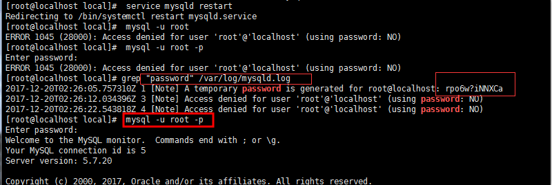

# Mysql配置

## Mysql按照

```shell
[root@localhost ~]# cd /usr/local/src/
[root@localhost src]# wget http://repo.mysql.com/mysql57-community-release-el7-8.noarch.rpm 

[root@localhost src]# rpm -ivh mysql57-community-release-el7-8.noarch.rpm 

[root@localhost src]#  yum -y install mysql-server 

```

默认配置文件路径： 
配置文件：/etc/my.cnf 
日志文件：/var/log/var/log/mysqld.log 
服务启动脚本：/usr/lib/systemd/system/mysqld.service 

socket文件：/var/run/mysqld/mysqld.pid


## 修改配置

```properties
# For advice on how to change settings please see
# http://dev.mysql.com/doc/refman/5.7/en/server-configuration-defaults.html

[mysqld]
#
# Remove leading # and set to the amount of RAM for the most important data
# cache in MySQL. Start at 70% of total RAM for dedicated server, else 10%.
# innodb_buffer_pool_size = 128M
#
# Remove leading # to turn on a very important data integrity option: logging
# changes to the binary log between backups.
# log_bin
#
# Remove leading # to set options mainly useful for reporting servers.
# The server defaults are faster for transactions and fast SELECTs.
# Adjust sizes as needed, experiment to find the optimal values.
# join_buffer_size = 128M
# sort_buffer_size = 2M
# read_rnd_buffer_size = 2M
datadir=/var/lib/mysql
socket=/var/lib/mysql/mysql.sock

server_id=1
expire_logs_days=3
# Disabling symbolic-links is recommended to prevent assorted security risks
symbolic-links=0
#忽略表名大小写，如果创建了大小写的表后再更改会出现所有的表都不存在，需要先把表名都改成小写
lower_case_table_names=1

log-error=/var/log/mysqld.log
pid-file=/var/run/mysqld/mysqld.pid

[client]
#客户端编码改成utf8
default-character-set=utf8

[mysql]
no-auto-rehash
#服务端编码改成utf8
default-character-set=utf8

```

## 修改默认密码

> 重启mysql

```shell
service mysqld restart
```

> 查看默认密码

```shell
grep "password" /var/log/mysqld.log 
```



> 登入mysql

第一次登入mysql什么都不要做，直接修改密码，创建用户，授权、然后重启mysql

```shell
alter user 'root'@'localhost' identified by 'Root!!2018';  
```

> 刷新权限

```shell
flush privileges;
```

> 创建新用户并授权

```shell
grant all on *.* to 'newUser'@'%' identified by 'newPassword'  with grant option;
```


```shell
alter user 'root'@'localhost' identified by 'Root!!2019';  

flush privileges 

CREATE USER 'ebuy' IDENTIFIED BY 'Ebuy^&2019';

grant all on *.* to 'ebuy' identified by 'Ebuy^&2019'  with grant option;


```

