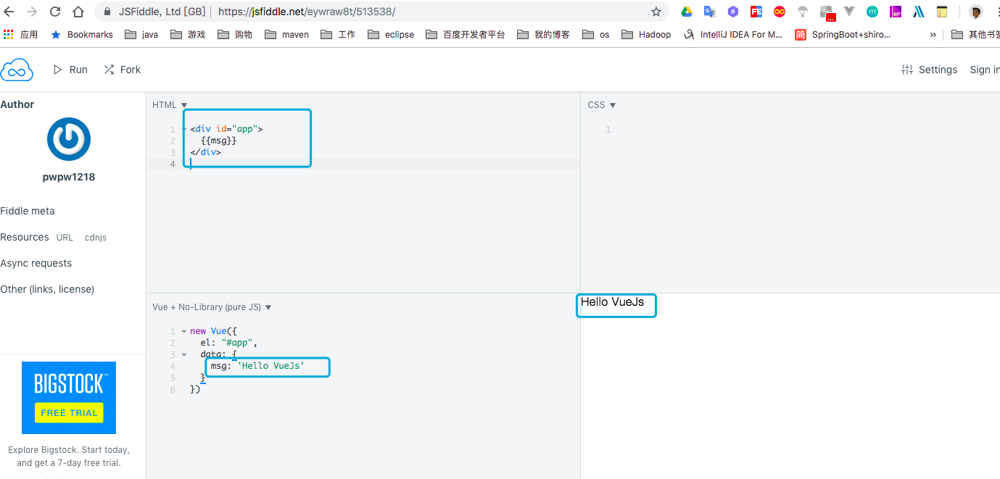

# vuejs入门教程

## vuejs入门案例

​	我们使用下载的网站做一个测试: https://jsfiddle.net/pwpw1218/k8nubpsL/4/

> html代码

```html
<div id="app">
  {{msg}}
</div>
```

> js代码

```javascript
new Vue({
  el: '#app',
  data: {
    msg: 'Hello VueJs'
  }
})
```





```html

```

