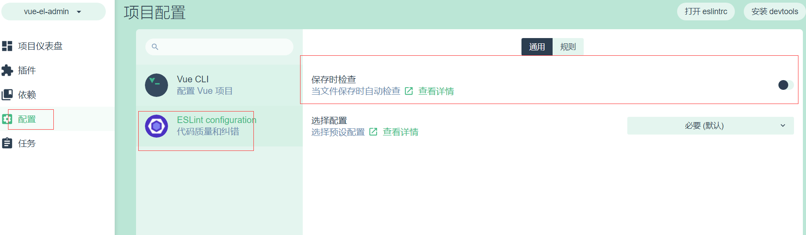

# Vuejs的安装


## 1. 安装nodejs

下载软件node-v10.16.0-x64.msi，下一步，下一步安装

## 2. 安装cnpm

```js
npm install -g cnpm --registry=https://registry.npm.taobao.org
```

## 3. 安装vuejs

```js
cnpm install -g @vue/cli
```

## 4. 创建项目

```js
 ~/Documents/GitHub/vue-js
vue create vue-el-admin  # 选择默认设置，等待创建项目，安装依赖
...
??  Invoking generators...
??  Installing additional dependencies...

added 36 packages from 27 contributors, updated 2 packages, moved 9 packages and audited 24189 packages in 14.408s
found 0 vulnerabilities

-  Running completion hooks...
?  Running completion hooks...

-  Generating README.md...
??  Generating README.md...

??  Successfully created project vue-el-admin.
??  Get started with the following commands:

 $ cd vue-el-admin  ## 进入项目
 $ npm run serve    ## 运行项目
```


> 启动成功

```js
  App running at:
  - Local:   http://localhost:8080/
  - Network: http://192.168.31.243:8080/

  Note that the development build is not optimized.
  To create a production build, run npm run build.
```

> 访问

http://localhost:8080/

## 5. vue ui界面

```js
vue ui
```

vue ui关闭保存代码错误提示



## 6.  关闭保存代码提示错误

```js
module.exports ={
	lintOnSave: false
}
```


